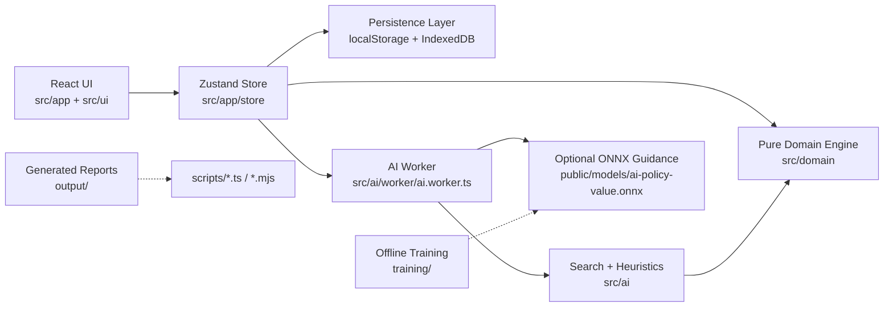

# YOUI

**Copyright (c) 2026 Kostiantyn Stroievskyi. All Rights Reserved.**

No permission is granted to use, copy, modify, merge, publish, distribute, sublicense, or sell copies of this software or any portion of it, for any purpose, without explicit written permission from the copyright holder.

---

YOUI is a local-first implementation of a two-player abstract board game on a `6 x 6` board. The repository is organized as a layered system rather than a single application bundle: a pure rules engine, a browser-side search AI, a Zustand runtime store, a React UI, persistence/migration infrastructure, and an optional offline-trained neural guidance path.

The central architectural choice is strict responsibility separation:

- the domain layer defines legality, state transitions, repetition semantics, and victory;
- the AI depends on the domain layer rather than duplicating rules;
- the store orchestrates persistence, interaction, and worker communication;
- the UI projects state and emits intent, but does not infer legality.

That separation is what keeps the project coherent: rules are authored once, the store turns those rules into a safe interaction protocol, and the AI searches over the same immutable state model that the UI renders.

## Reading Order

The repository documentation is intentionally split by subsystem.

1. [`docs/instruction.md`](./docs/instruction.md) or [`docs/instruction.ru.md`](./docs/instruction.ru.md): canonical rulebook.
2. [`docs/ARCHITECTURE.md`](./docs/ARCHITECTURE.md): runtime store, worker, hydration, undo/redo, and testing philosophy.
3. [`src/domain/README.md`](./src/domain/README.md): canonical rules-engine and invariant reference.
4. [`src/ai/README.md`](./src/ai/README.md): AI architecture, search pipeline, model integration, and academic lineage.
5. [`src/ai/HEURISTICS.md`](./src/ai/HEURISTICS.md): exact scoring, ordering, tagging, and participation formulas.
6. [`src/ui/README.md`](./src/ui/README.md): presentation-layer and localization strategy.
7. [`docs/INFRASTRUCTURE.md`](./docs/INFRASTRUCTURE.md): PWA/runtime caching and generated report tooling.
8. [`training/README.md`](./training/README.md): offline dataset and training path for the optional neural guidance model.

## System Map



## What The Product Does

At runtime the application supports two match modes:

- `hotSeat`: two humans share one device, optionally using the pass-device overlay between turns;
- `computer`: the store sends an immutable engine snapshot plus a hidden per-match AI behavior profile to a worker, the worker searches for one move, and the store applies only the latest non-stale result.

Computer mode now has three product-facing AI traits that are intentionally not separate UI toggles:

- a hidden per-match persona (`expander`, `hunter`, or `builder`) so different games do not all feel strategically identical;
- dynamic draw aversion, so equal-or-better positions do not treat sterile draws as neutral outcomes;
- risk escalation under stagnation or once `moveNumber >= 70`, so very flat games become more decisive without overriding forced tactics.

The rules revolve around six recurring ideas:

- every cell may contain a single checker or a stack of height `2` or `3`;
- the top checker controls a stack;
- only single checkers may be jumped over;
- jumping an active enemy single freezes it;
- jumping any frozen single thaws it;
- victory is either complete own-home single conversion or six height-`3` stacks on the front home row.

Optional rule toggles are explicit in `RuleConfig` rather than hidden in the UI.

The current optional toggles are:

- non-adjacent friendly stack transfer;
- threefold repetition as a terminal trigger with tiebreak resolution;
- informational score summaries independent of terminal truth.

Threefold and stalemate tiebreaks both compare:

1. own-home single checkers;
2. completed home-row height-`3` stacks;
3. draw if still tied.

## Repository Map

| Path | Role |
| --- | --- |
| [`src/domain/`](./src/domain/) | Pure rules engine, reducers, validators, hashing, serialization, invariants |
| [`src/ai/`](./src/ai/) | Search engine, heuristics, model encoding, worker bridge, tests |
| [`src/app/store/`](./src/app/store/) | Store assembly, interaction flow, persistence runtime, AI control |
| [`src/app/`](./src/app/) | Application shell and top-level composition |
| [`src/ui/`](./src/ui/) | Board, tabs, panels, tooltips, and other presentation components |
| [`src/shared/`](./src/shared/) | i18n, constants, hooks, and shared utilities |
| [`docs/`](./docs/) | Rulebook and cross-cutting technical documentation |
| [`scripts/`](./scripts/) | Self-play, report generation, and benchmark tooling |
| [`training/`](./training/) | Offline training script and requirements |
| [`public/models/`](./public/models/) | Deployment slot for the optional ONNX model |
| [`output/`](./output/) | Generated report artifacts |

The application shell itself lives in [`src/app/App/App.tsx`](./src/app/App/App.tsx). It owns top-level tab switching between game, instructions, and settings, mounts the PWA lifecycle banner, and preloads non-critical overlays during idle time through `preloadAppOverlays()`. Shell-level regression coverage lives in [`src/app/App.test.tsx`](./src/app/App.test.tsx) and [`src/app/rendering.test.tsx`](./src/app/rendering.test.tsx), while the deeper runtime contracts remain under [`src/app/store/`](./src/app/store/).

## Key Runtime Concepts

| Concept | Where it lives | Role in the system |
| --- | --- | --- |
| `GameState` | [`src/domain/model/types.ts`](./src/domain/model/types.ts) | authoritative live position, including board, side to move, terminal status, history, and repetition counts |
| `StateSnapshot` | [`src/domain/model/types.ts`](./src/domain/model/types.ts) | serialization-safe and history-safe position snapshot without live history arrays |
| `TurnRecord` | [`src/domain/model/types.ts`](./src/domain/model/types.ts) | one committed move plus before/after snapshots, auto-passes, and canonical post-move hash |
| `UndoFrame` | [`src/shared/types/session.ts`](./src/shared/types/session.ts) | lightweight history cursor used by undo/redo and persistence compaction |
| `AiBehaviorProfile` | [`src/shared/types/session.ts`](./src/shared/types/session.ts) | hidden persisted persona that keeps a computer opponent's style stable across reloads in one match |
| `InteractionState` | [`src/shared/types/session.ts`](./src/shared/types/session.ts) | store-owned UI protocol: idle, piece selection, targeting, jump follow-up, pass overlay, or game over |
| `AiSearchResult` | [`src/ai/types.ts`](./src/ai/types.ts) | one complete AI decision, including chosen move, fallback mode, diagnostics, root candidates, active risk mode, and persona id |

## Runtime Boundaries

### Domain

The domain layer is the only subsystem allowed to answer questions such as:

- which actions are legal from this state;
- how jump continuations constrain the turn;
- when repetition counts advance;
- when the game ends and how tiebreaks are resolved.

Every other layer consumes those answers rather than recomputing them.

### AI

The AI is search-first, not model-first. The browser move chooser is built from:

- iterative deepening root search;
- negamax with alpha-beta pruning;
- principal-variation-style null-window re-search;
- quiescence search;
- domain-specific move ordering, strategic analysis, participation heuristics, hidden personas, and stagnation-aware risk shaping;
- optional policy priors from a small residual policy/value network.

The neural model is guidance only. The current runtime uses policy priors for ordering and exposes `valueEstimate` for diagnostics, but it does **not** inject the value head into [`evaluateState()`](./src/ai/evaluation.ts). In risk-escalation modes the engine attenuates policy-prior weight and prefers heuristic strategic intent over stale-safe model intent, because the product goal becomes decisive play rather than merely reproducing the baseline policy. The first few opening plies also deliberately reduce root prior weight when a hidden persona is active, so the safe opening band can split into different styles instead of collapsing back to one model-favored move every game.

### Store And UI

The store owns:

- interaction state;
- AI request lifecycle;
- persistence and hydration;
- undo/redo cursors;
- cross-layer orchestration.

The UI renders store-derived state and emits explicit actions. It does not infer legality or victory on its own.

## Persistence Snapshot

The runtime persistence contract has two layers with different version numbers:

- browser storage key namespace: `youi/session/v4`
- app-level persisted envelope version: `1`
- embedded serializable session version: `4`

Session `v4` adds persisted `aiBehaviorProfile` beside `matchSettings`. Older `v1`, `v2`, and `v3` payloads are still accepted and normalized into `SerializableSessionV4` with `aiBehaviorProfile: null`, so imports remain backward-compatible while new computer matches keep their hidden style across reloads.

Boot is assembled through the exact runtime path:

```text
createGameStore()
  -> getInitialPersistenceState()
  -> createGameStoreStateRuntime()
  -> createStore(runtime.stateCreator)
  -> runPostCreate()
```

The detailed explanation of hydration modes, archive recovery, and store slices lives in [`docs/ARCHITECTURE.md`](./docs/ARCHITECTURE.md).

## Generated Artifacts

Files under `output/` are generated artifacts, not canonical prose documentation.

Key commands:

- `npm run ai:selfplay`: generate training/self-play JSONL
- `npm run ai:crossplay`: generate difficulty-vs-difficulty and persona-vs-persona cross-play matrices
- `npm run ai:loop-benchmark`: measure recurrence, trapping, and loop-escape behavior on late benchmark states
- `npm run ai:position-buckets`: aggregate interestingness metrics over structural position buckets
- `npm run ai:stage-variety`: generate opening-versus-late-stage AI variety reports
- `npm run ai:threat`: measure pressure creation, frontier compression, and certified risk progress
- `npm run ai:variety`: generate AI variety reports
- `npm run perf:report`: generate browser and domain performance reports
- `npm run perf:compare`: compare historical and current performance JSON snapshots
- `npm run ai:crossplay:compare`: compare two cross-play report snapshots by git ref or `working`
- `npm run ai:loop-benchmark:compare`: compare two loop-benchmark snapshots by git ref or `working`
- `npm run ai:position-buckets:compare`: compare two position-bucket snapshots by git ref or `working`
- `npm run ai:stage-variety:compare`: compare two stage-variety snapshots by git ref or `working`
- `npm run ai:threat:compare`: compare two threat snapshots by git ref or `working`
- `npm run ai:variety:compare`: compare two aggregate variety snapshots by git ref or `working`
- `npm run perf:compare:git`: compare two performance runs by git ref or `working`
- `npm run docs:check-links`: validate relative Markdown links

All `*:compare` wrappers accept `--before=<ref|working>` and `--after=<ref|working>`, plus any pipeline-specific flags such as `--pairs=` or `--max-turns=`. That makes the report tooling usable for three common cases without manual snapshot juggling:

- last committed tree versus unstaged changes;
- one branch or tag versus another branch or tag;
- a fixed baseline ref versus the current working tree.

## Design Principles

1. Domain purity over convenience. Rules are authored once and reused everywhere.
2. Immutable external state with structural sharing internally. The system preserves clean boundaries without paying the cost of naive deep cloning on every move.
3. Search remains the tactical authority. Heuristics and model guidance improve move ordering and style; they do not replace legality or tree search.
4. Asynchronous work is isolated. Worker results and archive hydration are versioned so stale results can be ignored safely.
5. Optional infrastructure degrades gracefully. The model file, IndexedDB archive, and some browser features may be absent without breaking the core game.

## Where To Go Next

- Exact rules and invariants: [`src/domain/README.md`](./src/domain/README.md)
- AI architecture and references: [`src/ai/README.md`](./src/ai/README.md)
- Exact heuristic formulas: [`src/ai/HEURISTICS.md`](./src/ai/HEURISTICS.md)
- Runtime store and persistence: [`docs/ARCHITECTURE.md`](./docs/ARCHITECTURE.md)
- PWA/report tooling: [`docs/INFRASTRUCTURE.md`](./docs/INFRASTRUCTURE.md)
