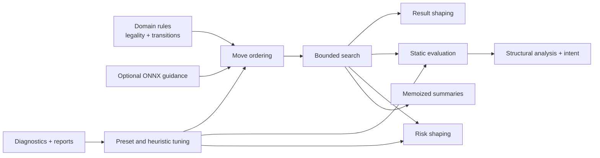
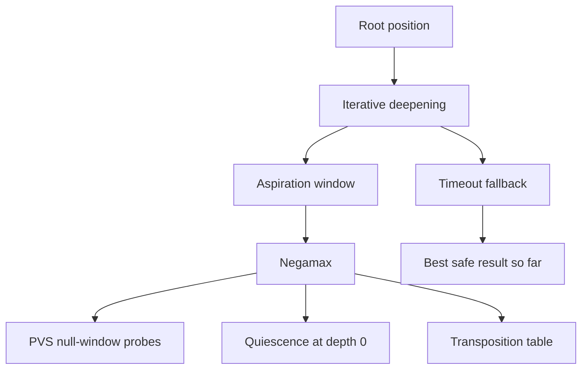
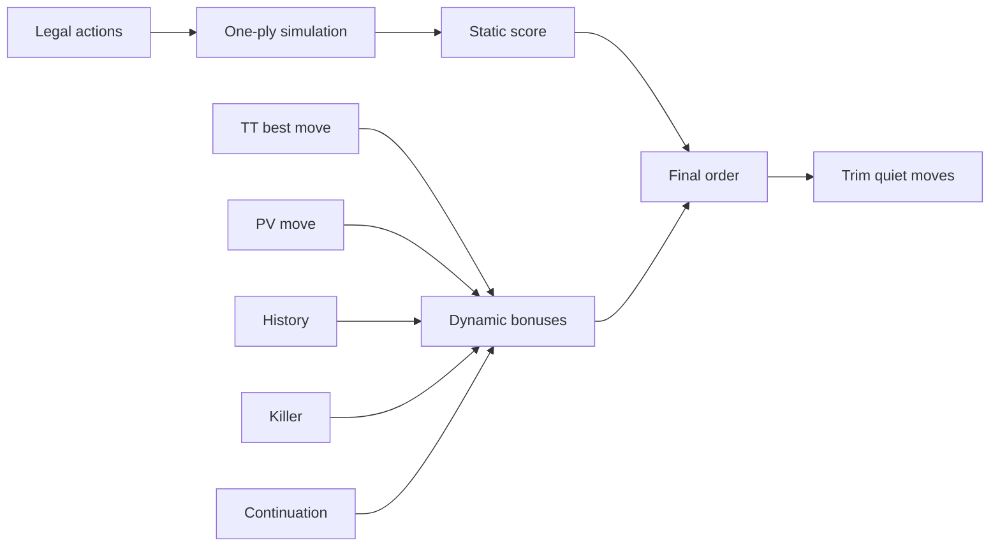
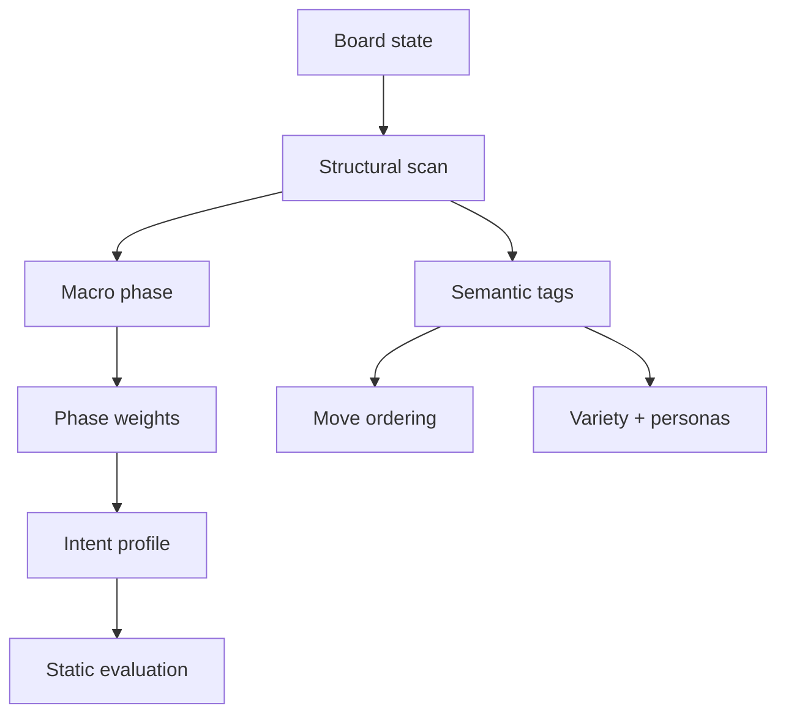
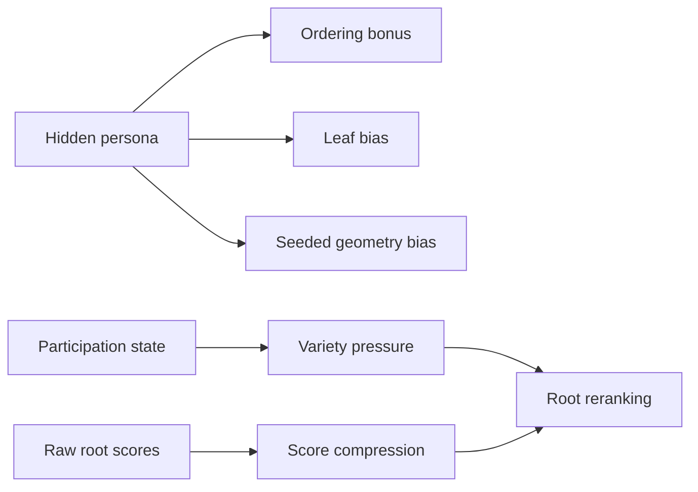
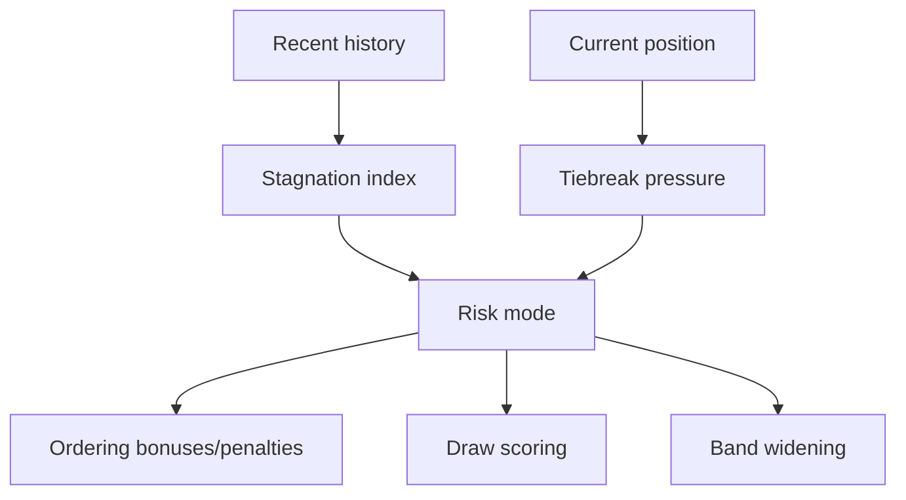
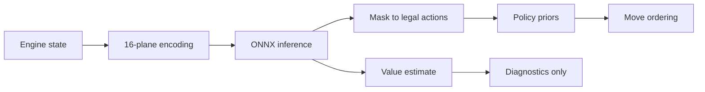
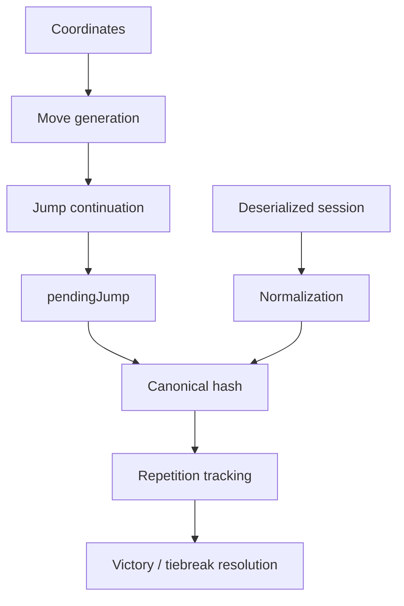
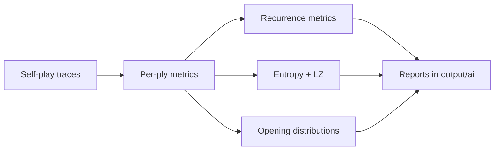
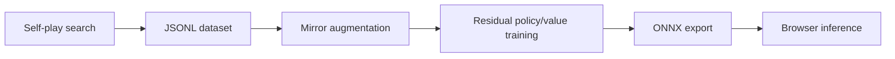

# Algorithm Guide

**Copyright (c) 2026 Kostiantyn Stroievskyi. All Rights Reserved.**

No permission is granted to use, copy, modify, merge, publish, distribute, sublicense, or sell copies of this software or any portion of it, for any purpose, without explicit written permission from the copyright holder.

---

This document is the implementation-oriented algorithm reference for YOUI. Its purpose is stricter than the surrounding READMEs:

- [`README.md`](../README.md) explains the system map.
- [`ARCHITECTURE.md`](./ARCHITECTURE.md) explains runtime ownership and orchestration.
- [`src/ai/README.md`](../src/ai/README.md) explains the AI architecture and lineage.
- [`src/ai/HEURISTICS.md`](../src/ai/HEURISTICS.md) explains the exact coefficients and formulas.
- [`src/domain/README.md`](../src/domain/README.md) explains rules-engine semantics.
- [`training/README.md`](../training/README.md) explains the model-training workflow.

This file answers a different question:

> If a developer understands TypeScript and game AI, but is unfamiliar with one of the algorithms used here, what exactly do they need to implement the same idea correctly?

For every algorithm listed below, this document gives:

- the role of the algorithm inside YOUI;
- the concrete files that implement it;
- the required inputs and outputs;
- simplified pseudocode;
- implementation notes and trade-offs.

## Coverage Checklist

The following algorithm families are explicitly covered in this document.

| Family | Algorithm | Files |
| --- | --- | --- |
| Search core | Negamax with alpha-beta pruning | [`src/ai/search/negamax.ts`](../src/ai/search/negamax.ts) |
| Search core | Iterative deepening | [`src/ai/search/rootSearch.ts`](../src/ai/search/rootSearch.ts) |
| Search core | Principal variation search | [`src/ai/search/negamax.ts`](../src/ai/search/negamax.ts) |
| Search core | Quiescence search | [`src/ai/search/quiescence.ts`](../src/ai/search/quiescence.ts) |
| Search core | Aspiration windows | [`src/ai/search/rootSearch.ts`](../src/ai/search/rootSearch.ts) |
| Search core | Time-governed control flow | [`src/ai/search/rootSearch.ts`](../src/ai/search/rootSearch.ts) |
| Move ordering | PV ordering | [`src/ai/moveOrdering.ts`](../src/ai/moveOrdering.ts) |
| Move ordering | TT move ordering | [`src/ai/moveOrdering.ts`](../src/ai/moveOrdering.ts) |
| Move ordering | History heuristic | [`src/ai/search/heuristics.ts`](../src/ai/search/heuristics.ts), [`src/ai/moveOrdering.ts`](../src/ai/moveOrdering.ts) |
| Move ordering | Killer heuristic | [`src/ai/search/heuristics.ts`](../src/ai/search/heuristics.ts), [`src/ai/moveOrdering.ts`](../src/ai/moveOrdering.ts) |
| Move ordering | Continuation heuristic | [`src/ai/search/heuristics.ts`](../src/ai/search/heuristics.ts), [`src/ai/moveOrdering.ts`](../src/ai/moveOrdering.ts) |
| Move ordering | Static action scoring | [`src/ai/moveOrdering.ts`](../src/ai/moveOrdering.ts) |
| Move ordering | Quiet move trimming | [`src/ai/moveOrdering.ts`](../src/ai/moveOrdering.ts) |
| Evaluation and planning | Static evaluation | [`src/ai/evaluation.ts`](../src/ai/evaluation.ts) |
| Evaluation and planning | Structural analysis | [`src/ai/strategy.ts`](../src/ai/strategy.ts) |
| Evaluation and planning | Macro phase detection | [`src/ai/strategy.ts`](../src/ai/strategy.ts) |
| Evaluation and planning | Phase-dependent reweighting | [`src/ai/strategy.ts`](../src/ai/strategy.ts) |
| Evaluation and planning | Strategic intent classification | [`src/ai/strategy.ts`](../src/ai/strategy.ts) |
| Evaluation and planning | Hybrid valuation logic | [`src/ai/strategy.ts`](../src/ai/strategy.ts) |
| Evaluation and planning | Semantic tagging engine | [`src/ai/strategy.ts`](../src/ai/strategy.ts) |
| Evaluation and planning | Novelty penalty | [`src/ai/strategy.ts`](../src/ai/strategy.ts) |
| Behavior and variety | Participation layer | [`src/ai/participation.ts`](../src/ai/participation.ts) |
| Behavior and variety | Procedural personas | [`src/ai/behavior.ts`](../src/ai/behavior.ts) |
| Behavior and variety | Seeded source-geometry bias | [`src/ai/behavior.ts`](../src/ai/behavior.ts) |
| Behavior and variety | Deterministic result shaping | [`src/ai/search/result.ts`](../src/ai/search/result.ts) |
| Behavior and variety | Score compression | [`src/ai/search/result.ts`](../src/ai/search/result.ts) |
| Behavior and variety | Adjusted candidate reranking | [`src/ai/search/result.ts`](../src/ai/search/result.ts) |
| Risk shaping | Stagnation detection index | [`src/ai/risk.ts`](../src/ai/risk.ts) |
| Risk shaping | Dynamic draw aversion | [`src/ai/risk.ts`](../src/ai/risk.ts) |
| Risk shaping | Risk escalation modes | [`src/ai/risk.ts`](../src/ai/risk.ts), [`src/ai/search/rootSearch.ts`](../src/ai/search/rootSearch.ts) |
| Risk shaping | Certified risk progress gate | [`src/ai/risk.ts`](../src/ai/risk.ts) |
| Risk shaping | Tiebreak-aware draw-trap pressure | [`src/ai/risk.ts`](../src/ai/risk.ts) |
| Neural guidance | Perspective-normalized state encoding | [`src/ai/model/encoding.ts`](../src/ai/model/encoding.ts) |
| Neural guidance | Action-space indexing | [`src/ai/model/actionSpace.ts`](../src/ai/model/actionSpace.ts) |
| Neural guidance | In-browser ONNX inference | [`src/ai/model/guidance.ts`](../src/ai/model/guidance.ts) |
| Domain engine | Recursive jump pathfinding | [`src/domain/rules/moveGeneration/jump.ts`](../src/domain/rules/moveGeneration/jump.ts) |
| Domain engine | Deterministic position hashing | [`src/domain/model/hash.ts`](../src/domain/model/hash.ts) |
| Search core | 64-bit Zobrist hashing | [`src/ai/search/zobristHash.ts`](../src/ai/search/zobristHash.ts) |
| Domain engine | Draw tiebreak logic | [`src/domain/rules/victory.ts`](../src/domain/rules/victory.ts) |
| Domain engine | Incremental state normalization | [`src/domain/serialization/session/normalization.ts`](../src/domain/serialization/session/normalization.ts) |
| Domain engine | Coordinate vector delta math | [`src/domain/model/coordinates.ts`](../src/domain/model/coordinates.ts) |
| Persistence and perf | Lazy state evaluation and memoization | [`src/ai/perf.ts`](../src/ai/perf.ts) |
| Persistence and perf | Session compaction and history rebase | [`src/app/store/sessionPersistence.ts`](../src/app/store/sessionPersistence.ts) |
| Persistence and perf | IndexedDB serializer bridge | [`src/app/store/sessionArchive.ts`](../src/app/store/sessionArchive.ts) |
| Diagnostics | Recurrence quantification analysis | [`src/ai/test/advancedMetrics.ts`](../src/ai/test/advancedMetrics.ts) |
| Diagnostics | Sample entropy | [`src/ai/test/advancedMetrics.ts`](../src/ai/test/advancedMetrics.ts) |
| Diagnostics | Permutation entropy | [`src/ai/test/advancedMetrics.ts`](../src/ai/test/advancedMetrics.ts) |
| Diagnostics | Lempel-Ziv complexity | [`src/ai/test/advancedMetrics.ts`](../src/ai/test/advancedMetrics.ts), [`src/ai/test/metrics.ts`](../src/ai/test/metrics.ts) |
| Diagnostics | Shannon entropy | [`src/ai/test/metrics.ts`](../src/ai/test/metrics.ts) |
| Diagnostics | Simpson diversity | [`src/ai/test/metrics.ts`](../src/ai/test/metrics.ts) |
| Diagnostics | Jensen-Shannon divergence | [`src/ai/test/metrics.ts`](../src/ai/test/metrics.ts) |
| Training pipeline | Heuristic-guided self-play generation | [`scripts/ai-selfplay-dataset.ts`](../scripts/ai-selfplay-dataset.ts) |
| Training pipeline | Residual policy/value network | [`training/train_policy_value.py`](../training/train_policy_value.py) |
| Training pipeline | ONNX export pipeline | [`training/train_policy_value.py`](../training/train_policy_value.py), [`src/ai/model/guidance.ts`](../src/ai/model/guidance.ts) |

## Shared Mental Model

Before reading individual algorithms, keep the overall pipeline in mind.



The important design rule is that legality always comes from the domain layer. Every other algorithm helps decide which legal line is worth exploring, preferring, caching, or analyzing.

## 1. Search Core



### 1.1 Negamax With Alpha-Beta Pruning

Files:
[`src/ai/search/negamax.ts`](../src/ai/search/negamax.ts),
[`src/ai/search/shared.ts`](../src/ai/search/shared.ts)

Role in YOUI:
The core recursive tree search. It evaluates alternating-turn positions under the assumption that one side's gain is the other side's loss.

Inputs:

- `state`
- `depth`
- `alpha`, `beta`
- current search line and participation state
- mutable `SearchContext`

Outputs:

- one scalar score from the perspective of the side to move at `state`

Simplified pseudocode:

```text
function negamax(state, depth, alpha, beta, context):
  throw_if_timed_out()
  cached = TT.lookup(state)
  if cached is usable:
    narrow alpha/beta or return exact score

  if state is terminal:
    return evaluate(state)

  if depth == 0:
    return quiescence(state, alpha, beta)

  moves = order_moves(state)
  bestScore = -INF
  bestMove = null

  for move in moves:
    nextState = apply(move)
    if nextState keeps same player:
      score = negamax(nextState, nextDepth, alpha, beta)
    else:
      score = -negamax(nextState, nextDepth, -beta, -alpha)

    score -= move_penalty(move)
    update bestScore/bestMove
    alpha = max(alpha, score)
    if alpha >= beta:
      remember_cutoff(move)
      break

  TT.store(state, bestScore, bestMove, bound_type)
  return bestScore
```

Step by step:

1. Start from a node with a score window instead of searching for an absolute best score.
2. Reuse any sufficiently deep transposition-table entry before expanding children.
3. Stop immediately on terminal states because no deeper reasoning can change the game result.
4. Delegate unstable leaf handling to quiescence instead of trusting a raw depth cutoff.
5. Order children before recursion so the likely-best move is searched first.
6. Recurse on the child, preserving score sign only when YOUI's same-turn continuation keeps the same player moving.
7. Subtract local move penalties after the recursive score comes back.
8. Raise `alpha` when a better score is found, and cut the rest of the branch when `alpha >= beta`.
9. Store the final bounded result back into the TT for reuse by sibling or deeper searches.

Implementation notes:

- The sign flip happens only when the side to move changes. YOUI has same-turn jump continuations, so not every child flips perspective.
- Bounded TT entries are stored as `exact`, `lower`, or `upper`, not just raw scores.
- When the TT reaches its `50_000`-entry cap, YOUI evicts the oldest inserted entry before storing the new one. The replacement policy is therefore simple FIFO-by-insertion-order, not depth-preferred replacement.
- Move penalties are applied after child search, which keeps tactical truth primary but lets repetition and self-undo still matter.
Trade-offs:

- Very strong for deterministic tactical games.
- Performance depends heavily on move ordering.
- Not naturally exploratory the way Monte Carlo methods are.

### 1.2 Iterative Deepening

File:
[`src/ai/search/rootSearch.ts`](../src/ai/search/rootSearch.ts)

Role in YOUI:
Makes the search deadline-safe. Even if the AI runs out of time, it still has a completed shallow answer.

Inputs:

- root state
- preset with `maxDepth` and `timeBudgetMs`

Outputs:

- best result from the deepest fully or safely completed pass

Simplified pseudocode:

```text
bestCompleted = null
for depth from 1 to maxDepth:
  try:
    current = search_root_to_depth(depth)
    bestCompleted = current
  catch timeout:
    if current has partial ranking:
      return partial_current_depth(current)
    if bestCompleted exists:
      return previous_depth(bestCompleted)
    return ordered_root_fallback()
return bestCompleted
```

Step by step:

1. Search depth `1` first so the engine always has at least one completed answer.
2. Promote that completed answer to the current safe fallback.
3. Increase depth one layer at a time rather than jumping directly to the maximum depth.
4. Reuse what earlier depths learned about ordering and PV hints.
5. Stop cleanly when the deadline is reached, returning the best complete or partial answer already earned.

Implementation notes:

- Depth `1` is intentionally completed first to guarantee a legal fallback.
- Root ordering is reused across passes, so repeated shallow work improves deeper ordering quality.

Trade-offs:

- Repeats some work across depths.
- Pays for itself by improving move ordering and making timeouts safe.

### 1.3 Principal Variation Search

File:
[`src/ai/search/negamax.ts`](../src/ai/search/negamax.ts)

Role in YOUI:
Cheaply verifies whether later siblings can beat the current best line.

Inputs:

- ordered sibling list
- current `alpha`, `beta`

Outputs:

- same final score as full alpha-beta, but often with fewer full-window searches

Simplified pseudocode:

```text
search first child with full window
for each later child:
  score = search child with null window [alpha, alpha+1]
  if alpha < score < beta:
    score = re-search child with full window [alpha, beta]
  update alpha and best score
```

Step by step:

1. Assume the first ordered move is the principal variation candidate.
2. Search that move normally to establish the current best line.
3. Probe later siblings with the cheapest possible window that only asks, "can this beat the current best?"
4. Only pay for a full re-search if the probe says the sibling might actually become the new PV.

Implementation notes:

- Only works well if the move ordering is good enough that the first child is often near-best.
- YOUI records `pvsResearches` in diagnostics so failed assumptions are visible.

Trade-offs:

- Adds complexity and occasional re-search cost.
- Usually much cheaper than searching every child on the full window.

### 1.4 Quiescence Search

File:
[`src/ai/search/quiescence.ts`](../src/ai/search/quiescence.ts)

Role in YOUI:
Stabilizes leaf evaluation when the nominal depth cut happens in the middle of a tactical swing.

Inputs:

- leaf position
- alpha-beta window

Outputs:

- a more stable leaf score after exploring only forcing continuations

Simplified pseudocode:

```text
function quiescence(state, alpha, beta):
  standPat = evaluate(state)
  if depth_limit_reached:
    return standPat
  if standPat >= beta:
    return standPat
  alpha = max(alpha, standPat)

  forcingMoves = get_quiescence_moves(state)
  if forcingMoves is empty:
    return standPat

  best = standPat
  for move in forcingMoves:
    score = recursive_quiescence(apply(move))
    score -= move_penalty(move)
    best = max(best, score)
    alpha = max(alpha, score)
    if alpha >= beta:
      break
  return best
```

Step by step:

1. Evaluate the leaf once as a stand-pat baseline.
2. Treat that baseline as the answer if the position is already quiet enough.
3. Build a forcing-only move set rather than re-expanding the full legal-action list.
4. Recursively continue only through forcing lines that can still change the tactical picture.
5. Return the best stabilized leaf score that survives those forcing continuations.

Implementation notes:

- Forcing moves in YOUI are not only captures. They also include meaningful manual unfreezes and strong home/front-row continuations.
- The quiescence limit is hard-capped to avoid search explosion.

Trade-offs:

- Much safer than raw depth cutoffs.
- Still an approximation because only some "volatile" moves are extended.

### 1.5 Aspiration Windows

File:
[`src/ai/search/rootSearch.ts`](../src/ai/search/rootSearch.ts)

Role in YOUI:
Shrinks the root alpha-beta window around the previous depth's best score so pruning becomes tighter in stable positions.

Inputs:

- previous best root score
- current depth

Outputs:

- `alphaWindow`, `betaWindow`

Simplified pseudocode:

```text
if previous depth exists:
  window = base + depth_growth
  alpha = previousBest - window
  beta = previousBest + window
  result = search(depth, alpha, beta)
  if result is outside window:
    result = search(depth, -INF, +INF)
else:
  result = search(depth, -INF, +INF)
```

Step by step:

1. Use the previous completed depth as a score forecast for the next pass.
2. Search inside a narrow band around that forecast to maximize pruning.
3. Detect fail-low or fail-high outcomes when the returned score lands outside that band.
4. Re-run on the full window only when the narrow assumption proved wrong.

Implementation notes:

- A fail-low occurs when the returned score drops below `alpha`; a fail-high when it rises above `beta`. Either means the narrow guess was wrong and the depth must be re-searched on the full window.
- YOUI tracks aspiration re-searches explicitly.
- A too-narrow window hurts performance because it forces the expensive second pass.

Trade-offs:

- Great in stable positions.
- Worse in volatile positions that bounce far from the previous score.

### 1.6 Time-Governed Control Flow

Files:
[`src/ai/search/rootSearch.ts`](../src/ai/search/rootSearch.ts),
[`src/ai/search/shared.ts`](../src/ai/search/shared.ts)

Role in YOUI:
Search interruption is a normal control-flow path, not an error path.

Inputs:

- `deadline`
- `now()` timer

Outputs:

- best coherent result reachable before the browser budget expires

Simplified pseudocode:

```text
deadline = start + timeBudget
try every expensive phase:
  throw_if_timed_out(now, deadline)

on timeout:
  if deep pass produced partial ranking:
    return partial current depth
  if previous complete depth exists:
    return previous depth
  if root ordering exists:
    return ordered root
  return legal-order fallback
```

Step by step:

1. Associate every expensive phase with the same absolute deadline.
2. Interrupt the phase the moment the deadline is crossed.
3. Prefer the deepest trustworthy result already produced over continuing partial computation.
4. Degrade in layers: partial depth, previous depth, ordered root, then legal order.

Implementation notes:

- Timeout checks run in move ordering too, not only in recursion.
- The returned `fallbackKind` tells the UI and diagnostics exactly what happened.
- The sentinel `Error` object (`TIMEOUT_ERROR`) is pre-allocated once at module load. `new Error()` in V8 captures a stack trace at construction, not at throw time, so creating a new object on every timeout check would waste ~2 ms per throw. Reusing the singleton removes that cost entirely.

Trade-offs:

- Slight overhead from frequent timeout checks.
- Much safer behavior in a browser worker.

## 2. Move Ordering And Tree Pruning



### 2.1 PV Ordering

File:
[`src/ai/moveOrdering.ts`](../src/ai/moveOrdering.ts)

Role in YOUI:
Pushes the move that was best in the previous iteration or current principal line to the front.

Simplified pseudocode:

```text
score = staticScore
if action == pvMove:
  score += very_large_bonus
```

Step by step:

1. Remember the best move from the previous iteration or current PV map.
2. When rescoring legal moves, detect whether a candidate matches that remembered move.
3. Add a large ordering bonus so that move is searched first again.

Implementation notes:

- PV ordering is cheap and works well with iterative deepening.
- It is applied at scoring time, not by mutating the legal action list directly.

### 2.2 TT Move Ordering

File:
[`src/ai/moveOrdering.ts`](../src/ai/moveOrdering.ts)

Role in YOUI:
If a TT entry already suggests the best move for the same position, try it first.

Simplified pseudocode:

```text
if action == ttMove:
  score += biggest_dynamic_bonus
```

Step by step:

1. Ask the transposition table whether this exact position already has a best move.
2. Compare each current legal action against that stored move.
3. Push the matching move to the front with a bonus larger than other dynamic hints.

Implementation notes:

- TT ordering is often the strongest single dynamic ordering hint.
- Action identity is compared via numeric action IDs (the same fixed lattice indices used by the neural model's policy head, via `encodeActionIndex`).

### 2.3 History Heuristic

Files:
[`src/ai/search/heuristics.ts`](../src/ai/search/heuristics.ts),
[`src/ai/moveOrdering.ts`](../src/ai/moveOrdering.ts)

Role in YOUI:
Learns that quiet moves which caused beta cutoffs elsewhere are worth trying early.

Simplified pseudocode:

```text
on quiet beta cutoff:
  history[action] += depth_weight

when ordering:
  score += clamp(history[action], maxHistoryBonus)
```

Step by step:

1. Observe a quiet move that caused a beta cutoff.
2. Credit that move in a global `Int32Array` history table indexed by numeric action ID.
3. Reuse that credit later when the same action appears in a different subtree.

Implementation notes:

- Used only as an ordering hint, never as proof of move quality.
- Especially useful when tactical structure repeats across different subtrees.
- The history table is an `Int32Array` of size `AI_MODEL_ACTION_COUNT` (2 736), indexed directly by numeric action ID. Realistic benchmarks (50–1 500 entries, mixed hot/cold access) show the write path (read + clamp + store) is **7–14× faster** than `Map.get` + `Map.set`. The read path favors `Map` by ~1.4×, but writes are penalized so heavily that `Int32Array` wins overall. Zero-initialization matches the former `map.get(id) ?? 0` fallback exactly.

### 2.4 Killer Heuristic

Files:
[`src/ai/search/heuristics.ts`](../src/ai/search/heuristics.ts),
[`src/ai/moveOrdering.ts`](../src/ai/moveOrdering.ts)

Role in YOUI:
Promotes quiet sibling moves that caused cutoffs at the same depth.

Simplified pseudocode:

```text
on quiet beta cutoff at depth d:
  killer[d] = remember(action)

when ordering at depth d:
  if action is in killer[d]:
    score += killerBonus
```

Step by step:

1. Watch for quiet moves that refuted sibling branches at one search depth.
2. Store those refuters in a depth-indexed killer table.
3. When ordering later nodes at the same depth, try those refuters early.

Implementation notes:

- Works well because sibling nodes often share tactical motifs.
- YOUI stores multiple killers per depth, not only one.
- Killers are stored as numeric action IDs (`number[]`) rather than `TurnAction[]`, making depth-indexed lookup and equality checks trivially cheap.

### 2.5 Continuation Heuristic

Files:
[`src/ai/search/heuristics.ts`](../src/ai/search/heuristics.ts),
[`src/ai/moveOrdering.ts`](../src/ai/moveOrdering.ts)

Role in YOUI:
Learns good action pairs, not only good standalone actions.

Simplified pseudocode:

```text
on cutoff after previousAction -> currentAction:
  continuation[previousAction -> currentAction] += bonus

when ordering:
  score += continuation[previousAction -> action]
```

Step by step:

1. Track which action pair `previous -> current` caused a useful cutoff.
2. Store that pairwise association separately from plain history.
3. When the same predecessor appears again, reward followers that previously combined well with it.

Implementation notes:

- Stronger than plain history when move value depends on prior sequence context.
- Useful in YOUI because jump continuations and structural plans are sequence-sensitive.
- The continuation table is `Map<number, number>` keyed by `previousActionId * AI_MODEL_ACTION_COUNT + currentActionId`. This encodes the (previous, current) action pair as a single integer, avoiding string concatenation on every hot-path lookup.

### 2.6 Static Action Scoring

File:
[`src/ai/moveOrdering.ts`](../src/ai/moveOrdering.ts)

Role in YOUI:
Gives every legal move a cheap one-ply quality estimate before recursive search begins.

Inputs:

- current state
- candidate action
- next state after one application

Outputs:

- `staticScore`
- tactical flags
- strategic tags
- risk signals
- participation deltas

Simplified pseudocode:

```text
nextState = advance(state, action)
score = 0
if immediate win:
  score += huge win bonus
if jump:
  score += tactical bonus
score += bounded structural delta
score += bounded strategic intent delta
score += bounded participation delta
score += policyPriorWeight * policyPrior
score += persona and geometry bias
score -= novelty penalty
score -= repetition penalty if repeated
score -= selfUndo penalty if self-undo
score -= drawTrap penalty if adverse
score += risk adjustment if risk mode active
```

Step by step:

1. Simulate each legal move exactly one ply to get the next state.
2. Extract tactical facts such as immediate wins, jumps, freeze swings, and tactical tags.
3. Extract structural facts such as intent delta, participation delta, home progress, and repetition risk.
4. Combine those bounded features into a single pre-search score.
5. Leave deep tactical truth to the recursive search rather than trusting this score as final evaluation.

Implementation notes:

- This is the single densest heuristic bundle in the AI.
- It is intentionally one-ply and bounded. Deep tactical truth still comes from search.

### 2.7 Quiet Move Trimming

File:
[`src/ai/moveOrdering.ts`](../src/ai/moveOrdering.ts)

Role in YOUI:
Limits breadth for non-tactical moves while always preserving tactical candidates.

Simplified pseudocode:

```text
ordered = sort_descending(allMoves)
tactical = filter(isTactical)
quiet = filter(not isTactical).take(quietMoveLimit)
return tactical + quiet
```

Step by step:

1. Sort the full move list by the combined static and dynamic score.
2. Split it into tactical and quiet partitions.
3. Keep every tactical move regardless of breadth limits.
4. Keep only the top `quietMoveLimit` quiet moves for the active preset.

Implementation notes:

- Difficulty controls not only depth, but also width through `quietMoveLimit`.
- This is why harder presets search both deeper and wider.
- The partition is done in a single forward pass rather than two separate `filter()` calls: tactical moves always push through; quiet moves push until the limit is reached and are then skipped. This halves the number of array iterations and eliminates the intermediate filtered array allocation.

Trade-offs:

- Faster than searching every quiet move.
- Can miss a deep quiet idea if the one-ply ordering score is misleading.

## 3. Evaluation, Planning, And Semantic Interpretation



### 3.1 Static Evaluation Function

Files:
[`src/ai/evaluation.ts`](../src/ai/evaluation.ts),
[`src/ai/HEURISTICS.md`](../src/ai/HEURISTICS.md)

Role in YOUI:
Scores quiet positions after tactics have been deferred to search.

Simplified pseudocode:

```text
if terminal win:
  return +TERMINAL_SCORE
if terminal loss:
  return -TERMINAL_SCORE
if terminal draw:
  return dynamic_draw_score()

score =
  strategic_score()
  + participation_score()
  + behavior_state_bias()
  + risk_state_bias()
  + nonterminal_draw_trap_bias()
return score
```

Step by step:

1. Resolve terminal outcomes before any heuristic math.
2. Use dynamic draw scoring instead of a fixed zero when the terminal result is a draw.
3. Build the nonterminal score from strategic shape, participation, persona bias, and risk bias.
4. Return one scalar that the search can compare across sibling leaves.

Implementation notes:

- `evaluateStructureState()` is a cheaper sibling used mostly by move ordering.
- The value head from the ONNX model is not injected into this evaluator today.

### 3.2 Structural Analysis Layer

File:
[`src/ai/strategy.ts`](../src/ai/strategy.ts)

Role in YOUI:
Builds one cached summary of structural board facts that many heuristics can reuse.

Inputs:

- one `EngineState`

Outputs:

- `PositionAnalysis`

Simplified pseudocode:

```text
analysis = empty summary
for each coordinate:
  inspect stack shape and controller
  count home singles
  count front-row mass
  count frozen singles
  count buried debt
  count openness and jump lanes
  count transport potential
derive macro phase from summary
return analysis
```

Step by step:

1. Visit every cell once.
2. Measure ownership, stack control, and frozen-state liabilities.
3. Measure progress toward both win conditions.
4. Measure geometric openness and transport capacity.
5. Cache the resulting summary so the rest of the AI can reuse it.

Implementation notes:

- This layer is about board structure, not exact legal tactic counting.
- It is cached by position hash because it is reused everywhere.

### 3.3 Macro Phase Detection

File:
[`src/ai/strategy.ts`](../src/ai/strategy.ts)

Role in YOUI:
Decides whether the position behaves more like an `opening`, `transport`, or `conversion` phase.

Simplified pseudocode:

```text
if many home singles or strong front-row stack progress:
  phase = conversion
else if few empty cells remain:
  phase = opening
else:
  phase = transport
```

Step by step:

1. Read the structural summary rather than the raw board again.
2. Detect clear late-conversion signs first.
3. Otherwise detect the compressed-board condition that YOUI names `opening`.
4. Treat everything else as the transport phase.

Implementation notes:

- The name `opening` here is project-specific. In code it currently means very low empty-cell count, not classical chess opening theory.
- This is a YOUI-specific geometry artifact: the game starts heavily occupied, so early play is a crowded decompression phase rather than an initially open board.
- This phase label does not drive rules, only evaluation emphasis.

### 3.4 Phase-Dependent Feature Reweighting

File:
[`src/ai/strategy.ts`](../src/ai/strategy.ts)

Role in YOUI:
Amplifies different structural signals depending on phase.

Simplified pseudocode:

```text
switch phase:
  opening -> emphasize lanes
  transport -> emphasize transport balance
  conversion -> emphasize home progress and front-row stacks
```

Step by step:

1. Infer the current macro phase.
2. Select one coefficient family for that phase.
3. Reuse the same raw structural features under different weights instead of inventing a new evaluator.

Implementation notes:

- This is a compact way to encode "same feature, different stage importance" without multiple evaluators.

### 3.5 Strategic Intent Classification

File:
[`src/ai/strategy.ts`](../src/ai/strategy.ts)

Role in YOUI:
Maps one board into a high-level win plan: `home`, `sixStack`, or `hybrid`.

Simplified pseudocode:

```text
homePotential = weighted home-conversion formula
sixStackPotential = weighted front-row stack formula
delta = sixStackPotential - homePotential

if front-row thresholds or delta strongly favor sixStack:
  intent = sixStack
else if home thresholds or reverse delta favor home:
  intent = home
else:
  intent = hybrid
```

Step by step:

1. Compute the board's fit for the home-conversion narrative.
2. Compute its fit for the front-row six-stack narrative.
3. Compare them through thresholds, not only raw difference.
4. Commit to one plan only when the evidence is strong enough.
5. Otherwise stay in the hybrid planning state.

Implementation notes:

- Intent is not future-proof proof. It is a planning prior.
- The thresholds are deliberate product tuning, not formal game-theory results.

### 3.6 Hybrid Valuation Logic

File:
[`src/ai/strategy.ts`](../src/ai/strategy.ts)

Role in YOUI:
Avoids premature commitment when the board does not clearly justify `home` or `sixStack`.

Simplified pseudocode:

```text
hybrid =
  round(homePotential * 0.58 + sixStackPotential * 0.42)
  + lane_difference_bonus
  - frozen_critical_difference_penalty
```

Step by step:

1. Reuse the two main plan potentials already computed for the side.
2. Blend them asymmetrically toward home conversion.
3. Correct the blend using lane and frozen-critical asymmetries.
4. Use the result only when the position is not yet polarized enough for a hard commitment.

Implementation notes:

- The hybrid plan is intentionally asymmetric at `0.58 / 0.42`, not `0.50 / 0.50`.
- This acts like a transitional planning layer rather than a third win condition.

### 3.7 Semantic Tagging Engine

File:
[`src/ai/strategy.ts`](../src/ai/strategy.ts)

Role in YOUI:
Converts raw move effects into reusable semantic labels.

Outputs:

- sorted tag list such as `openLane`, `decompress`, `rescue`, `frontBuild`

Simplified pseudocode:

```text
compare baseAnalysis and nextAnalysis
if lane openness increased:
  add openLane
if home progress improved:
  add advanceMass
if enemy freeze pressure increased:
  add freezeBlock
if own frozen debt reduced:
  add rescue
if front-row structure improved:
  add frontBuild
if target control flipped:
  add captureControl
if stack burden reduced:
  add decompress
```

Step by step:

1. Compare before/after structural summaries for one candidate move.
2. Translate each meaningful change into a semantic tag.
3. Sort the final tag set so downstream consumers get stable output.
4. Reuse those tags in behavior, risk, reranking, and reports.

Implementation notes:

- Tags are the bridge between structure, personalities, risk shaping, and report metrics.
- They are deliberately semantic, not control-flow terms like `jump` or `split`.

### 3.8 Novelty Penalty

File:
[`src/ai/strategy.ts`](../src/ai/strategy.ts)

Role in YOUI:
Penalizes repeating the same semantic story on consecutive same-side turns.

Simplified pseudocode:

```text
if no previous tags or no current tags:
  return 0
if every current tag is contained in previous tags:
  return fixedPenalty
return 0
```

Step by step:

1. Recover the previous same-side semantic story from history.
2. Compare it against the current move's tags.
3. Penalize the move only when it repeats the same story wholesale.

Implementation notes:

- This is semantic anti-repetition, not position anti-repetition.
- It helps the engine avoid "tell the same story twice" behavior.

## 4. Behavior, Variety, And Result Shaping



### 4.1 Participation Layer

File:
[`src/ai/participation.ts`](../src/ai/participation.ts)

Role in YOUI:
Implements bounded recent-move memory so quiet play does not collapse into repeated use of the same checker family or region.

Simplified pseudocode:

```text
for each recent move in window:
  record movedCheckerIds
  record sourceFamily
  record sourceRegion

derive:
  activeCheckerCount
  distinctFamilyCount
  frontierWidth
  hotSourceConcentration
  hotRegionConcentration
  idleReserveMass
  sameFamilyReuseStreak
  sameRegionReuseStreak

score =
  reward breadth and distinct families
  penalize idle reserves and hotspot reuse
```

Step by step:

1. Rebuild a bounded recent-move window from committed history.
2. Convert each move into checker-identity, source-family, and source-region signals.
3. Measure how broad or concentrated recent participation has been.
4. Convert those participation features into a score difference between the two sides.

Implementation notes:

- `sourceFamily` is checker-identity-based when possible, not merely coordinate-based.
- Phase scaling weakens variety pressure in late conversion races.

### 4.2 Procedural Personas

File:
[`src/ai/behavior.ts`](../src/ai/behavior.ts)

Role in YOUI:
Creates a stable hidden "opponent personality" for one computer match.

Simplified pseudocode:

```text
hash persisted seed
profileId = [expander, hunter, builder][hash % 3]
return profileId with same seed
```

Step by step:

1. Persist one seed with the match.
2. Hash that seed deterministically.
3. Map the hash into one of the fixed persona ids.
4. Reuse the same persona everywhere in the match so behavior stays stable across reloads.

Implementation notes:

- Persona is persisted with the session.
- Persona is match identity, not live tactical urgency.

### 4.3 Seeded Source-Geometry Bias

File:
[`src/ai/behavior.ts`](../src/ai/behavior.ts)

Role in YOUI:
Breaks symmetric openings without unstable randomness.

Simplified pseudocode:

```text
geometryBand = center / inner / edge from action source
preferredOrder = persona_specific_order(seed)
weights = assign strongest bonus to first preferred band
return weights[geometryBand]
```

Step by step:

1. Classify the source coordinate into a broad geometry band.
2. Use the persona id and seed to choose one preferred band ordering.
3. Convert that preference order into concrete bonuses.
4. Apply the bonus only as a subtle splitter among near-equal moves.

Implementation notes:

- This is deliberately small and mainly active in early opening plies.
- It is deterministic per seed, so reloading a match does not rewrite style.

### 4.4 Deterministic Result Shaping

File:
[`src/ai/search/result.ts`](../src/ai/search/result.ts)

Role in YOUI:
Transforms internal root rankings into the public result while preserving tactical correctness and controlled variety.

Simplified pseudocode:

```text
ranked = sort root actions
nearEqual = actions close to best score
filter out forced-bad rerank candidates
ensure family diversity in candidate pool
compute adjustedScore for each candidate
if widened-band case:
  pick highest adjustedScore deterministically
else:
  sample by weight within bounded temperature
```

Step by step:

1. Sort raw root candidates by search score.
2. Build a near-equal band around the best move.
3. Remove candidates that are clearly unsuitable for stylistic reranking.
4. Rerank the survivors with variety, persona, participation, and risk terms.
5. Choose deterministically in low-confidence widened-band cases, or probabilistically inside a bounded temperature otherwise.

Implementation notes:

- Immediate wins and forced lines bypass stylistic freedom.
- This is the place where root search becomes product behavior.

### 4.5 Score Compression

File:
[`src/ai/search/result.ts`](../src/ai/search/result.ts)

Role in YOUI:
Flattens raw search score gaps inside a near-equal candidate band so style and variety terms can meaningfully influence the final choice.

Simplified pseudocode:

```text
if bandBoost <= 0:
  compression = 1
else if riskMode == normal:
  compression = 0.2
else:
  compression = 0.1

compressedScore = bestScore + (candidateScore - bestScore) * compression
```

Step by step:

1. Decide whether the current root choice is in a widened-band situation.
2. If not, keep raw score gaps untouched.
3. If yes, flatten the gap from the best move to each near-equal candidate.
4. Let secondary style and anti-collapse bonuses become visible on top of that compressed score.

Implementation notes:

- `bandBoost` is the extra near-best-band widening computed at root selection time. In YOUI it becomes positive in specific low-confidence cases, such as the first few opening plies or risk-mode searches that timed out or never completed a meaningful depth.
- Compression is only for reranking inside a safe band, not for the underlying search.
- Risk mode compresses even more aggressively so stagnation-breaking signals can surface.

### 4.6 Adjusted Candidate Reranking

File:
[`src/ai/search/result.ts`](../src/ai/search/result.ts)

Role in YOUI:
Computes the final "interesting enough but still safe" score used to choose among near-equal root candidates.

Simplified pseudocode:

```text
adjustedScore =
  compressedScore
  + familyBonus
  + diversityBonus
  + personaTagBonus
  + geometryBonus
  + participationDeltaTerm
  + policyPriorTerm
  + riskBonus
  - drawTrapPenalty
  + smallHybridBonus
  - rankIndexPenalty
```

Step by step:

1. Start from the compressed root score, not the raw one.
2. Add diversity and family-coverage bonuses.
3. Add persona and geometry bonuses when normal variety shaping is allowed.
4. Add participation and policy-prior terms.
5. Add or subtract risk and draw-trap terms depending on mode and tiebreak context.
6. Use the resulting adjusted score to break ties inside the safe band.

Implementation notes:

- This is deterministic in widened-band cases.
- Outside widened-band cases, YOUI still uses weighted selection for bounded variability.

## 5. Risk And Stagnation Systems



### 5.1 Stagnation Detection Index

File:
[`src/ai/risk.ts`](../src/ai/risk.ts)

Role in YOUI:
Measures when the game has become structurally flat enough that the engine should prefer more decisive continuations.

Simplified pseudocode:

```text
recent = last N plies
repetitionPressure = how many recent positions repeated
displacementPressure = how few cells changed
mobilityPressure = how flat legal move counts remained
progressPressure = how little home or six-stack progress changed
selfUndoPressure = how often same actor undid quiet move geometry

stagnationIndex =
  weighted_average(
    repetitionPressure,
    selfUndoPressure,
    displacementPressure,
    mobilityPressure,
    progressPressure
  )
```

Step by step:

1. Look at a short recent window instead of the entire game history.
2. Ask whether positions are repeating.
3. Ask whether the board is barely changing.
4. Ask whether mobility and win-condition progress are staying flat.
5. Ask whether the same actor keeps quietly undoing prior geometry.
6. Combine those pressures into one bounded stagnation score.

Implementation notes:

- If history is unavailable, YOUI falls back to a simpler pressure estimate.
- This score is intentionally bounded to `[0, 1]`.

### 5.2 Dynamic Draw Aversion

File:
[`src/ai/risk.ts`](../src/ai/risk.ts)

Role in YOUI:
Scores draws differently depending on whether the side was structurally ahead or behind.

Simplified pseudocode:

```text
aheadness = clamp(structuralScore / scale, -1, 1)
aheadPenalty = drawAheadCoeff * max(0, aheadness + margin)
behindRelief = drawReliefCoeff * max(0, -aheadness - margin)
multiplier = riskMode specific multiplier
drawScore = round(-aheadPenalty * multiplier + behindRelief)
```

Step by step:

1. Estimate whether the current side is structurally ahead or behind.
2. Convert being ahead into "a draw is disappointing."
3. Convert being behind into "a draw is relief."
4. Increase that effect when risk mode says the game has gone stale or late.

Implementation notes:

- This is applied to terminal draws.
- A losing draw can be slightly positive because it is relief compared to likely defeat.

### 5.3 Risk Escalation Modes

Files:
[`src/ai/risk.ts`](../src/ai/risk.ts),
[`src/ai/search/rootSearch.ts`](../src/ai/search/rootSearch.ts)

Role in YOUI:
Switches behavior between `normal`, `stagnation`, and `late`.

Simplified pseudocode:

```text
if moveNumber >= 70:
  riskMode = late
else if stagnationIndex >= threshold:
  riskMode = stagnation
else:
  riskMode = normal
```

Step by step:

1. Check the hard late-game move-number trigger first.
2. Otherwise compute the softer stagnation-based trigger.
3. Route the search into the matching risk mode.
4. Let that mode influence draw scoring, candidate bands, and root reranking.

Implementation notes:

- `late` is a hard move-number trigger.
- `stagnation` is history-sensitive and softer.
- Risk mode affects ordering, draw scoring, candidate band width, and policy-prior scale.

### 5.4 Certified Risk Progress Gate

File:
[`src/ai/risk.ts`](../src/ai/risk.ts)

Role in YOUI:
Stops risk mode from rewarding fake activity.

Simplified pseudocode:

```text
planProgress = homeFieldDelta + sixStackDelta
laneProgress = tag contains decompress/openLane and opens space or mobility
return (
  emptyCellsDelta > 0
  or mobilityDelta >= 2
  or planProgress >= threshold
  or freezeSwingBonus > 0
  or laneProgress
)
```

Step by step:

1. Measure direct spatial decompression.
2. Measure mobility release.
3. Measure concrete progress toward either win condition.
4. Measure tactical freeze/unfreeze swing.
5. Certify the candidate only if at least one of those progress channels is real.

Implementation notes:

- This gate is used both in root reranking and draw-trap estimation.
- It is the central "interesting enough to justify risk" test.

### 5.5 Tiebreak-Aware Draw-Trap Pressure

File:
[`src/ai/risk.ts`](../src/ai/risk.ts)

Role in YOUI:
Punishes repetition-adjacent lines more when the current tiebreak trajectory is unfavorable.

Simplified pseudocode:

```text
metrics = domain_draw_tiebreak_metrics(state)
edgeKind = ahead / behind / tied
drawPressure = repetition + flatness + move pressure

if candidate is flat_or_loop_adjacent and not progressCertified:
  drawTrapRisk = drawPressure * edgeSeverity
else:
  drawTrapRisk = smaller scaled value
```

Step by step:

1. Compute the side's current tiebreak edge from the domain layer.
2. Estimate how draw-prone the position already is.
3. Detect whether the candidate is another flat, loop-adjacent continuation.
4. Suppress the penalty when the move actually creates certified progress.
5. Penalize adverse draw trajectories more strongly when the side is already behind on tiebreak.

Implementation notes:

- This uses domain rules, not AI-specific fantasy scoring.
- The same draw sequence is interpreted differently depending on who is ahead on tiebreak.

## 6. Neural Guidance Model



### 6.1 Perspective-Normalized State Encoding

File:
[`src/ai/model/encoding.ts`](../src/ai/model/encoding.ts)

Role in YOUI:
Converts the board into a fixed tensor where "own" and "opponent" are relative to the side to move.

Simplified pseudocode:

```text
buffer = zeros(16, 6, 6)
for each coordinate:
  if empty:
    set empty plane
  if in own home rows:
    set home plane
  if in own front home row:
    set front-row plane
  if pendingJump source:
    set pending-jump plane

  for each checker depth in cell:
    choose own/opponent plane group
    choose plane by single/stack-top/under-stack role
    activate plane at coordinate
```

Step by step:

1. Allocate a zero tensor with fixed plane-major layout.
2. Walk the board in canonical coordinate order.
3. Mark board-context planes such as empties, own home rows, front home row, and pending jump source.
4. Encode each checker relative to the side to move, not by absolute player color.
5. Separate stack-top and under-stack roles so stack semantics remain visible to the model.

Implementation notes:

- This is not piece-type encoding like chess. It is stack-role and ownership encoding.
- The pending-jump plane matters because jump continuation changes legality.

### 6.2 Action-Space Indexing

File:
[`src/ai/model/actionSpace.ts`](../src/ai/model/actionSpace.ts)

Role in YOUI:
Maps legal domain actions into a fixed `2736`-wide policy head.

Simplified pseudocode:

```text
if manualUnfreeze:
  index = manualOffset + coordIndex(coord)
else if jumpSequence:
  index = jumpOffset + sourceIndex * directionCount + jumpDirectionIndex
else if friendlyStackTransfer:
  index = transferOffset + allToAllSourceTargetIndex
else:
  index = adjacentOffset
        + sourceIndex * directionCount * actionKindCount
        + directionIndex * actionKindCount
        + actionKindIndex
```

Step by step:

1. Partition the action head into disjoint index ranges by action family.
2. Map coordinates into fixed source indices.
3. Map geometry into fixed direction indices when the move family is direction-local.
4. Use a different all-to-all encoding for non-directional friendly transfers.
5. Reuse the same mapping in self-play, training, and runtime masking.

Implementation notes:

- Friendly transfers are encoded all-to-all because they are not direction-local.
- Runtime and training must share this exact contract or the model becomes meaningless.
- The same numeric indices produced by `encodeActionIndex` are used directly as keys in the search engine's history and continuation heuristic tables (via `actionId` in `search/shared.ts`). The model action space therefore doubles as the search engine's action identity space, eliminating all string serialization in the search inner loop.

### 6.3 In-Browser ONNX Inference

File:
[`src/ai/model/guidance.ts`](../src/ai/model/guidance.ts)

Role in YOUI:
Loads the optional policy/value model locally and converts its output into ordering priors.

Simplified pseudocode:

```text
if session not loaded:
  probe asset
  import onnxruntime-web
  create inference session

input = encodeStateForModel(state)
outputs = session.run(input)
policyLogits = read policy tensor
value = read value tensor
legalActions = domain.getLegalActions(state)
priors = mask_and_softmax(policyLogits over legalActions)
return { priors, valueEstimate }
```

Step by step:

1. Verify that a real ONNX asset exists before paying to load it.
2. Lazily initialize the runtime session once.
3. Encode the current engine state into the fixed tensor format.
4. Run the model and read the policy and value outputs.
5. Throw away every policy logit that does not correspond to a legal domain action.
6. Return normalized priors plus the optional diagnostic value estimate.

Implementation notes:

- If the asset is missing or invalid, the function quietly returns `null`.
- Runtime currently uses `valueEstimate` for diagnostics, not for leaf evaluation.
- `buildMaskedActionPriors` returns a `Float32Array` of size `AI_MODEL_ACTION_COUNT` rather than a string-keyed record. Each element is the softmax-normalized prior for that action index. This lets the search engine look up policy priors with `policyPriors[actionId]` — an O(1) array index — instead of a hash-table lookup on a generated string key.

## 7. Domain Engine Algorithms



### 7.1 Recursive Jump Pathfinding

File:
[`src/domain/rules/moveGeneration/jump.ts`](../src/domain/rules/moveGeneration/jump.ts)

Role in YOUI:
Resolves same-turn jump chains while preventing illegal reuse of the same jumped checker.

Simplified pseudocode:

```text
function resolveJumpPath(board, source, path, movingPlayer, jumpedSeed):
  nextBoard = clone_structure(board)
  jumpedIds = copy(jumpedSeed)
  current = source

  for landing in path:
    middle = middle_coord(current, landing)
    jumpedId = checker_id_at(middle)
    if jumpedId already in jumpedIds:
      fail
    apply_single_jump_segment(nextBoard, current, landing)
    jumpedIds.add(jumpedId)
    current = landing

  return { board: nextBoard, currentCoord: current, jumpedCheckerIds: jumpedIds }
```

Step by step:

1. Start from the current source coordinate and a possibly preexisting jumped-checker set.
2. For each requested landing, resolve the middle jumped coordinate.
3. Reject the step if the jumped checker identity was already crossed earlier in the same chain.
4. Apply the segment to the board, including freeze or thaw side effects.
5. Advance the current coordinate to the new landing and continue.
6. Return the updated board plus the updated jumped-checker identity set.

Implementation notes:

- Loop prevention is checker-identity-based, not landing-square-based.
- Jumping can freeze enemy singles and thaw frozen singles.

### 7.2 Deterministic Position Hashing

File:
[`src/domain/model/hash.ts`](../src/domain/model/hash.ts)

Role in YOUI:
Produces a canonical string representation of a position for cross-session identity: threefold-repetition detection, `TurnRecord.positionHash`, and session normalization. **Not used for the AI transposition table** — see §7.2a below.

Simplified pseudocode:

```text
function hashBoard(board):
  return join for coord in fixed_order:
    coord + ":" + join(checker signatures in stack order)

function hashPosition(state):
  pendingJumpKey = source + trail if pendingJump exists else "-"
  return currentPlayer + "::" + pendingJumpKey + "::" + hashBoard(board)
```

Step by step:

1. Serialize the board in one fixed coordinate order so equivalent boards always produce the same string.
2. Serialize checker ownership and frozen state at each coordinate.
3. Prefix the side to move.
4. Prefix the pending-jump continuation identity when present.
5. Use that final string as the cross-session canonical position key.

Implementation notes:

- This is deterministic string serialization with zero collision risk: two different positions always produce different strings.
- The trade-off is exactness over speed: string allocation on every call makes it unsuitable for the AI's inner search loop.
- The output is stored in `TurnRecord.positionHash` and in `GameState.positionCounts`, giving it cross-session persistence obligations that rule out any hash format that might collide.

### 7.2a 64-bit Zobrist Hashing

File:
[`src/ai/search/zobristHash.ts`](../src/ai/search/zobristHash.ts)

Role in YOUI:
Produces a compact 64-bit position key for the AI transposition table. Replaces `hashPosition` in that context only; never used for cross-session identity or rule purposes.

Simplified pseudocode:

```text
// Precomputed at module load from two independent Splitmix32 streams:
TABLE_H1[471], TABLE_H2[471]        // board / player / pending-jump source+owner
CHECKER_H1[36], CHECKER_H2[36]      // one entry per checker id (white-01..black-18)
LEGACY_COORD_H1[36], LEGACY_COORD_H2[36]  // one entry per coord (legacy trail path)

function zobristHash(state):
  h1 = h2 = 0

  for each cell (36 total, in fixed coord order):
    assert checkers.length <= 3        // guard: silent OOB would corrupt the hash
    for each checker at stackPos:
      cs = (owner == 'black' ? 2 : 0) | (frozen ? 1 : 0)
      idx = cellIndex * 12 + stackPos * 4 + cs
      h1 ^= TABLE_H1[idx]
      h2 ^= TABLE_H2[idx]

  if currentPlayer == 'black':
    h1 ^= TABLE_H1[PLAYER_OFFSET]
    h2 ^= TABLE_H2[PLAYER_OFFSET]

  if pendingJump:
    assert source in COORD_TO_IDX      // unknown coord is a logic error, not skipped
    h1 ^= TABLE_H1[PENDING_SOURCE_OFFSET + sourceIndex]
    h2 ^= TABLE_H2[PENDING_SOURCE_OFFSET + sourceIndex]
    if firstJumpedOwner:
      h1 ^= TABLE_H1[PENDING_OWNER_OFFSET + ownerBit]
      h2 ^= TABLE_H2[PENDING_OWNER_OFFSET + ownerBit]

    // Three trail formats in priority order (mirrors getPendingJumpTrail):
    if jumpedCheckerIds.length:
      for id in jumpedCheckerIds:
        if id is standard 8-char format and index in [0,36):
          h1 ^= CHECKER_H1[index]; h2 ^= CHECKER_H2[index]
        else:
          [ih1, ih2] = fnv1a_splitmix32_finalize(id)  // non-standard / test IDs
          h1 ^= ih1; h2 ^= ih2
    else if visitedCoords.length:          // legacy: coord strings
      for coord in visitedCoords:
        h1 ^= LEGACY_COORD_H1[coordIndex]; h2 ^= LEGACY_COORD_H2[coordIndex]
    else if visitedStateKeys.length:       // oldest legacy: arbitrary strings
      for key in visitedStateKeys:
        [ih1, ih2] = fnv1a(key)
        h1 ^= ih1; h2 ^= ih2

  return h1.hex(8) + h2.hex(8)  // 16-char hex string
```

Step by step:

1. At module load, fill three pairs of `Uint32Array` tables with sequential Splitmix32 output from two fixed seeds.
2. Validate stack height (> 3 is a logic error); for each cell XOR in the value for position × stack depth × checker state.
3. XOR in the side-to-move entry if black is to move.
4. Assert the pending-jump source coord is known; XOR its table entry. XOR the `firstJumpedOwner` entry when present.
5. Hash the jumped-checker trail using whichever format is present, in the same priority order as `getPendingJumpTrail()`:
   - **Current format** (`jumpedCheckerIds`): standard 8-char IDs look up `CHECKER_H1/H2` by index; non-standard IDs (e.g. test-factory 3-digit IDs) derive a hash via FNV-1a seeded into two independent Splitmix32 finalization rounds.
   - **Legacy format** (`visitedCoords`): coord strings look up `LEGACY_COORD_H1/H2` by coord index.
   - **Oldest legacy** (`visitedStateKeys`): arbitrary strings use raw FNV-1a (unreachable in newly generated game states).
6. Concatenate the two 32-bit halves as 8-char hex each → 16-char result.

Implementation notes:

- Three table pairs (board/player/pending, checker ids, legacy coords) keep every path in the Zobrist framework and off FNV-1a for reachable game states.
- XOR accumulation over `jumpedCheckerIds` is order-independent by design: `getJumpTargetsForContext` checks set membership only, so states that reached the same jumped-checker set via different orderings are identical for TT purposes.
- XOR degeneracy: two distinct checker-id sets can hash identically if their per-half XOR sums cancel. Per-half probability is ~630/2³² ≈ 1.5×10⁻⁷ (630 pairs from 36 checkers); the 64-bit joint probability is ~630²/2⁶⁴ ≈ 2×10⁻¹⁴ — negligible for a 50,000-entry table.
- `firstJumpedOwner` encodes one bit (black vs white), not a specific checker. Two states that differ only in which exact checker was jumped first produce the same contribution from this field; the trail itself provides the differentiation.
- All three Splitmix32 streams are consumed during initialization and not reused; the tables are stable and deterministic across runs.
- This hash intentionally has no cross-session obligations. It lives only within a single search pass and is discarded when the worker terminates.
- `hashPosition` continues to serve all game-rule purposes (threefold repetition, `TurnRecord.positionHash`, persistence). The two hashes are architecturally independent and their outputs are never compared against each other.

### 7.3 Draw Tiebreak Logic

File:
[`src/domain/rules/victory.ts`](../src/domain/rules/victory.ts)

Role in YOUI:
Resolves threefold or stalemate outcomes into either a tiebreak win or a true draw.

Simplified pseudocode:

```text
metrics = {
  ownFieldCheckers[player],
  completedHomeStacks[player]
}

if whiteCheckers != blackCheckers:
  winner = larger checker count
else if whiteStacks != blackStacks:
  winner = larger completed stack count
else:
  draw
```

Step by step:

1. Compute both sides' own-field checker totals.
2. Use that as the first tiebreak axis.
3. If still tied, compute both sides' completed home-stack totals.
4. Use that as the second tiebreak axis.
5. Declare a real draw only if both axes are still equal.

Implementation notes:

- Used by the domain for final results.
- Also reused indirectly by the AI risk system.

### 7.4 Incremental State Normalization

File:
[`src/domain/serialization/session/normalization.ts`](../src/domain/serialization/session/normalization.ts)

Role in YOUI:
Rebuilds canonical hashes and repetition counts from imported or migrated state.

Simplified pseudocode:

```text
normalizeTurnLog(turnLog):
  for each record:
    record.positionHash = hashPosition(record.afterState)

normalizeGameState(gameState):
  history = normalizeTurnLog(gameState.history)
  positionCounts = {}
  count initial beforeState once
  count every afterState once
  validate resulting game state
  return normalized state
```

Step by step:

1. Recompute every turn-record hash from the canonical after-state.
2. Rebuild repetition counts from snapshots instead of trusting serialized counters.
3. Reconstruct the normalized game state.
4. Validate the normalized result against domain invariants.

Implementation notes:

- This is essential after deserialization because trusting stale serialized hashes is dangerous.

### 7.5 Coordinate Vector Delta Math

File:
[`src/domain/model/coordinates.ts`](../src/domain/model/coordinates.ts)

Role in YOUI:
Centralizes board geometry so legality code stays declarative.

Simplified pseudocode:

```text
coordToIndices("C4") -> (2, 3)
toCoord(file, rank) -> coord or null if out of bounds
getAdjacentCoord(coord, direction) -> one-step target
getJumpLandingCoord(coord, direction) -> two-step target
getDirectionBetween(source, target) -> unit vector or null
getJumpDirection(source, landing) -> jump vector or null
```

Step by step:

1. Parse a symbolic coordinate into integer file and rank indices.
2. Apply the direction vector in index space.
3. Reject any result that leaves the `6 x 6` bounds.
4. Convert the indices back to typed coordinates for the rest of the rules engine.

Implementation notes:

- The helpers are small, but correctness here protects the whole rules engine.

## 8. Persistence And Performance Glue

### 8.1 Lazy State Evaluation And Memoization

File:
[`src/ai/perf.ts`](../src/ai/perf.ts)

Role in YOUI:
Reuses pure summaries across the search without changing semantics.

Simplified pseudocode:

```text
function getStatePerfBundle(state):
  key = hashPosition(state)
  if cache has key:
    return cache[key]
  bundle = empty lazy bundle
  cache[key] = bundle
  return bundle

lazy getters:
  if summary missing:
    compute once
  return summary
```

Step by step:

1. Address every position by its canonical hash.
2. Create an empty lazy bundle the first time that hash appears in one search.
3. Fill bundle fields only when some caller actually asks for them.
4. Reuse the same bundle for ordering, evaluation, and risk shaping as long as the position is identical.

Implementation notes:

- Cache entries are bounded.
- Legal actions are cached separately by position plus rule config.

### 8.2 Session Compaction And History Rebase

File:
[`src/app/store/sessionPersistence.ts`](../src/app/store/sessionPersistence.ts)

Role in YOUI:
Keeps a compact local snapshot around the current history cursor for fast boot.

Simplified pseudocode:

```text
windowSize = max(1, desiredTurnRecords)
if turnLog shorter than window:
  clone whole session

cursor = present.historyCursor
windowStart = center around cursor
windowEnd = clamp to turnLog length

compact.turnLog = slice(windowStart, windowEnd)
compact.present.cursor = cursor - windowStart
compact.past/future = keep only frames inside window and rebase their cursors
```

Step by step:

1. Choose a bounded turn-log window around the current history cursor.
2. Slice the shared turn log to that window.
3. Rebase the present cursor relative to the slice start.
4. Keep only past and future undo frames that still fall inside the compact window.
5. Rebase those frames to the compact coordinate system.

Implementation notes:

- This is not lossy for the compact window.
- Full history is preserved separately in IndexedDB.

### 8.3 IndexedDB Serializer Bridge

File:
[`src/app/store/sessionArchive.ts`](../src/app/store/sessionArchive.ts)

Role in YOUI:
Normalizes callback-style IndexedDB into promise-based archive operations.

Simplified pseudocode:

```text
requestToPromise(request):
  resolve on success
  reject on error

withStore(mode, run):
  db = openDatabase()
  tx = db.transaction(store, mode)
  result = await run(objectStore)
  await tx completion
  close db
  return result
```

Step by step:

1. Wrap callback-style requests into promises.
2. Open the database and transaction explicitly.
3. Run the requested read or write against the object store.
4. Wait for transaction completion, not only request success.
5. Close the database handle when the operation is done.

Implementation notes:

- This is infrastructure glue, but it is algorithmic flow normalization.
- It keeps transaction completion semantics explicit and testable.

## 9. Diagnostics And Report Metrics



### 9.1 Recurrence Quantification Analysis

File:
[`src/ai/test/advancedMetrics.ts`](../src/ai/test/advancedMetrics.ts)

Role in YOUI:
Measures how "loopy" traces are, not just whether they ended in a draw.

Simplified pseudocode:

```text
matrix[row][col] = sequence[row] == sequence[col] and row != col
recurrenceRate = recurring points / possible points
diagonalRuns = lengths of true runs on diagonals
verticalRuns = lengths of true runs on columns
determinism = points in long diagonals / recurrence points
laminarity = points in long verticals / recurrence points
trappingTime = average long vertical length
```

Step by step:

1. Convert a trace into a symbolic sequence of position identifiers.
2. Build the recurrence matrix for all pairwise revisits.
3. Count how often the trajectory revisits old states at all.
4. Look for long diagonal replay patterns.
5. Look for long vertical dwell patterns.
6. Convert those structures into recurrence, determinism, laminarity, and trapping-time metrics.

Implementation notes:

- Diagonals capture replayable pattern continuation.
- Verticals capture dwell and stagnation.

### 9.2 Sample Entropy

File:
[`src/ai/test/advancedMetrics.ts`](../src/ai/test/advancedMetrics.ts)

Role in YOUI:
Measures irregularity in score sequences.

Simplified pseudocode:

```text
for every pair of length-m windows:
  if they match within tolerance:
    mMatches += 1
  if next value also matches:
    mPlusOneMatches += 1
return -log((mPlusOneMatches + eps) / (mMatches + eps))
```

Step by step:

1. Choose a template length and tolerance.
2. Compare pairs of windows of that length.
3. Count how many matching windows stay matching one step longer.
4. Convert that ratio into entropy by taking the negative logarithm.

Implementation notes:

- Lower entropy means more predictable repeated structure.

### 9.3 Permutation Entropy

File:
[`src/ai/test/advancedMetrics.ts`](../src/ai/test/advancedMetrics.ts)

Role in YOUI:
Measures complexity of ordinal score patterns regardless of magnitude.

Simplified pseudocode:

```text
slide a small window over values
convert each window to ordinal ranking pattern
count pattern distribution
compute normalized Shannon entropy over that distribution
```

Step by step:

1. Walk a small ordinal window over the score series.
2. Replace raw values with their relative ordering pattern.
3. Count how often each ordering pattern appears.
4. Compute normalized entropy over the resulting pattern distribution.

Implementation notes:

- Good for detecting "same shape, different scale" oscillations.

### 9.4 Lempel-Ziv Complexity

Files:
[`src/ai/test/advancedMetrics.ts`](../src/ai/test/advancedMetrics.ts),
[`src/ai/test/metrics.ts`](../src/ai/test/metrics.ts)

Role in YOUI:
Measures how much genuinely new symbolic structure appears in move or position sequences.

Simplified pseudocode:

```text
scan sequence left to right
extend substring while it already appeared before
when new substring found:
  complexity += 1
  start new phrase
normalize by sequence length
```

Step by step:

1. Read the symbolic sequence left to right.
2. Keep extending the current phrase while it still matches something seen before.
3. When a genuinely new phrase appears, increment complexity and start a new phrase.
4. Normalize the final count so traces of different lengths are comparable.

Implementation notes:

- YOUI uses it both for action-kind and position-key style traces.

### 9.5 Shannon Entropy

File:
[`src/ai/test/metrics.ts`](../src/ai/test/metrics.ts)

Role in YOUI:
Measures spread in opening or tag distributions.

Simplified pseudocode:

```text
for each bucket probability p:
  entropy += -p * log2(p)
```

Step by step:

1. Convert raw counts into probabilities.
2. Ignore empty buckets.
3. Sum the standard `-p log p` contribution of each bucket.

Implementation notes:

- High entropy means unpredictable spread.
- Low entropy means concentration in a few buckets.

### 9.6 Simpson Diversity

File:
[`src/ai/test/metrics.ts`](../src/ai/test/metrics.ts)

Role in YOUI:
Measures how likely two samples are to come from different buckets.

Simplified pseudocode:

```text
diversity = 1 - sum(p^2 for each bucket probability p)
```

Step by step:

1. Convert counts into probabilities.
2. Square each probability to measure concentration.
3. Sum those concentration terms.
4. Subtract from `1` to get diversity.

Implementation notes:

- Easier to read than Shannon entropy when the question is "how concentrated is this opening distribution?"

### 9.7 Jensen-Shannon Divergence

File:
[`src/ai/test/metrics.ts`](../src/ai/test/metrics.ts)

Role in YOUI:
Measures how different the current opening distribution is from a baseline run.

Simplified pseudocode:

```text
normalize current distribution
normalize baseline distribution
mean = 0.5 * (current + baseline)
JSD = 0.5 * KL(current || mean) + 0.5 * KL(baseline || mean)
```

Step by step:

1. Normalize the current and baseline distributions.
2. Build their midpoint distribution.
3. Measure how far each side sits from that midpoint.
4. Average those two distances into a symmetric divergence score.

Implementation notes:

- Symmetric and bounded, which makes it practical for regression reports.

## 10. Offline Training And Model Export



### 10.1 Heuristic-Guided Self-Play Generation

File:
[`scripts/ai-selfplay-dataset.ts`](../scripts/ai-selfplay-dataset.ts)

Role in YOUI:
Generates supervised training targets from the current search engine.

Simplified pseudocode:

```text
for each game:
  state = initial state
  while not terminal and turn < maxTurns:
    result = chooseComputerAction(state)
    record {
      planes = encodeStateForModel(state)
      policy = sparse policy from rootCandidates
      intent = result.strategicIntent
      player = currentPlayer
    }
    state = apply(result.action)

  for each recorded sample:
    value = terminal outcome from recorded player perspective
    emit sample
    emit mirrored sample
```

Step by step:

1. Run the current search engine in self-play rather than importing human games.
2. Record the encoded board before the move is applied.
3. Record the root-candidate distribution instead of only the chosen move.
4. Finish the game to obtain the terminal value target.
5. Emit the original sample and its mirrored counterpart.

Implementation notes:

- The policy target is derived from root candidate rankings, not one-hot chosen move labels.
- The mirrored sample teaches left-right symmetry.

### 10.2 Residual Policy/Value Network

File:
[`training/train_policy_value.py`](../training/train_policy_value.py)

Role in YOUI:
Learns a compact browser-usable prior from self-play data.

Simplified pseudocode:

```text
dataset = load JSONL samples
model = convolution stem + 4 residual blocks
policyHead = conv -> linear -> 2736 logits
valueHead = conv -> mlp -> tanh scalar

for each epoch:
  for each batch:
    policyLogits, valuePred = model(planes)
    policyLoss = cross_entropy over dense target distribution
    valueLoss = mse(valuePred, targetValue)
    loss = policyLoss + valueLoss
    backprop and update with AdamW
```

Step by step:

1. Read every JSONL example into fixed plane tensors plus sparse policy/value targets.
2. Densify the sparse policy target into the fixed action head.
3. Pass the input through the residual trunk.
4. Produce policy logits and a scalar value estimate.
5. Train both heads jointly with one summed loss.

Implementation notes:

- Small by design because runtime is browser-side.
- This is a guidance model, not a full replacement for search.

### 10.3 ONNX Export Pipeline

Files:
[`training/train_policy_value.py`](../training/train_policy_value.py),
[`src/ai/model/guidance.ts`](../src/ai/model/guidance.ts)

Role in YOUI:
Exports the trained model to a browser-consumable format and runs it with runtime graph optimization.

Simplified pseudocode:

```text
after training:
  create dummy input [1, 16, 6, 6]
  torch.onnx.export(
    model,
    input,
    output_names = [policy, value],
    dynamic batch axes,
    opset_version = 17
  )

in browser:
  InferenceSession.create(modelUrl, graphOptimizationLevel = "all")
```

Step by step:

1. Finish training in PyTorch.
2. Export one ONNX graph with stable input and output names.
3. Load that graph in the browser runtime.
4. Let ONNX runtime optimize the graph for inference.
5. Feed the exported policy/value outputs back into the move-ordering path.

Implementation notes:

- Current code does not do post-training quantization.
- The practical optimization here is export compatibility plus ONNX runtime graph optimization.

## Hidden But Critical Design Decisions

Three implementation choices are easy to miss because they are small in code size but huge in practical effect.

### Canonical hashing includes `pendingJump`

Why it matters:
Two boards that look identical are not equivalent if one is in the middle of a same-turn jump continuation.

### Negamax only flips sign when the side to move changes

Why it matters:
YOUI has same-turn continuations, so standard "always negate child score" logic would be wrong here.

### Risk mode rewards only certified progress

Why it matters:
Without that gate, the engine could become noisier while still staying strategically stagnant.

## Boundary Of This Document

This document explains algorithm roles, implementation flow, and pseudocode-level reconstruction guidance.

For exact coefficients and scoring constants, use [`src/ai/HEURISTICS.md`](../src/ai/HEURISTICS.md).
For runtime ownership and async orchestration, use [`ARCHITECTURE.md`](./ARCHITECTURE.md).
For rule semantics and invariants, use [`src/domain/README.md`](../src/domain/README.md).
For model-training commands and deployment workflow, use [`training/README.md`](../training/README.md).
