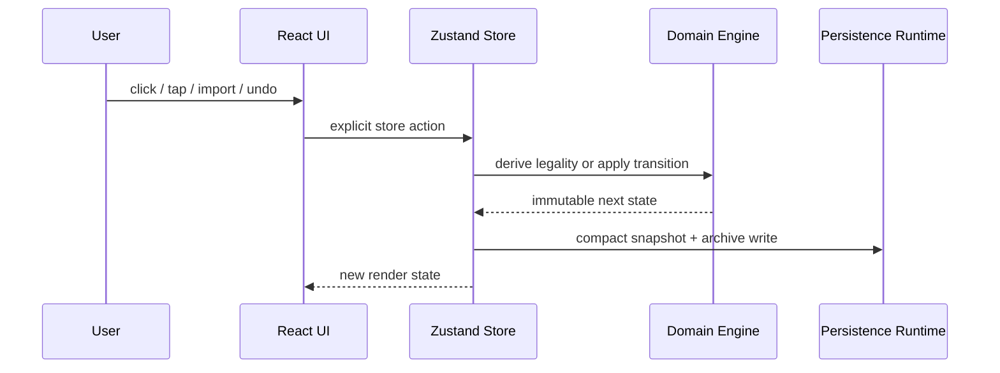
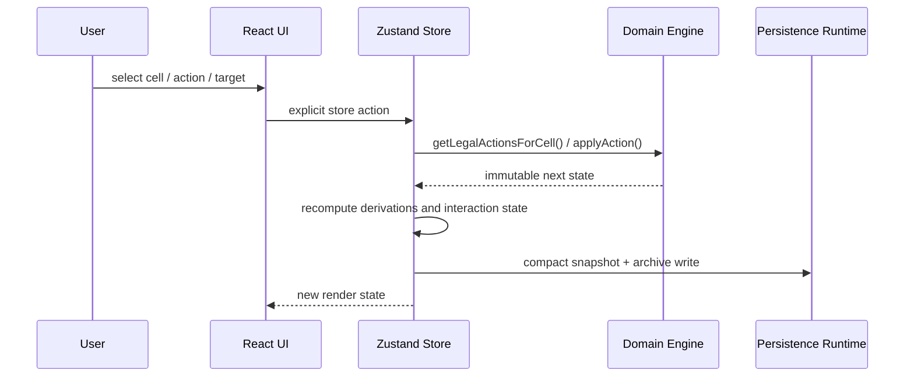
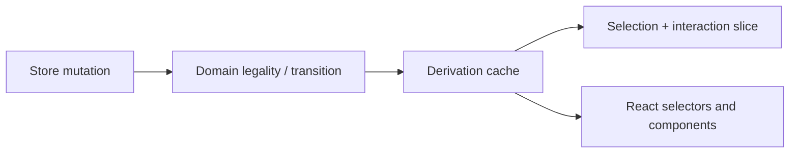
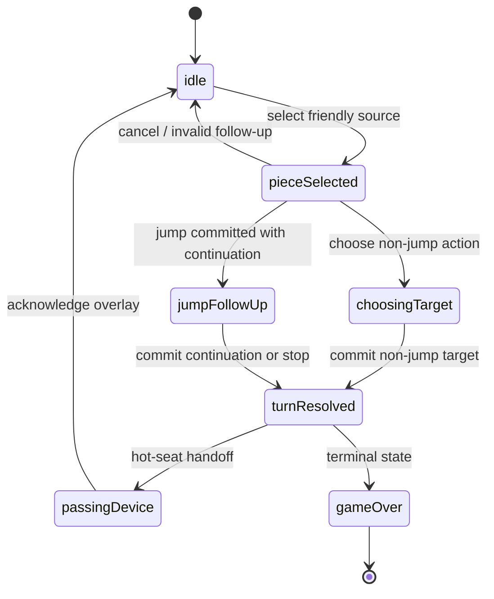
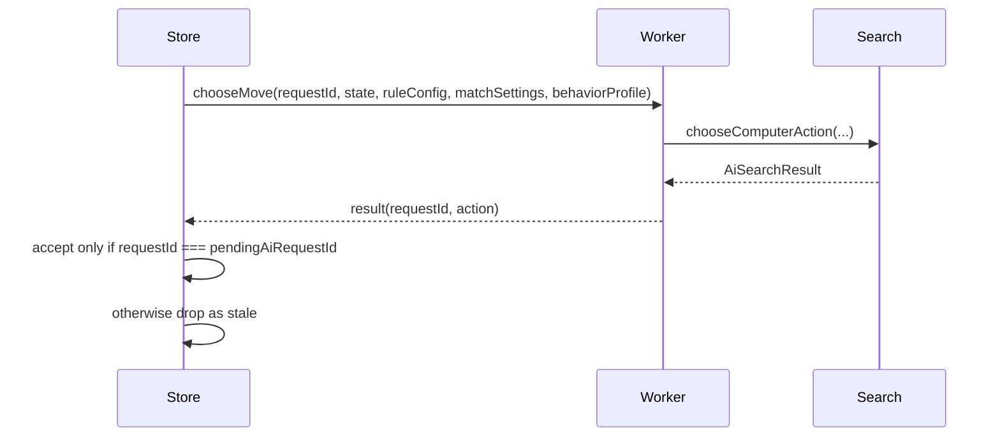
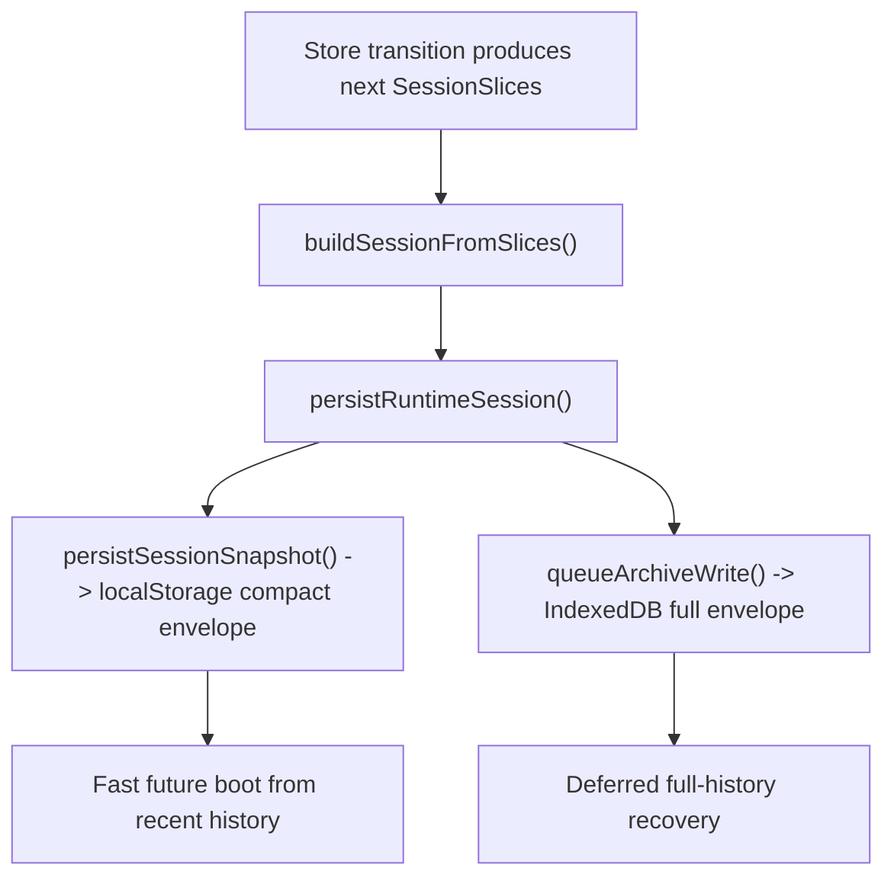
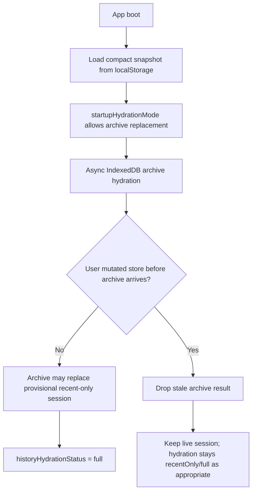
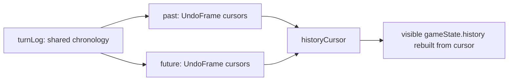
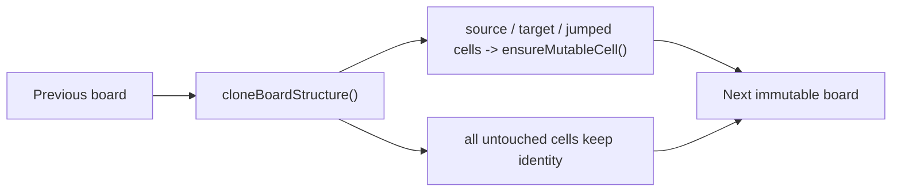

# Cross-Cutting Runtime Architecture

**Copyright (c) 2026 Kostiantyn Stroievskyi. All Rights Reserved.**

No permission is granted to use, copy, modify, merge, publish, distribute, sublicense, or sell copies of this software or any portion of it, for any purpose, without explicit written permission from the copyright holder.

---

This document describes the application runtime around the domain engine: store composition, AI worker orchestration, persistence, hydration, undo/redo, and the tests that keep those boundaries stable.

The key architectural fact is that YOUI is not "just" a rule engine with a UI on top. The browser application must reconcile synchronous rules, asynchronous AI, persistent local state, imported sessions, and replayable history without letting those concerns leak into each other.

## Data Flow

The runtime is deliberately unidirectional:



The UI never defines legality and the domain never touches browser APIs directly. The store is the coordination layer between them.

### Human move flow



## Store Composition

[`createGameStore()`](../src/app/store/createGameStore.ts) assembles the runtime from focused modules under [`src/app/store/createGameStore/`](../src/app/store/createGameStore/).

The main slices are:

| Slice | Representative fields | Why it exists |
| --- | --- | --- |
| Session truth | `ruleConfig`, `preferences`, `matchSettings`, `aiBehaviorProfile`, `gameState`, `turnLog`, `past`, `future` | Persistent, replayable match state, including hidden computer-opponent style |
| Session cursor | `historyCursor`, `historyHydrationStatus` | Tracks how much of the historical archive is live |
| Draft setup | `setupMatchSettings` | Editable new-match configuration kept separate from the committed live match settings |
| Interaction state | `selectedCell`, `selectedActionType`, `selectedTargetMap`, `availableActionKinds`, `draftJumpPath`, `legalTargets`, `interaction` | Encodes input flow without putting rule logic in the UI |
| Derived read models | `selectableCoords`, `scoreSummary` | Precomputed projections consumed heavily by the view |
| Asynchronous peripherals | `aiStatus`, `pendingAiRequestId`, `lastAiDecision`, `importBuffer`, `importError`, `exportBuffer` | Isolates worker and persistence side effects |

Two implementation details are easy to miss:

- `setupMatchSettings` is intentionally distinct from `matchSettings`. The former is draft UI configuration for the next game; the latter is the committed configuration of the current persisted match.
- `aiBehaviorProfile` is intentionally committed session truth rather than ephemeral worker state. A resumed computer game should feel like the same opponent, so the hidden persona persists until a brand-new computer match is started.
- `turnLog` plus `past` and `future` looks redundant until you inspect the data model. `turnLog` stores the shared chronology once; `past` and `future` store cheap `UndoFrame` cursors into that chronology rather than duplicating whole histories.

Important modules:

- [`stateCreator.ts`](../src/app/store/createGameStore/stateCreator.ts): store assembly and post-create hooks
- [`selection.ts`](../src/app/store/createGameStore/selection.ts): UI interaction state machine
- [`transitions.ts`](../src/app/store/createGameStore/transitions.ts): domain transitions plus persistence and AI synchronization
- [`aiController.ts`](../src/app/store/createGameStore/aiController.ts): worker lifecycle, request ids, watchdogs, reveal pacing
- [`persistence.ts`](../src/app/store/createGameStore/persistence.ts) and [`persistenceRuntime.ts`](../src/app/store/createGameStore/persistenceRuntime.ts): boot hydration and browser storage integration
- [`derivations.ts`](../src/app/store/createGameStore/derivations.ts): derived board/cell projections

### Store bootstrap path

The exact runtime assembly is:

```text
createGameStore()
  -> getInitialPersistenceState()
  -> createGameStoreStateRuntime()
  -> createStore(runtime.stateCreator)
  -> runPostCreate()
```

Each step has a different responsibility:

1. `createGameStore()` selects the concrete browser storage and archive facilities for this store instance.
2. `getInitialPersistenceState()` chooses the fastest trustworthy startup session before async archive hydration begins.
3. `createGameStoreStateRuntime()` wires persistence, AI control, derivation caches, and public actions around one `set/get` pair.
4. `runPostCreate()` defers boot-time side effects such as initial persistence sync, archive hydration, and immediate computer-turn retries until the store object exists.

The startup choice inside `getInitialPersistenceState()` follows a strict source-of-truth order:

1. injected `initialSession`, used by tests and explicit callers;
2. the current `youi/session/v4` compact persisted envelope from `localStorage`;
3. legacy serialized session keys migrated through `deserializeSession()`;
4. a fresh default session when nothing trustworthy exists.

### Why derivations are their own concern

The derivation cache exists so the view layer does not repeatedly re-solve expensive board facts on its own. Board-level selectors such as `selectableCoords` and `scoreSummary`, and cell-level selectors such as `availableActionKinds` and `selectedTargetMap`, are derived once inside the store and then projected into React.

That matters for two reasons:

- the UI receives a coherent interaction payload that has already been checked against the current domain state;
- derivations can be reused safely across renders as long as the underlying board or selection inputs have not changed.



## Interaction Ownership

The store, not the view, owns the interaction protocol.

That matters because YOUI has rule-dependent flows that are easy to mishandle if a component infers them locally:

- jump follow-up turns constrained by `pendingJump`;
- temporary read-only states while the AI is thinking;
- pass-device overlays in hot-seat mode;
- undo/redo cursors that may not point at the live tail of the turn log.

The concrete state machine is encoded in the `interaction` field and surfaced through selectors and public actions rather than being reconstructed inside React components.

The interaction slice also carries the stepwise targeting payload the UI needs:

- `availableActionKinds` for the selected source;
- `selectedTargetMap` grouped by action kind;
- `draftJumpPath` while a human is sketching a multi-segment jump;
- `legalTargets` for the currently committed sub-step.

The explicit interaction states are:

| State | Meaning |
| --- | --- |
| `idle` | no active selection |
| `pieceSelected` | a source cell is selected and action kinds are available |
| `choosingTarget` | a non-jump action kind was chosen and the user must choose a target |
| `buildingJumpChain` | the UI is previewing a drafted jump path before commit |
| `jumpFollowUp` | a jump segment has resolved and the same source may continue acting |
| `turnResolved` | the move is committed and the next turn handoff is being processed |
| `passingDevice` | hot-seat privacy overlay between turns |
| `gameOver` | terminal read-only state |



## AI Worker Protocol

The AI is isolated in [`src/ai/worker/ai.worker.ts`](../src/ai/worker/ai.worker.ts) and controlled by [`aiController.ts`](../src/app/store/createGameStore/aiController.ts).



### Why a worker exists

Search can take hundreds of milliseconds to over a second on harder settings. Running that synchronously on the main thread would stall input and paint.

### How stale replies are handled

The store assigns a monotonically increasing `requestId` to each worker request. When a response arrives, the store accepts it only if `message.requestId === pendingAiRequestId`.

That means stale replies are dropped for correctness and responsiveness. The point is not to preserve cross-request transposition-table state; each search builds its own in-memory search context. The point is to ensure that an old computation cannot mutate a newer board state.

### Watchdogs and cold start

`aiController.ts` also manages:

- a per-request watchdog derived from the difficulty time budget plus buffers;
- a larger first-request buffer for cold worker/model startup;
- reveal pacing between chained AI jumps via `AI_MOVE_REVEAL_MS`;
- worker disposal on error paths and on state transitions that invalidate the current request.

Behavioral coverage for these cases lives primarily in [`src/app/store/createGameStore.ai.test.ts`](../src/app/store/createGameStore.ai.test.ts).

### Persona and risk ownership

The worker does not invent opponent identity on its own. The store chooses one hidden persona per computer match and persists it with the session:

- `startNewGame()` hashes a fresh session id into one of `expander`, `hunter`, or `builder`;
- hot-seat games explicitly keep `aiBehaviorProfile = null`;
- restore, import, compact storage, and archive hydration all preserve the same persona if the match already had one.

Risk mode is deliberately not persisted. Search recomputes it from the live board and recent history on every turn:

- `normal`: default search behavior;
- `stagnation`: repetition, low displacement, low mobility change, and flat progress suggest the game is stalling;
- `late`: unresolved position with `moveNumber >= 70`.

That separation is intentional. Persona is match identity; risk mode is live board interpretation.

## Persistence And Hydration

Persistence is intentionally layered.

### Two storage tiers

- `localStorage`: compact, synchronous, boot-critical snapshot
- IndexedDB: full archive for longer histories and rehydration

This split avoids the usual local-first trade-off between fast startup and full historical fidelity. The app can boot immediately from the compact envelope while continuing to recover the archive asynchronously.

The versions involved are intentionally distinct:

- browser storage key: `youi/session/v4`
- app-level persisted envelope version: `1`
- embedded serializable session version: `4`

Those numbers describe different layers and therefore are not expected to match.

### Storage write path

After a committed session mutation, the persistence flow is:



This is implemented through [`sessionPersistence.ts`](../src/app/store/sessionPersistence.ts), [`persistence.ts`](../src/app/store/createGameStore/persistence.ts), and [`persistenceRuntime.ts`](../src/app/store/createGameStore/persistenceRuntime.ts):

- `createCompactSession()` builds the fast-boot recent-history window;
- `persistSessionSnapshot()` writes the compact envelope to `localStorage`;
- `queueArchiveWrite()` serializes full-history archive writes so IndexedDB persistence stays ordered.

Session `v4` is the first canonical payload that persists hidden computer-opponent identity explicitly:

- `matchSettings` stores the committed mode, side ownership, and exposed difficulty;
- `aiBehaviorProfile` stores the hidden per-match persona;
- `riskMode` is recomputed during search and is therefore never stored.

### Hydration states

`historyHydrationStatus` makes the boot state explicit:

- `hydrating`: the store is trying to recover the full archive
- `recentOnly`: only the compact recent window is available
- `full`: the full session history is present in memory



That public status is separate from the internal `startupHydrationMode` boot policy in `persistenceRuntime.ts`. The internal mode tracks whether the store started from compact or default data and whether archive hydration is still allowed to overwrite the provisional state. Once the user mutates the store, the startup mode is consumed and stale archive results are no longer allowed to replace the live session.

The persistence behavior is covered in [`src/app/store/createGameStore.persistence.test.ts`](../src/app/store/createGameStore.persistence.test.ts).

### Session migration policy

The domain deserializer now normalizes every imported payload into `SerializableSessionV4`:

- `v1`: nested `present` / `past` / `future` game states;
- `v2`: shared `turnLog` plus `UndoFrame` cursors;
- `v3`: `v2` plus `matchSettings`;
- `v4`: `v3` plus `aiBehaviorProfile`.

Legacy sessions migrate with `aiBehaviorProfile: null`. That is deliberate: older payloads never encoded opponent-style identity, so the canonical restore path preserves correctness first instead of inventing a persona retroactively.


*The app boots from a compact synchronous snapshot first, hydrates the full archive later, and refuses to let a stale archive overwrite a session the user has already changed.*

## Session History And Undo/Redo

YOUI treats history as a first-class runtime artifact rather than a debugging convenience.

The main structures are:

- `turnLog`: canonical chronology of committed turns
- `past`: undo frames
- `future`: redo frames
- `historyCursor`: current position inside the chronology



Undo/redo does not fork whole copies of match history. Instead, the store rebuilds the visible `gameState.history` from the shared canonical `turnLog` and the active cursor.

This keeps replay, import/export, and AI context consistent with the same source chronology. The cursor behavior is exercised in [`src/app/store/createGameStore.history.test.ts`](../src/app/store/createGameStore.history.test.ts).


*Undo and redo do not duplicate whole game histories; they move a lightweight cursor across one canonical turn log.*

## Persistence Trust Boundary

Imported or restored sessions are not trusted blindly. The domain serialization layer performs:

- schema migration;
- validation of session structure;
- normalization of position counts and other derived fields.

The runtime therefore treats persistence as an optimization boundary, not as an authority boundary.

That keeps persisted state from becoming a second rule engine. The authoritative interpretation remains the runtime domain code in [`src/domain/`](../src/domain/).

## Structural Sharing And Rendering

The runtime relies on a key cooperation between layers:

- the domain reducer returns immutable external state;
- internal move application uses structural sharing so untouched cells keep their identity;
- the UI can memoize board components safely because unchanged cells remain referentially equal.



The key implementation detail is in the domain board helpers:

- `cloneBoardStructure()` clones only the board record;
- `ensureMutableCell()` deep-clones a cell only the first time a move path touches it;
- untouched coordinates keep their original references.

That gives the codebase three useful properties at once:

- immutable public transitions for correctness;
- low cloning overhead inside the AI search path;
- safe referential equality checks in memoized React board components.

This is why performance-sensitive rendering optimizations in the view do not need to invent their own caching protocol, and why the AI can simulate deep trees without paying for a whole-board deep clone on every ply.


## Testing Philosophy

The test suites are written as behavioral contracts for subsystem boundaries.

Representative coverage:

- [`src/domain/rules/gameEngine.moves.test.ts`](../src/domain/rules/gameEngine.moves.test.ts): rule semantics, jump behavior, freeze/thaw outcomes
- [`src/domain/rules/gameEngine.actions.test.ts`](../src/domain/rules/gameEngine.actions.test.ts): action legality and reducer boundaries
- [`src/app/store/createGameStore.ai.test.ts`](../src/app/store/createGameStore.ai.test.ts): worker orchestration, stale replies, watchdogs, AI pacing
- [`src/app/store/createGameStore.persistence.test.ts`](../src/app/store/createGameStore.persistence.test.ts): storage, hydration, stale archive handling
- [`src/app/store/createGameStore.history.test.ts`](../src/app/store/createGameStore.history.test.ts): undo/redo and cursor behavior
- [`src/ai/search.behavior.test.ts`](../src/ai/search.behavior.test.ts) and related AI tests: search correctness, timeout fallback, and heuristic behavior

The point of the tests is not only regression prevention. They are the executable form of the repository's cross-layer contracts.

## Boundary Of This Document

This file explains runtime coordination, not rule semantics or search formulas.

- exact rules and invariants: [`src/domain/README.md`](../src/domain/README.md)
- AI architecture and lineage: [`src/ai/README.md`](../src/ai/README.md)
- heuristic formulas: [`src/ai/HEURISTICS.md`](../src/ai/HEURISTICS.md)
