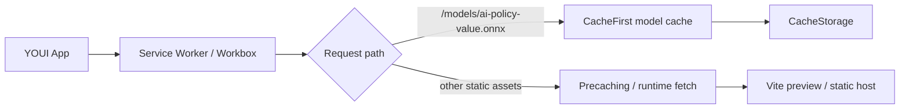
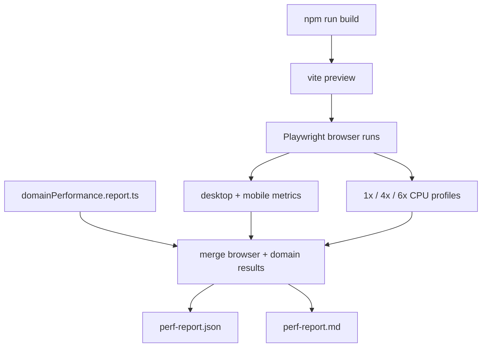

# PWA Infrastructure and Report Tooling

**Copyright (c) 2026 Kostiantyn Stroievskyi. All Rights Reserved.**

No permission is granted to use, copy, modify, merge, publish, distribute, sublicense, or sell copies of this software or any portion of it, for any purpose, without explicit written permission from the copyright holder.

---

This document covers the browser runtime infrastructure around YOUI rather than the game logic itself: Progressive Web App configuration, lazy model delivery, and the scripts that emit performance and AI-behavior reports.

The key design constraint is local-first execution. The application must remain playable, searchable, and inspectable without a backend service.

## PWA Configuration

[`vite.config.ts`](../vite.config.ts) defines the PWA boundary through `vite-plugin-pwa`.

Important settings:

- `registerType: 'prompt'`: update flow is explicit rather than silently replacing a running app;
- `navigateFallback: 'index.html'`: client-side routing keeps working offline;
- `maximumFileSizeToCacheInBytes: 32 * 1024 * 1024`: large static assets, including the optional model, are cacheable;
- manifest metadata defines standalone installability, icons, theme color, and background color.
- the concrete manifest colors are `theme_color: '#e8dfd2'` and `background_color: '#f9f3e8'`;
- the icon set is `pwa-192x192.png`, `pwa-512x512.png`, and the maskable `pwa-maskable-512x512.png`.

## Optional Model Delivery

The optional ONNX artifact lives at `/models/ai-policy-value.onnx`. The runtime handles it in two layers:

1. [`src/ai/model/guidance.ts`](../src/ai/model/guidance.ts) probes the asset with a small ranged `GET` and loads `onnxruntime-web` only when the file looks like a real model.
2. [`vite.config.ts`](../vite.config.ts) applies a `CacheFirst` Workbox rule for that exact pathname with a 30-day retention window and `200`/`206` cacheable responses.

That split avoids bundling neural inference payloads into the main application path while still allowing offline reuse once the file has been fetched successfully.

## Why The Model Stays Outside The Bundle

The model is optional infrastructure, not a product prerequisite. Bundling it into the main JavaScript path would penalize hot-seat users and first-load performance for a feature they may never use. Keeping it in `public/models/` and loading it lazily preserves the following properties:

- the baseline app remains lightweight;
- the AI still works when no model file exists;
- browser inference failures degrade to heuristic search rather than blocking gameplay.

## Performance Report Pipeline

[`scripts/perf-report.mjs`](../scripts/perf-report.mjs) is the main performance harness. It does more than snapshot one page load:

- runs `vite preview` against the built app;
- launches Playwright against that preview;
- measures browser timings on desktop and mobile-style viewports;
- applies CPU throttling through Chrome DevTools for the default mobile profile set `1x`, `4x`, and `6x`;
- merges the browser results with the domain benchmark JSON produced by [`scripts/domainPerformance.report.ts`](../scripts/domainPerformance.report.ts).

Outputs:

- [`output/playwright/perf-report.json`](../output/playwright/perf-report.json): canonical machine-readable report;
- [`output/playwright/perf-report.md`](../output/playwright/perf-report.md): generated human-readable summary.

The harness covers more than one cold-load number. The browser side measures:

- initial navigation, paint, layout-shift, long-task, and DOM-size metrics;
- board interaction latency for opening the move dialog, choosing an action, and committing a move;
- compact-layout tab switching on the mobile viewport profile;
- fresh-match AI reply timing after human or computer opening ownership is configured;
- imported late-game hard-AI replies from serialized sessions.

The imported-session fixtures are deterministic and come from [`scripts/lateGamePerfFixtures.ts`](../scripts/lateGamePerfFixtures.ts). The current labels are `opening`, `turn50`, `turn100`, and `turn200`.

The domain-side report merged into the same JSON also measures root-ordering reuse on those fixtures by comparing a baseline full reordering loop against the optimized `precomputeOrderedActions()` plus `orderPrecomputedMoves()` path.

The Markdown file is a report artifact, not hand-authored documentation. Its prose should therefore explain methodology and thresholds, but the numeric body should always come from the generator.

## Archival Baselines And Comparisons

The repository also keeps historical comparison artifacts:

- [`output/playwright/perf-report.before.json`](../output/playwright/perf-report.before.json): baseline machine snapshot;
- [`output/playwright/perf-report.before.md`](../output/playwright/perf-report.before.md): archival baseline summary;
- [`output/playwright/perf-report.before-after.md`](../output/playwright/perf-report.before-after.md): generated comparison between baseline and current report JSON.

The comparison file is now generated from JSON by [`scripts/compare-perf-reports.mjs`](../scripts/compare-perf-reports.mjs). That keeps the comparison reproducible and prevents the Markdown from drifting away from the underlying measurements.

## AI Variety Report Pipeline

[`scripts/ai-variety.report.ts`](../scripts/ai-variety.report.ts) runs the offline self-play behavior suite defined in [`src/ai/test/metrics.ts`](../src/ai/test/metrics.ts).

Outputs:

- [`output/ai/ai-variety-report.json`](../output/ai/ai-variety-report.json): structured report;
- [`output/ai/ai-variety-report.md`](../output/ai/ai-variety-report.md): generated summary.
- [`output/ai/ai-stage-variety-report.json`](../output/ai/ai-stage-variety-report.json): structured opening-versus-late-stage continuation report;
- [`output/ai/ai-stage-variety-report.md`](../output/ai/ai-stage-variety-report.md): generated stage-by-stage summary.
- [`output/ai/ai-crossplay-report.json`](../output/ai/ai-crossplay-report.json): difficulty-vs-difficulty and persona-vs-persona matrix data;
- [`output/ai/ai-crossplay-report.md`](../output/ai/ai-crossplay-report.md): human-readable cross-play matrix summary;
- [`output/ai/ai-loop-benchmark-report.json`](../output/ai/ai-loop-benchmark-report.json): late-stage loop/escape benchmark data;
- [`output/ai/ai-loop-benchmark-report.md`](../output/ai/ai-loop-benchmark-report.md): generated loop benchmark summary;
- [`output/ai/ai-position-buckets-report.json`](../output/ai/ai-position-buckets-report.json): structural-bucket AI behavior report;
- [`output/ai/ai-position-buckets-report.md`](../output/ai/ai-position-buckets-report.md): generated bucket summary;
- [`output/ai/ai-threat-report.json`](../output/ai/ai-threat-report.json): pressure/threat-oriented trace diagnostics;
- [`output/ai/ai-threat-report.md`](../output/ai/ai-threat-report.md): generated pressure report.

The generator compares current results against two checked-in fixtures:

- [`src/ai/test/fixtures/ai-variety-target-bands.json`](../src/ai/test/fixtures/ai-variety-target-bands.json): status thresholds;
- [`src/ai/test/fixtures/ai-variety-baselines.json`](../src/ai/test/fixtures/ai-variety-baselines.json): regression baseline.

That distinction matters. A metric can be inside its acceptable target band yet still regress against the previous known-good baseline, or vice versa.

The current harness intentionally exercises the same product behavior that ships in browser play:

- each side receives a hidden behavior profile (`expander`, `hunter`, or `builder`) derived from the mirrored seed pair;
- each search trace records the returned `behaviorProfileId` and `riskMode`;
- late or stagnating games therefore show up in the report as deliberate style/risk changes rather than as unexplained variance.

The Markdown summary is intentionally opinionated rather than exhaustive. It now foregrounds decisive-play health through `decisiveResultShare` alongside repetition, stagnation, decompression, mobility release, tension, and composite interestingness.

The complementary stage report exists because the aggregate suite can hide where a behavioral change really helps or hurts. `npm run ai:stage-variety` reruns the same mirrored self-play metrics from four fixed starting positions: the normal opening plus the deterministic `turn50`, `turn100`, and `turn200` imported states used by the performance harness. Those late fixtures are replayed with draws disabled and then normalized into playable continuation states by keeping only the recent history window and rebuilding repetition counts for that window; otherwise the shipped threefold rule would make those imported positions terminal before the AI can be evaluated. The report also summarizes `riskMode` activation shares, so a late-game latency increase can be interpreted alongside the amount of actual stagnation/late-risk behavior being exercised. Because the normalization intentionally discards long-range repetition memory, early `stagnation` activation can look weaker there than on the raw full-history perf fixtures; the stage report and perf fixtures should therefore be read together.

The wider report family exists because "interestingness" is not one scalar:

- `npm run ai:crossplay` asks whether the behavior remains distinct and competitive across difficulty tiers and forced personas.
- `npm run ai:loop-benchmark` isolates the cyclic late-stage fixtures and measures recurrence, laminarity, trapping time, loop-escape rates, and symbolic complexity.
- `npm run ai:position-buckets` aggregates scenarios into structural buckets (`opening`, `congested`, `loopPressure`, `conversionRace`, `lateSparse`) so one pathological fixture does not overrule the whole judgment.
- `npm run ai:threat` measures pressure creation directly from chosen moves: freeze swings, frontier compression, and certified risk progress.

These newer reports combine the core variety metrics from [`src/ai/test/metrics.ts`](../src/ai/test/metrics.ts) with nonlinear trace analytics from [`src/ai/test/advancedMetrics.ts`](../src/ai/test/advancedMetrics.ts). The current advanced metric family includes:

- recurrence quantification analysis over visited-state sequences (`recurrenceRate`, `determinism`, `laminarity`, `trappingTime`);
- sample entropy and permutation entropy over evaluation-score traces;
- normalized symbolic Lempel-Ziv complexity over visited-position sequences;
- explicit loop-escape latency metrics once risk activation or loop pressure appears.

When the intended shipped AI behavior changes materially, the workflow is:

1. run `npm run ai:variety`;
2. run `npm run ai:stage-variety` when a change is specifically meant to affect flat midgame or late-game behavior;
3. run one or more focused pipelines (`ai:loop-benchmark`, `ai:threat`, `ai:position-buckets`, `ai:crossplay`) when the change claims to improve loops, pressure, or style diversity rather than only aggregate variety;
4. inspect the generated JSON and Markdown;
5. update `src/ai/test/fixtures/ai-variety-baselines.json` only if the new aggregate behavior is the new accepted baseline;
6. keep `src/ai/test/fixtures/ai-variety-target-bands.json` as the longer-lived product target file rather than rewriting it for every iteration.

## Git-Aware Report Comparison

[`scripts/run-git-report-compare.mjs`](../scripts/run-git-report-compare.mjs) is the shared compare wrapper for report pipelines. It accepts a pipeline name plus `--before=<ref|working>` and `--after=<ref|working>`, materializes the requested snapshots, reruns the pipeline, flattens the numeric leaves from both JSON outputs, and writes a Markdown diff report.

Current compare wrappers:

- `npm run ai:variety:compare`
- `npm run ai:stage-variety:compare`
- `npm run ai:crossplay:compare`
- `npm run ai:loop-benchmark:compare`
- `npm run ai:position-buckets:compare`
- `npm run ai:threat:compare`
- `npm run perf:compare:git`

The compare layer supports three common workflows directly:

- compare `HEAD` or `HEAD~N` against the current unstaged tree by passing `--after=working`;
- compare one branch, tag, or commit against another branch, tag, or commit;
- rerun the same working tree twice with different pipeline flags, for example a short smoke run versus a full default run.

The comparison script intentionally tolerates a non-zero exit code when the expected JSON report still exists. This matters for behavior gates such as `ai:variety`, which can exit non-zero purely because the report detected a regression.

One limitation remains structural rather than tooling-related: a comparison only works when the target ref still exposes the data and exports required by that pipeline. For example, a brand-new nonlinear trace report cannot be meaningfully run against a historical ref from before the corresponding telemetry existed in the AI trace layer.

## Operational Commands

The repository exposes the infrastructure/report commands through `package.json`:

- `npm run build`
- `npm run ai:crossplay`
- `npm run ai:loop-benchmark`
- `npm run ai:position-buckets`
- `npm run perf:report`
- `npm run perf:compare`
- `npm run perf:compare:git`
- `npm run ai:stage-variety`
- `npm run ai:threat`
- `npm run ai:variety`
- `npm run ai:crossplay:compare`
- `npm run ai:loop-benchmark:compare`
- `npm run ai:position-buckets:compare`
- `npm run ai:stage-variety:compare`
- `npm run ai:threat:compare`
- `npm run ai:variety:compare`
- `npm run docs:check-links`

The last command is intentionally part of the documentation toolchain. Broken relative links are a documentation defect, and the repository now treats them as checkable.

## Boundary Of This Document

This file does not explain search algorithms, heuristic formulas, or domain legality. Those belong elsewhere:

- game and state semantics: [`src/domain/README.md`](../src/domain/README.md)
- AI architecture and lineage: [`src/ai/README.md`](../src/ai/README.md)
- heuristic formulas: [`src/ai/HEURISTICS.md`](../src/ai/HEURISTICS.md)
