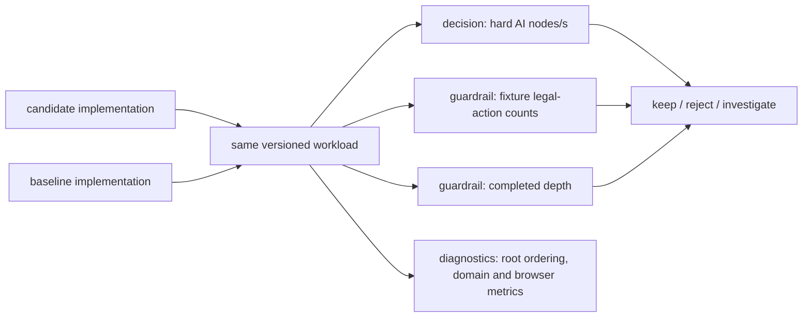
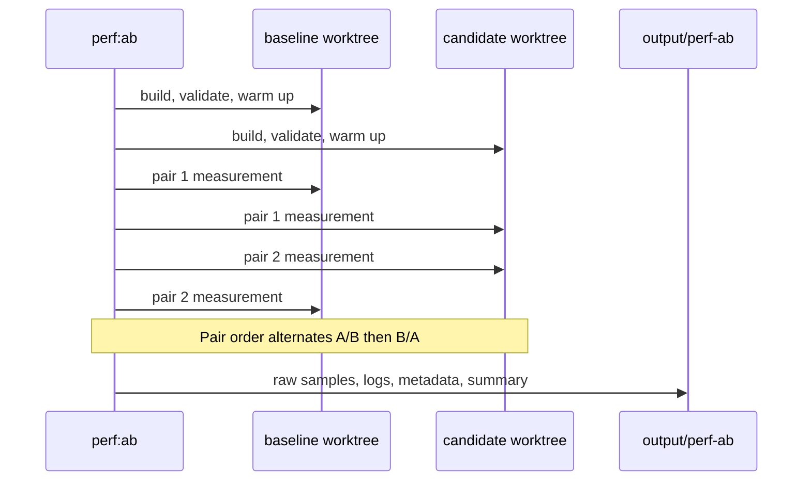

# Performance A/B Testing

Use `perf:ab` to compare two immutable Git revisions under the same workload,
dependencies, build settings, hardware, and counterbalanced run schedule.

This document is the canonical decision protocol for performance work. It does
not replace [`INFRASTRUCTURE.md`](./INFRASTRUCTURE.md), which explains the
report-producing tools, or [`src/ai/README.md`](../src/ai/README.md), which
explains the search implementation. Its narrower question is:

> Did this candidate make the intended workload materially faster without
> reducing the guarded search quality or changing the exercised legal-action
> workload?

## What Is Being Tested

The default `domain` pipeline runs the deterministic domain/AI workload
`domain-ai-v1`. Its decision metric is hard-mode average nodes per second. AI
wall time is intentionally diagnostic rather than decisive: hard AI is governed
by a time budget, so a faster implementation normally spends approximately the
same wall time searching more nodes.

The `full` pipeline runs the production browser report as well. It retains the
same embedded domain workload and adds browser, mobile CPU-profile, interaction,
long-task, layout-shift, and delivered-JavaScript metrics. Use it when a change
can affect the shipped application surface; use `domain` for a fast, focused
search/domain experiment.



The runner never requires the chosen action itself to be identical. A
time-bounded search can legally choose a different move when it reaches more
nodes or completes a deeper iteration. It does require the fixture labels and
legal-action counts to match, which prevents accidentally comparing different
rule states or different workloads.

## Experiment contract

- Decision: keep, reject, or investigate a performance change.
- Default decision metric: hard-mode AI nodes per second.
- Material improvement label: the lower bound of the paired 95% bootstrap
  interval must be at least 5%.
- Smaller positive changes may still be retained when the interval excludes
  regression, exact-equivalence tests pass, game-quality reports do not move,
  and the implementation removes a demonstrated cost without disproportionate
  complexity. They remain `null-result` rather than being described as a
  material or confirmed win.
- Correctness invariants: both revisions build and pass the non-benchmark test
  suite; fixture labels and legal-action counts must match.
- Quality guardrail: median completed search depth must not decrease for any
  recorded AI fixture.
- Artifact guardrails in the full pipeline: JavaScript bytes may grow by at
  most 1%. Browser layout-shift and long-task guardrails use explicit absolute
  tolerances and require at least ten pairs before they can prove a regression;
  smaller runs remain inconclusive.
- Selected moves are recorded but are not required to be identical. A faster
  time-budgeted search can legitimately finish more work and select a different
  legal move without changing game logic.

## Why The Protocol Is Structured This Way

Performance work in this repository has three distinct claims, and the runner
tests them separately:

1. **Mechanism:** a change removes or shortens a local cost, such as duplicate
   feature extraction or repeated object construction. Root-ordering and domain
   metrics help explain this claim.
2. **End-to-end throughput:** the full bounded search processes more useful
   work. Hard-mode nodes per second is the default decision metric.
3. **Safety:** the candidate still receives the same legal-action workload and
   does not reduce the completed search depth on a recorded fixture.

For AI changes, safety also includes the offline behavior surface. A throughput
gain is not sufficient when variety, participation, repetition, persona share,
or composite interestingness regresses. Use the immutable-revision variety and
stage-variety comparisons for this check; direct participation aggregates are
`meanParticipationDelta` and `positiveParticipationPlyShare`.

The separation prevents a fast microbenchmark from being mistaken for a faster
AI. Amdahl's law applies: even a large speedup in move ordering can yield a much
smaller whole-search gain if state transition, victory evaluation, recursion,
or garbage collection still dominate the remaining time.

It also matters that YOUI is a selective, time-bounded alpha-beta search.
Move ordering is not merely presentation: after dynamic ordering, quiet moves
are trimmed to the active preset's `quietMoveLimit`. A proposed change that
changes which quiet moves are admitted is a search-policy change and requires
AI-quality evaluation in addition to a performance measurement. In contrast,
reusing an already-computed `PositionAnalysis` or an already-built
participation profile preserves the same search inputs and ranking formula.

The paired design addresses slow run-to-run drift from CPU frequency, garbage
collection, JIT state, and background activity. Each pair supplies a relative
improvement:

```text
higher-is-better: (candidate - baseline) / |baseline| * 100
lower-is-better:  (baseline - candidate) / |baseline| * 100
```

The runner takes the median paired improvement and calculates a deterministic
non-parametric bootstrap interval by resampling paired improvements with
replacement. This is deliberately an interval for the recorded workload, not a
claim that the change is universally faster on every browser, device, or game
position.

## Usage

Run a cheap validation of refs, dependency identity, and the paired schedule:

```bash
pnpm perf:ab --baseline=main --candidate=my-performance-branch --dry-run
```

Run the default AI/domain experiment with 20 paired samples:

```bash
pnpm perf:ab --baseline=main --candidate=my-performance-branch
```

Run the production browser pipeline, which adds UI, startup, mobile CPU
profiles, delivered bundle sizes, and worker-driven AI interactions:

```bash
pnpm perf:ab \
  --baseline=main \
  --candidate=my-performance-branch \
  --pipeline=full
```

Useful controls:

```text
--pairs=20                    paired sample count; minimum 2
--minimum-decision-pairs=10   samples required for a performance verdict
--minimum-improvement=5       required paired improvement percentage
--bootstrap-samples=4000      deterministic bootstrap resamples
--root-order-iterations=24    work per root-ordering benchmark sample
--out=output/perf-ab          artifact parent directory
--skip-build                  local smoke testing only
--skip-validation             local smoke testing only
```

The runner deliberately rejects `working` as a target, aliases resolving to the
same commit, and revisions with different `pnpm-lock.yaml` contents. Those cases
would confound code effects with mutable source or dependency drift.

## Execution model

1. Resolve both refs to commit SHAs.
2. Verify identical lockfiles.
3. Create detached temporary worktrees and reuse the current dependency store.
4. Build and test both revisions once.
5. Run one unmeasured warmup per revision.
6. Alternate pair order as `A B`, `B A`, `A B`, `B A`, and so on.
7. Preserve every raw report and command log.
8. Calculate paired improvements and deterministic bootstrap intervals.
9. Emit `experiment.json` and a human-readable `report.md`.



Before any measurement, the runner verifies that both refs resolve to distinct
commits and that their `pnpm-lock.yaml` contents are identical. It creates
detached temporary worktrees, symlinks the current dependency store, builds and
runs the non-benchmark suite in each worktree, and refuses a workspace that
modified tracked files during validation. This guards against dependency drift,
an accidental mutable working tree, and side effects from a benchmark rather
than treating a timing number as self-authenticating.

Output is written under `output/perf-ab/<run-id>/` and ignored by Git because a
full run can produce many large raw artifacts.

Each run directory contains the resolved revision metadata and schedule in
`experiment.json`, the human-readable verdict in `report.md`, validation and
measurement logs, warmups, and the raw baseline/candidate reports for every
pair. Inspect the raw artifacts before explaining an unexpected result; the
Markdown summary is a decision aid, not a substitute for those observations.

## Interpretation

A result is one of:

- `confirmed-win`: every decision metric clears materiality and guardrails pass;
- `null-result`: the measured effect is confidently below materiality;
- `inconclusive`: the confidence interval overlaps the decision boundary;
- `regression`: a decision metric or guardrail becomes worse.

`minimum-decision-pairs` defaults to 10. A smaller exploratory run can reveal a
promising mechanism or an obvious regression, but it cannot establish the
default keep verdict. Similarly, a positive interval below the configured 5%
materiality threshold is a `null-result`, not an accepted primary performance
win. This protects the codebase from accumulating complexity for noise-level
effects.

Micro and domain metrics explain mechanisms. Only the `full` pipeline provides
browser-level evidence. Neither pipeline generalizes beyond its recorded
hardware, revisions, fixtures, and runtime metadata.

## Reading A Report Without Overclaiming

Use the fields in this order:

1. Confirm that the baseline/candidate commits, pipeline, workload identifier,
   sample count, and materiality threshold are the intended ones.
2. Read the decision-metric median and both bounds of its 95% interval.
3. Check legal-action fixture identity and completed-depth guardrails before
   treating a throughput number as a win.
4. Use root-ordering and domain timings to explain the mechanism, not to
   override the decision metric.
5. For `full` runs, inspect browser and artifact guardrails separately; a
   domain win does not automatically prove a browser win.

The final report explicitly records its limits: it proves only the two recorded
revisions, workload, environment, and pipeline. It cannot by itself prove
playing strength, product desirability, or performance on unmeasured hardware.
