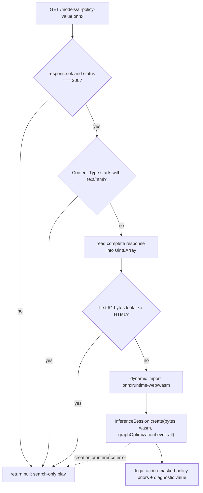
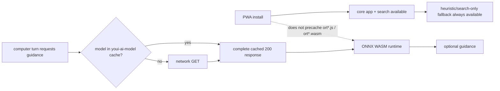

# Model Artifact Slot

Place the exported ONNX guidance model here as `ai-policy-value.onnx`.

This directory is a deployment slot, not a source directory. The browser worker fetches `/models/ai-policy-value.onnx` as a complete `200` response, rejects an HTML-like fallback response, then lazily imports the `onnxruntime-web` WASM runtime and creates a session from the fetched bytes. It falls back to search-only play if the file is absent or unusable.

Using complete bytes is intentional: a session must never be built from a cached range probe. The full response also makes the failure boundary explicit—asset availability is checked before the optional inference runtime is imported.

## Exact Loading Pipeline

[`src/ai/model/guidance.ts`](../../src/ai/model/guidance.ts) accepts an artifact
through the following gates:

The prefix check is an HTML-fallback guard, not a complete ONNX file validator.
Any other malformed payload reaches `InferenceSession.create()`, whose failure
is caught and converted to the same `null` guidance fallback. This distinction
keeps the README from promising validation the code does not perform.

The bytes, dynamic module, and session are each memoized in a worker-local
promise. Concurrent requests share initialization, and both success and
failure remain cached for that worker lifetime. A newly deployed model will not
be retried by a worker that has already memoized a failed load until that worker
is restarted.

## PWA Cache And Residency

[`vite.config.ts`](../../vite.config.ts) assigns this exact URL a Workbox
`CacheFirst` runtime rule:

- cache name: `youi-ai-model`;
- cacheable response status: `200` only;
- maximum entries: `1`;
- maximum age: `30` days.

The ONNX Runtime `ort*.js` and `ort*.wasm` assets are excluded from install-time
precache. They are requested only after valid model bytes cause the dynamic
runtime import. This separates core offline search from the optional model's
download, compilation, and memory costs.

Important constraints:

- the runtime model is optional;
- policy priors are used for move ordering;
- `valueEstimate` is diagnostic only and is not injected into [`evaluateState()`](../../src/ai/evaluation.ts);
- the file is cached by the PWA runtime caching rule in [`vite.config.ts`](../../vite.config.ts).

These constraints mean that model availability can affect move ordering and
therefore the amount of useful work completed within a deadline, but it never
changes domain legality. Performance comparisons involving the model must
record whether the artifact and inference session were actually present;
search-only and model-guided runs are different execution paths.

To produce the artifact, follow [`training/README.md`](../../training/README.md).
