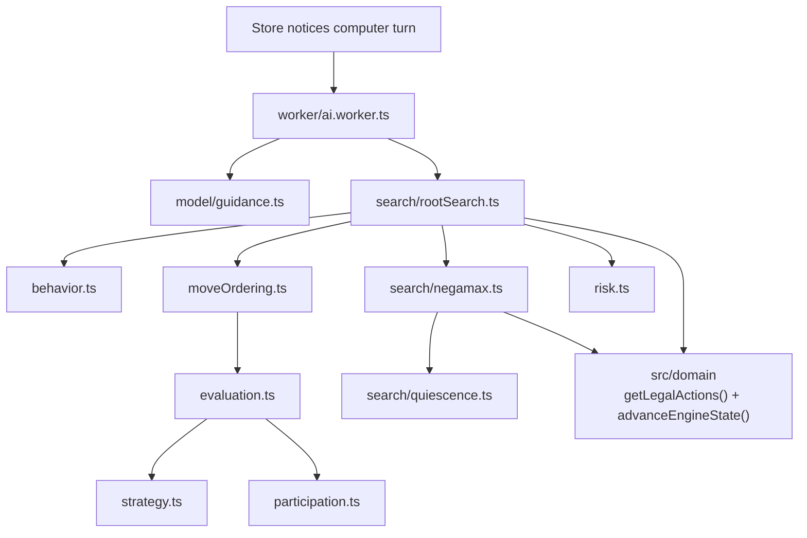
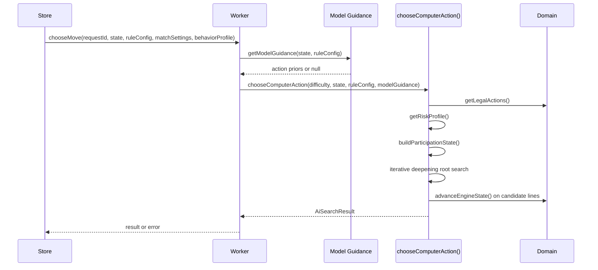
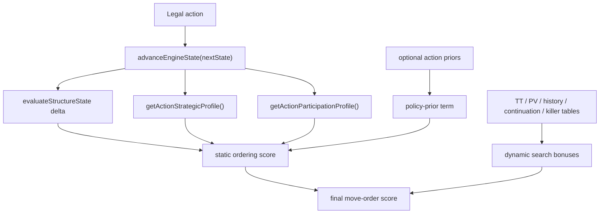
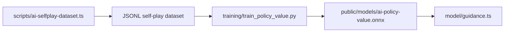

# AI Engine

**Copyright (c) 2026 Kostiantyn Stroievskyi. All Rights Reserved.**

No permission is granted to use, copy, modify, merge, publish, distribute, sublicense, or sell copies of this software or any portion of it, for any purpose, without explicit written permission from the copyright holder.

---

`src/ai/` contains YOUI's computer-opponent system. It is separated from React, separated from the store, and almost entirely separated from browser APIs except for the worker bridge and the optional ONNX loading path.

The runtime AI is a hybrid, but the hierarchy matters:

1. the domain engine defines which actions are legal and what state follows from each action;
2. the AI orders those legal actions using structural heuristics and optional policy priors;
3. the search explores the resulting tree under a bounded time/depth budget;
4. the result layer returns one chosen action plus diagnostics and root candidates.

This is therefore a search-first engine with heuristic and neural guidance, not a neural-only move picker.

## Boundary With The Rest Of The App



The AI does not mutate live application state. It receives an immutable engine snapshot, searches, and returns one `AiSearchResult`.

## What The Runtime AI Is

The current runtime AI is:

- deterministic search under a bounded browser-side time budget;
- iterative deepening over a negamax tree with alpha-beta pruning;
- principal-variation-style null-window re-search;
- quiescence extension on forcing leaves;
- domain-specific ordering, strategy, and participation heuristics;
- optionally nudged by masked policy priors from a residual policy/value network.

The current runtime AI is not:

- Monte Carlo Tree Search;
- a direct AlphaZero reproduction;
- a server-backed opponent;
- a model-only move selector.

## Public Entry Points

| File | Role |
| --- | --- |
| [`index.ts`](./index.ts) | stable barrel used by store, worker, tests, and scripts |
| [`search.ts`](./search.ts) | Public search re-export |
| [`search/rootSearch.ts`](./search/rootSearch.ts) | `chooseComputerAction()` orchestration |
| [`behavior.ts`](./behavior.ts) | hidden persona generation and persona-specific style bias |
| [`perf.ts`](./perf.ts) | lazy per-search summary cache and keyed legal-action reuse |
| [`risk.ts`](./risk.ts) | stagnation detection, dynamic draw utility, and risk-mode state bonuses |
| [`worker/ai.worker.ts`](./worker/ai.worker.ts) | Worker boundary for browser integration |
| [`types.ts`](./types.ts) | Search request/result contracts |
| [`presets.ts`](./presets.ts) | Product difficulty policy encoded as data |

## End-To-End Decision Flow



The worker exists for responsiveness, not to supply rule truth. Correctness still comes from the domain engine and the search code.

## Search Pipeline

### Root orchestration

[`chooseComputerAction()`](./search/rootSearch.ts) is the top-level coordinator. It:

- reads the difficulty preset;
- gathers legal root actions from the domain engine;
- recomputes the current `riskMode` from recent history, repetition pressure, and `moveNumber`;
- derives strategic intent from heuristics unless a model-supplied intent exists, and deliberately prefers heuristic intent once risk escalation is active;
- reconstructs participation context from recent history;
- precomputes expensive root ordering features;
- searches depths `1..maxDepth` under a fixed deadline;
- uses aspiration windows around the last completed score;
- degrades gracefully on timeout with ordered or previous-depth fallbacks;
- returns the chosen action, principal variation, root candidates, diagnostics, the active `riskMode`, and the persona id that shaped the search.

Fallback labels are explicit:

| `fallbackKind` | Meaning |
| --- | --- |
| `none` | normal search completion |
| `orderedRoot` | timeout before meaningful depth completion; root ordering decides |
| `partialCurrentDepth` | timeout after partial ranking at the current depth |
| `previousDepth` | deeper search timed out, so the previous completed depth stands |
| `legalOrder` | trivial legal-order fallback |

#### Time-governed iterative deepening

The root search is not "depth first until it feels done." It is deadline-driven iterative deepening:

- depth `1` is completed first so the engine always has a legal fallback;
- each completed depth becomes a better-informed fallback for the next one;
- aspiration windows narrow the expected score range around the last completed result;
- timeouts are handled as part of the normal control flow rather than as exceptional corruption.

That is why the search can fail soft under a browser deadline while still returning a coherent `AiSearchResult`.

### Negamax with alpha-beta pruning

[`search/negamax.ts`](./search/negamax.ts) implements the core recursive search. The game fits the negamax formulation because it is:

- deterministic;
- zero-sum;
- alternating-turn;
- perfect information.

The search stores bounded transposition entries, updates killer/history/continuation tables on quiet cutoffs, and maintains a per-search principal-variation hint map.


*This visual belongs with negamax rather than with evaluation because it explains the sign convention that makes the whole recursive search coherent: one side's gain is the other side's loss, so the score at a child node is interpreted through a sign flip when lifted back to the parent.*

### Principal variation search

The first child at each node is searched on the full window. Later children are searched on a null window first and re-searched only when they fail high inside the full alpha-beta range. The implementation surfaces these re-searches as `pvsResearches` in diagnostics.

This keeps the common case cheap while still preserving full correctness when a later move proves better than the current principal variation.

### Aspiration windows

After the first completed depth, root search centers a narrower window around the previous best score:

```text
windowSize = 220 + depth * 80
alpha = bestScore - windowSize
beta  = bestScore + windowSize
```

If the top result falls outside that range, the depth is re-run on a full window and `aspirationResearches` is incremented.

### Quiescence

[`search/quiescence.ts`](./search/quiescence.ts) extends unstable leaves rather than trusting a depth cutoff in the middle of a forcing exchange.

It considers:

- jumps;
- manual unfreezes;
- strong home-row and front-row continuation moves selected through `getQuiescenceMoves()`.

The quiescence search still uses the same ordering machinery and still applies move penalties, but it restricts the action set to moves that are likely to change the tactical picture immediately.

#### Horizon-effect mitigation

Quiescence exists because a leaf at nominal search depth is not necessarily strategically quiet. Without it, the engine can stop one ply before an obvious jump chain, unfreeze, or front-row structural swing and then evaluate an unstable position as if it were settled.


*This is a useful non-Mermaid illustration because the issue is not control flow but the shape of an evaluation error: a nominal depth cutoff can look stable until one more forcing ply causes the score to collapse.*

## Move Ordering And Evaluation

The AI becomes practical because it searches promising moves early. The details live in two files:

- [`moveOrdering.ts`](./moveOrdering.ts): static and dynamic action ordering
- [`evaluation.ts`](./evaluation.ts): quiet leaf scoring

Both of those rely on:

- [`strategy.ts`](./strategy.ts): structural interpretation and intent classification
- [`participation.ts`](./participation.ts): anti-oscillation and variety pressure

The exact formulas are intentionally kept in the dedicated appendix:

- [`HEURISTICS.md`](./HEURISTICS.md)

That separation matters. This README explains architecture, data flow, and lineage. `HEURISTICS.md` is the exact coefficient and formula reference.

### `moveOrdering.ts`

Move ordering is the bridge between shallow heuristics and deep search. The file combines:

- static action features computed from one-step simulation;
- dynamic search-learned features such as TT, PV, history, continuation, and killer bonuses;
- anti-repetition and anti-self-undo penalties;
- tiebreak-aware draw-trap metadata for draw-prone, adverse-repeat lines;
- strategic and participation deltas;
- optional policy priors from the neural guidance path.

The expensive static part is precomputed once at the root and then rescored with dynamic terms across iterative-deepening passes.

The ordered entries also carry metadata that later layers reuse instead of recomputing:

| Field | Why it matters |
| --- | --- |
| `winsImmediately` | marks direct terminal wins before deeper search |
| `isForced` | distinguishes terminal or forced lines during result shaping |
| `isTactical` | protects tactical moves from quiet trimming |
| `drawTrapRisk` | measures how dangerous a draw-prone continuation is when the actor is tiebreak-behind |
| `tiebreakEdgeKind` | records whether a repeated or stagnant finish would currently favor, hurt, or tie the actor |
| `sourceFamily` | tracks checker-family reuse across result shaping and variety metrics |
| `sourceRegion` | tracks coarse board-region reuse through the participation layer |



### Quiet move trimming

After ordering:

- tactical moves are preserved;
- quiet moves are truncated to the preset's `quietMoveLimit`;
- harder difficulties therefore search both deeper and wider, not only deeper.

## Difficulty Presets

Difficulty is encoded as data, not as vague labels.

| Difficulty | `timeBudgetMs` | `maxDepth` | `quietMoveLimit` | `rootCandidateLimit` |
| --- | ---: | ---: | ---: | ---: |
| `easy` | `120` | `2` | `8` | `4` |
| `medium` | `400` | `4` | `16` | `5` |
| `hard` | `1200` | `6` | `28` | `6` |

The presets also supply the heuristic coefficients for:

- participation pressure;
- repetition and self-undo penalties;
- policy-prior weight;
- controlled variety among near-equal root candidates.

Because those values encode product behavior, tests and report generators import them directly rather than copying them.

The newer preset fields are equally important to behavior identity:

- draw-aversion coefficients for terminal draws;
- stagnation-index weights and activation threshold;
- risk-mode widening, loop penalties, and progress/tactical bonuses;
- policy-prior attenuation under escalation.

Difficulty is therefore not just "more depth." It is a bundle of search budget, safety rails, draw contempt, and variety pressure.

## Behavior Profiles And Risk Modes

The current computer opponent deliberately separates long-lived style from short-lived urgency.

### Hidden per-match personas

[`behavior.ts`](./behavior.ts) defines three hidden personas:

- `expander`: prefers decompression, lane opening, and broader board geometry;
- `hunter`: prefers freeze pressure, capture control, and tactical obstruction;
- `builder`: prefers front-row scaffolding, stack construction, and forward mass shaping.

The store generates one persona per computer match by hashing a fresh session id and persists it in `aiBehaviorProfile`. That keeps resumed saves behaviorally stable without introducing a new player-facing mode switch.

The persona influences three layers:

- move ordering through tag-based action bonuses;
- opening roots through source-geometry bonuses derived from the persisted persona seed, so equal-score starts can split across different checker families instead of replaying one opener forever;
- quiet leaf evaluation through state-shape bonuses that bias equal lines toward different strategic textures.

During the first six plies the root search also attenuates policy-prior weight when a persona is active. That does not disable neural guidance globally; it only stops the opening from snapping back to one model-favored move when several near-equal persona-consistent moves exist.

### Dynamic draw aversion

[`risk.ts`](./risk.ts) replaces the old "every draw is `0`" convention with state-dependent draw utility:

- terminal wins and losses remain `±1_000_000`;
- equal or structurally favorable draws are scored negatively;
- clearly losing draws can be neutral or slightly positive;
- `stagnation` and `late` modes increase draw aversion further.

This is the implementation of the product rule "avoid a draw like a defeat" without breaking zero-sum search correctness. The engine does not globally pretend that a draw is always a loss; it only changes how attractive a draw is relative to the current board.

The newer tiebreak-aware layer goes one step further for nonterminal positions:

- draw pressure is estimated from repetition pressure, structural flatness, and late-game escalation;
- the engine computes whether the acting side is currently `ahead`, `tied`, or `behind` on the rules-level draw tiebreak;
- repetition-adjacent or flat continuations get a `drawTrapRisk` penalty only when that projected finish is adverse or neutral, while tiebreak-favorable draw lines remain acceptable.

### Risk escalation

Search distinguishes three urgency modes:

| `riskMode` | Trigger | Intended effect |
| --- | --- | --- |
| `normal` | default | standard bounded search |
| `stagnation` | recent plies are repetitive, low-displacement, and low-progress | prefer decompression and decisive continuations |
| `late` | unresolved game with `moveNumber >= 70` | widen the near-best band and push hardest against sterile draws |

`stagnation` is computed from a weighted index over:

- repetition pressure;
- quiet self-undo motifs;
- low board displacement;
- flat mobility change;
- flat home-field and six-stack progress.

`late` is a hard fallback trigger, not a new rules-level draw condition.

Once a non-`normal` mode activates, non-forced tactical lines are no longer exempt from the anti-loop logic. Jump-heavy lines can still win on tactical truth, but they now pay repetition and self-undo costs unless they are genuinely forced.

## Result Shaping

[`search/result.ts`](./search/result.ts) turns internal ranking into the public result object:

- sorts root actions stably;
- reconstructs the principal variation from the transposition table;
- widens the root candidate band in two specific low-confidence cases: the first few opening plies and timeout/fallback risk roots;
- compresses raw score gaps inside that widened band and then chooses the best adjusted candidate deterministically, so hidden personas and risk bonuses actually surface in browser play instead of being washed out by noisy shallow scores;
- applies extra risk reranking inside the near-best band when `riskMode` is `stagnation` or `late`, including non-forced tactical candidates instead of only quiet ones;
- limits the exposed candidate set while preserving family diversity.

This is why the runtime returns more than a move. `AiSearchResult` is also a diagnostic envelope.

The key safety rule is that risk never overrides tactical truth:

- immediate wins still dominate;
- only-move defenses still dominate;
- only genuinely forced lines bypass the "be more interesting" preference.

## Search Context And Supporting Heuristics

[`search/types.ts`](./search/types.ts) defines the mutable search context shared across helpers:

- deadline and timer function;
- transposition table;
- killer/history/continuation tables;
- per-search lazy `perfCache` for pure position summaries;
- hidden `behaviorProfile`;
- participation state;
- live `riskMode`;
- previous same-side action and strategic tags at the root;
- diagnostic counters.

### `search/shared.ts`

[`search/shared.ts`](./search/shared.ts) provides the low-level glue that the rest of the search code assumes:

- `actionKey()` for stable action serialization across ordering, tests, and caches;
- `throwIfTimedOut()` and `isSearchTimeout()` for one timeout protocol across search phases;
- `makeTableKey()` for transposition-table addressing via the domain's position hash.

[`search/heuristics.ts`](./search/heuristics.ts) owns the supporting logic for:

- transposition-table capacity;
- move-penalty application;
- quiet cutoff learning;
- reconstruction of previous same-side action/position/tag context.

It also codifies two hard resource boundaries:

- `TRANSPOSITION_LIMIT = 50_000`
- `MAX_QUIESCENCE_DEPTH = 6`

Those numbers are not mathematical truths. They are bounded browser-runtime policy.

## Search-Time Summary Reuse

[`perf.ts`](./perf.ts) is the AI's semantics-preserving optimization layer. It exists because the newer draw-pressure, tiebreak, participation, and persona features all depend on pure board summaries that would otherwise be recomputed many times per node.

The design is intentionally conservative:

- every cached value is a pure function of `EngineState` plus, for legal actions, `RuleConfig`;
- the per-search `StatePerfBundle` is lazy, so evaluation does not pay for move-generation-only fields unless it actually asks for them;
- board-wide summaries reuse the canonical position hash, so scoring, tiebreak metrics, structural analysis, and legal-action lookup do not each re-hash the same state independently;
- cache reuse never changes formulas, thresholds, or candidate ranking policy.

The main reused summaries are:

- strategic analysis and strategic intent;
- informational score summary;
- draw-tiebreak metrics;
- empty-cell count;
- progress snapshot;
- legal-action count and legal-action list;
- base tiebreak-pressure profile per player and `riskMode`.

## Strategic Analysis Layer

[`strategy.ts`](./strategy.ts) is the position interpreter. It turns raw board geometry into a higher-level structural reading of the position.

### `strategy.ts`

The strategy layer performs one cached board scan and derives features such as:

- lane openness and jump-lane availability;
- home-field progress and total distance to home;
- front-row stack development;
- buried debt inside stacks;
- frozen singles and frozen critical singles.

Those features are reused by evaluation, move ordering, and reporting.

#### Main exports

| Function | Role |
| --- | --- |
| `analyzePosition()` | cached structural summary of the current position |
| `analyzePositionByKey()` | structural summary lookup when a caller already has the canonical position hash |
| `getStrategicIntentFromAnalysis()` | plan classification from a precomputed structural analysis |
| `getStrategicIntent()` | classifies the macro plan as `home`, `sixStack`, or `hybrid` |
| `getStrategicScoreFromAnalysis()` | scalar strategic score from a precomputed structural analysis |
| `getStrategicScore()` | plan-centric scalar position score |
| `getActionStrategicProfileFromAnalysis()` | per-move tags and deltas without rescanning sibling states |
| `getActionStrategicProfile()` | per-move strategic tags, intent delta, and policy bias |
| `getNoveltyPenalty()` | semantic anti-repetition penalty across same-side turns |
| `inferPreviousStrategicTags()` | history-based reconstruction of the previous same-side move story |

## Participation Layer

[`participation.ts`](./participation.ts) is the AI subsystem that tries to keep play legible and materially broad when tactics do not demand narrow reuse.

### `participation.ts`

It tracks recent same-side move participation through:

- moved checker identities;
- source families derived from checker ids;
- coarse source regions such as `left-front` or `center-mid`;
- recent reuse streaks;
- active material breadth and idle reserve mass.

#### Resolving oscillating mechanics

Classical local search can become tactically competent yet behaviorally narrow, repeatedly reusing the same source family or the same board region in neutral positions. The participation layer penalizes that concentration and rewards bringing previously idle material into the active frontier.

#### Main exports

| Function | Role |
| --- | --- |
| `buildParticipationState()` | reconstructs rolling recent-move context from history |
| `getParticipationScore()` | board-level participation term for static evaluation |
| `getActionParticipationProfileFromAnalysis()` | per-move participation delta while reusing precomputed structural analyses |
| `getActionParticipationProfile()` | per-move participation delta and next rolling state |

## Static Evaluation

[`evaluation.ts`](./evaluation.ts) is intentionally not a tactical oracle. It is the quiet leaf evaluator that the search calls once forcing lines have been handled by search depth and quiescence.

It exposes two evaluators:

- `evaluateStructureState()` for cheaper structure-first scoring used heavily in ordering;
- `evaluateState()` for the full leaf score used at quiet search leaves.

Exact coefficients live in [`HEURISTICS.md`](./HEURISTICS.md); this README keeps the architectural role of each evaluator distinct from the formulas themselves.

## Model Guidance Path

The neural path is optional but real.

### Action space

[`model/actionSpace.ts`](./model/actionSpace.ts) defines a fixed `2_736`-action policy head:

| Segment | Count |
| --- | ---: |
| manual unfreeze | `36` |
| jump directions | `288` |
| adjacent move kinds | `1_152` |
| friendly stack transfer | `1_260` |
| total | `2_736` |

The fixed action space is the contract shared by self-play generation, training, ONNX export, and runtime masking.

Important exports:

| Function | Role |
| --- | --- |
| `encodeActionIndex()` | maps one legal domain action into the fixed policy-head index |
| `buildMaskedActionPriors()` | turns raw logits into a normalized distribution over legal actions only |
| `getActionSpaceMetadata()` | exposes offsets and counts for tests, tooling, and documentation sanity checks |

### State encoding

[`model/encoding.ts`](./model/encoding.ts) encodes the side-to-move position into `16` planes on a `6 x 6` board:

- own active singles
- own frozen singles
- own top checker on height-2 stacks
- own top checker on height-3 stacks
- own buried depth-1 material
- own buried depth-2 material
- the same six planes for the opponent
- empty cells
- own home-row mask
- own front-home-row mask
- pending-jump source

The encoding is perspective-aligned so the same model serves both players without having to learn separate "white" and "black" geometries.

The important architectural point is not "convolution" but perspective normalization: the tensor consistently means "own" material, "opponent" material, and own-goal landmarks regardless of whether the acting side is white or black.

The committed asset filename below predates the terminology cleanup. It should be read as a visualization of the `16` input planes consumed by the residual policy/value network, not as a statement that the runtime system is a CNN-only engine.


### Runtime guidance bridge

[`model/guidance.ts`](./model/guidance.ts) performs runtime inference:

1. probe `/models/ai-policy-value.onnx` with a small ranged `GET`;
2. lazily import `onnxruntime-web`;
3. encode the current state;
4. run inference;
5. extract policy logits and optional value scalar;
6. mask policy logits down to the currently legal action set.

Important current behavior:

- if the model file is missing, the search silently falls back to heuristic-only ordering;
- `actionPriors` are consumed by move ordering;
- `valueEstimate` is exposed for diagnostics and tests only;
- `strategicIntent` is currently returned as `null`, so the runtime continues to rely on heuristic intent inference.

### Training path

The offline workflow is:



[`training/train_policy_value.py`](../../training/train_policy_value.py) trains a small residual policy/value network:

- `4` residual blocks
- `32` channels
- policy head over `2_736` actions
- scalar `tanh` value head

The model is best described as a neural guidance model, not as the runtime intelligence itself.

## Training Pipeline

The offline path is intentionally separate from runtime play:

### Self-play dataset generation

[`scripts/ai-selfplay-dataset.ts`](../../scripts/ai-selfplay-dataset.ts) records search-driven self-play into JSONL examples aligned with the fixed action space and the `16 x 6 x 6` encoding.

The generator intentionally fixes several policy choices so the dataset is reproducible:

- `drawRule: 'threefold'`
- `scoringMode: 'off'`
- deterministic seeded randomness through `createSeededRandom(gameIndex + 1)`
- deterministic hidden personas for both sides derived from the game index
- horizontal mirroring of every recorded position/action set

Each example stores the sparse root-candidate policy target, the terminal value from the acting side's perspective, and the heuristic strategic-intent label chosen at search time.

### Training script

[`training/train_policy_value.py`](../../training/train_policy_value.py) trains and exports the small residual policy/value model that the browser can consume through ONNX.

The deeper operational details live in [`../../training/README.md`](../../training/README.md).

## Algorithmic Lineage And References

The repository code does not embed a formal bibliography, so the list below should be read as the closest academic lineage for the techniques that are visibly implemented here, not as a claim that the project is a direct reproduction of any single paper.

| Technique visible in this repo | Closest reference |
| --- | --- |
| Alpha-beta search / negamax-style zero-sum pruning | Donald E. Knuth and Ronald W. Moore, "An Analysis of Alpha-Beta Pruning," *Artificial Intelligence* 6(4), 1975. DOI: `10.1016/0004-3702(75)90019-3`. |
| Iterative deepening under bounded search budgets | Richard E. Korf, "Depth-first Iterative-Deepening: An Optimal Admissible Tree Search," *Artificial Intelligence* 27(1), 1985. DOI: `10.1016/0004-3702(85)90084-0`. |
| Null-window / principal-variation-style search refinement | Murray Campbell and Tony Marsland, "A Comparison of Minimax Tree Search Algorithms," *Artificial Intelligence* 20(4), 1983. DOI: `10.1016/0004-3702(83)90037-5`. |
| Quiescence search to stabilize tactical leaves | Larry Harris, "The Heuristic Search and the Game of Chess: A Study of Quiescence, Sacrifices, and Plan Oriented Play," *IJCAI 1975*. |
| History heuristic family of move-ordering improvements | Jonathan Schaeffer, "The History Heuristic and Alpha-Beta Search Enhancements in Practice," *IEEE Transactions on Pattern Analysis and Machine Intelligence* 11(11), 1989. DOI: `10.1109/34.42847`. |
| Policy/value self-play guidance as conceptual lineage for the offline model path | David Silver et al., "Mastering the game of Go without human knowledge," *Nature* 550, 2017. DOI: `10.1038/nature24270`. |
| Residual network architecture used in the training script | Kaiming He, Xiangyu Zhang, Shaoqing Ren, and Jian Sun, "Deep Residual Learning for Image Recognition," *CVPR 2016*. |

The key takeaway is that this AI is intentionally hybrid: classical tree search does the hard tactical work, while domain-specific heuristics and optional neural priors improve ordering and style without replacing the deterministic rule engine underneath.

## Reporting And Quality Gates

Important supporting artifacts:

- [`moveOrdering.test.ts`](./moveOrdering.test.ts)
- [`search.behavior.test.ts`](./search.behavior.test.ts)
- [`search.timeout.test.ts`](./search.timeout.test.ts)
- [`search.soak.test.ts`](./search.soak.test.ts)
- [`search.variety.test.ts`](./search.variety.test.ts)
- [`model.test.ts`](./model.test.ts)
- [`test/metrics.ts`](./test/metrics.ts)

These tests and tools validate:

- timeout fallbacks and search stability;
- ordering behavior and candidate shaping;
- long playout stability;
- policy masking and model fallback behavior;
- behavior diversity and repetition pressure.

Generated reports live under `output/` and are produced by:

- [`scripts/ai-variety.report.ts`](../../scripts/ai-variety.report.ts)
- [`scripts/ai-stage-variety.report.ts`](../../scripts/ai-stage-variety.report.ts)
- [`scripts/ai-crossplay.report.ts`](../../scripts/ai-crossplay.report.ts)
- [`scripts/ai-loop-benchmark.report.ts`](../../scripts/ai-loop-benchmark.report.ts)
- [`scripts/ai-position-buckets.report.ts`](../../scripts/ai-position-buckets.report.ts)
- [`scripts/ai-threat.report.ts`](../../scripts/ai-threat.report.ts)
- [`scripts/perf-report.mjs`](../../scripts/perf-report.mjs)
- [`scripts/run-git-report-compare.mjs`](../../scripts/run-git-report-compare.mjs)

### Search and behavior tests

The search tests validate timeout handling, candidate shaping, and bounded-search correctness under browser-style constraints.

### Variety and quality metrics

The variety tooling checks that the engine remains strategically broad enough and does not collapse into a single deterministic style.

The trace layer also records `behaviorProfileId` and `riskMode` per ply, so later diagnostics can distinguish "the engine found a risky line" from "the engine happened to play differently for unrelated reasons."

That distinction matters even more away from the literal opening. The stage report replays the same fixed `opening`, `turn50`, `turn100`, and `turn200` benchmark states used by the perf harness, then measures the same diversity metrics plus `riskMode` activation shares. Because the shipped threefold rule would otherwise make those imported late positions terminal, the harness rebuilds them into playable continuation states by keeping only the recent history window and reconstructing repetition counts from that window. In practice, that report answers a different question than the aggregate suite: not just "is self-play varied in general?" but "when the engine enters a known flat or late position, does the risk system actually engage, and does that engagement reduce repetition or increase decisiveness?"

The metric vocabulary in [`test/metrics.ts`](./test/metrics.ts) is intentionally broader than win rate alone:

| Metric | Meaning |
| --- | --- |
| `decisiveResultShare` | share of games that end in a non-draw terminal result |
| `openingEntropy` | entropy of the first-move distribution across self-play traces |
| `openingSimpsonDiversity` | complementary diversity score for the opening distribution; higher means openings are less concentrated |
| `openingJsDivergence` | Jensen-Shannon divergence against the checked-in baseline opening distribution |
| `uniqueOpeningLineShare` | share of distinct first-ten-ply openings across traces |
| `sourceFamilyOpeningHhi` | concentration of opening moves into the same checker family; lower means broader material usage |
| `twoPlyUndoRate` | rate of quiet self-undo behavior across plies |
| `repetitionPlyShare` | share of plies that revisit an already seen full position |
| `stagnationWindowRate` | share of sliding windows whose displacement, mobility, and progress stay too flat |
| `normalizedLempelZiv` | normalized Lempel-Ziv complexity of move-kind sequences; higher means the trace keeps producing new symbolic motifs |
| `decompressionSlope` | average slope of empty-cell growth over the opening window |
| `mobilityReleaseSlope` | average slope of legal-move count growth over the same window |
| `meanBoardDisplacement` | average number of changed cells per ply |
| `drama` | mean absolute score swing between consecutive plies |
| `tension` | average closeness of normalized scores to zero |
| `compositeInterestingness` | target-band composite built from opening diversity, repetition pressure, decompression, drama, and decisive-result share |
| `behaviorSpaceCoverage` | fraction of coarse behavior bins actually occupied by the trace set |

The newer nonlinear metrics in [`test/advancedMetrics.ts`](./test/advancedMetrics.ts) answer a different question: not "did the engine vary?" but "what kind of dynamical system did the trace behave like?" Those metrics are used by the loop, threat, cross-play, and position-bucket reports:

| Advanced metric | Meaning |
| --- | --- |
| `recurrenceRate` | fraction of non-trivial revisit pairs in the visited-state sequence |
| `recurrenceDeterminism` | share of recurrence points that lie on diagonal replay lines rather than isolated revisits |
| `recurrenceLaminarity` | share of recurrence points that lie on vertical dwell lines, which is a strong loop/stall signal |
| `trappingTime` | average vertical dwell length inside recurrence plots |
| `scoreSampleEntropy` | irregularity of the evaluation-score time series under tolerance-based matching |
| `scorePermutationEntropy` | ordinal complexity of local score windows, insensitive to absolute scale |
| `positionLempelZiv` | symbolic complexity of the visited-position sequence |
| `loopEscapeRate8/16/24` | share of traces that break repetition/undo pressure within the next 8, 16, or 24 plies |
| `meanLoopEscapePly` | average number of plies needed to escape once loop pressure becomes active |
| `pressureEventRate` | share of plies that create freeze pressure, frontier compression, or direct conversion pressure |
| `frontierCompressionRate` | how often the chosen move shrinks the opponent reply frontier |
| `riskProgressShare` | share of risk-mode plies that satisfy the engine's certified progress test |

### Report comparison wrappers

[`scripts/run-git-report-compare.mjs`](../../scripts/run-git-report-compare.mjs) is the generic compare entry point behind the `*:compare` npm scripts. It materializes the `before` and `after` snapshots, reruns the requested pipeline for each snapshot, flattens the numeric leaves of both JSON reports, and emits a Markdown diff under `output/`.

The wrappers accept `--before=<ref|working>` and `--after=<ref|working>`. In practice that supports:

- a committed baseline versus unstaged edits (`HEAD` vs `working`);
- one branch, tag, or commit versus another;
- repeated reruns of the same working tree with different flags.

The comparison layer is intentionally generic. It compares whatever numeric leaves the pipeline emits, so new report metrics start showing up in compare output automatically without requiring a second per-pipeline diff implementation.

### Performance reports

The performance tooling checks that browser-side search and domain operations stay within the intended latency envelope as heuristics evolve.

The report pipeline measures two complementary surfaces:

- domain microbenchmarks such as hashing, legal-action generation, and root-ordering reuse;
- shipped-browser interaction and AI timings, including imported-session hard-AI replies on the deterministic `opening`, `turn50`, `turn100`, and `turn200` fixtures from [`scripts/lateGamePerfFixtures.ts`](../../scripts/lateGamePerfFixtures.ts).

## File-by-File Summary

| File | Role |
| --- | --- |
| [`behavior.ts`](./behavior.ts) | hidden persona generation and persona-specific action/state bias |
| [`evaluation.ts`](./evaluation.ts) | quiet leaf scoring |
| [`moveOrdering.ts`](./moveOrdering.ts) | static and dynamic move ranking |
| [`strategy.ts`](./strategy.ts) | structural interpretation and semantic tagging |
| [`participation.ts`](./participation.ts) | anti-oscillation and material-breadth scoring |
| [`risk.ts`](./risk.ts) | stagnation detection, draw utility, and live risk-mode shaping |
| [`search/rootSearch.ts`](./search/rootSearch.ts) | top-level orchestration and fallbacks |
| [`search/negamax.ts`](./search/negamax.ts) | recursive alpha-beta core |
| [`search/quiescence.ts`](./search/quiescence.ts) | forcing-leaf stabilization |
| [`search/result.ts`](./search/result.ts) | result shaping and candidate selection |
| [`model/actionSpace.ts`](./model/actionSpace.ts) | action-index contract |
| [`model/encoding.ts`](./model/encoding.ts) | state-to-tensor bridge |
| [`model/guidance.ts`](./model/guidance.ts) | runtime ONNX inference bridge |
| [`worker/ai.worker.ts`](./worker/ai.worker.ts) | browser worker boundary |

## Intentional Non-Goals

This AI is intentionally not trying to be:

- a server-side engine;
- a model-only policy picker;
- a literal AlphaZero clone;
- a full theorem-proving search with no product constraints on time, memory, or responsiveness.

The design target is a strong, explainable, bounded browser opponent.

## Algorithmic Lineage

The repository is not a direct reproduction of any single paper. The table below maps visibly implemented techniques to the closest primary references and the files where they appear.

| Implemented technique | Repo surface | Reference |
| --- | --- | --- |
| Alpha-beta / negamax zero-sum search | [`search/negamax.ts`](./search/negamax.ts) | Donald E. Knuth and Ronald W. Moore, "An Analysis of Alpha-Beta Pruning," *Artificial Intelligence* 6(4), 1975. DOI: `10.1016/0004-3702(75)90019-3` |
| Iterative deepening under fixed budgets | [`search/rootSearch.ts`](./search/rootSearch.ts) | Richard E. Korf, "Depth-first Iterative-Deepening: An Optimal Admissible Tree Search," *Artificial Intelligence* 27(1), 1985. DOI: `10.1016/0004-3702(85)90084-0` |
| Principal variation / null-window re-search | [`search/negamax.ts`](./search/negamax.ts), [`search/rootSearch.ts`](./search/rootSearch.ts) | Murray Campbell and Tony Marsland, "A Comparison of Minimax Tree Search Algorithms," *Artificial Intelligence* 20(4), 1983. DOI: `10.1016/0004-3702(83)90037-5` |
| Quiescence search | [`search/quiescence.ts`](./search/quiescence.ts) | Larry Harris, "The Heuristic Search and the Game of Chess: A Study of Quiescence, Sacrifices, and Plan Oriented Play," *IJCAI 1975* |
| History heuristic family | [`search/heuristics.ts`](./search/heuristics.ts) | Jonathan Schaeffer, "The History Heuristic and Alpha-Beta Search Enhancements in Practice," *IEEE TPAMI* 11(11), 1989. DOI: `10.1109/34.42847` |
| Residual network trunk for policy/value guidance | [`training/train_policy_value.py`](../../training/train_policy_value.py) | Kaiming He et al., "Deep Residual Learning for Image Recognition," *CVPR 2016* |
| Self-play policy/value conceptual lineage | [`scripts/ai-selfplay-dataset.ts`](../../scripts/ai-selfplay-dataset.ts), [`model/guidance.ts`](./model/guidance.ts) | David Silver et al., "Mastering the game of Go without human knowledge," *Nature* 550, 2017. DOI: `10.1038/nature24270` |
| Recurrence plots and recurrence quantification for loop/stall analysis | [`test/advancedMetrics.ts`](./test/advancedMetrics.ts), [`scripts/ai-loop-benchmark.report.ts`](../../scripts/ai-loop-benchmark.report.ts) | J.-P. Eckmann, S. O. Kamphorst, and D. Ruelle, "Recurrence Plots of Dynamical Systems," *Europhysics Letters* 4(9), 1987. DOI: `10.1209/0295-5075/4/9/004`; Charles L. Webber Jr. and Joseph P. Zbilut, "Dynamical assessment of physiological systems and states using recurrence plot strategies," *J. Appl. Physiology* 76(2), 1994 |
| Sample entropy for score-series irregularity | [`test/advancedMetrics.ts`](./test/advancedMetrics.ts) | Joshua S. Richman and J. Randall Moorman, "Physiological time-series analysis using approximate entropy and sample entropy," *AJP Heart and Circulatory Physiology* 278(6), 2000. DOI: `10.1152/ajpheart.2000.278.6.H2039` |
| Permutation entropy for ordinal score complexity | [`test/advancedMetrics.ts`](./test/advancedMetrics.ts) | Christoph Bandt and Bernd Pompe, "Permutation entropy: a natural complexity measure for time series," *Physical Review Letters* 88(17), 2002. DOI: `10.1103/PhysRevLett.88.174102` |
| Procedural personas / diverse competitive play-styles as the design basis for hidden personas and cross-play | [`behavior.ts`](./behavior.ts), [`scripts/ai-crossplay.report.ts`](../../scripts/ai-crossplay.report.ts) | Antonios Liapis, Julian Togelius, and Georgios N. Yannakakis, "Procedural Personas as Critics for Dungeon Generation," *EvoApplications 2015*; Diego Perez-Liebana et al., "Generating Diverse and Competitive Play-Styles for Strategy Games," 2021 |

## References

- [Knuth and Moore 1975](https://charlesames.net/references/DonaldKnuth/alpha-beta.html)
- [Korf 1985](https://doi.org/10.1016/0004-3702(85)90084-0)
- [Campbell and Marsland 1983](https://doi.org/10.1016/0004-3702(83)90037-5)
- [Harris 1975](https://www.ijcai.org/Proceedings/75-1/Papers/059.pdf)
- [Schaeffer 1989](https://doi.org/10.1109/34.42847)
- [Silver et al. 2017](https://www.nature.com/articles/nature24270)
- [He et al. 2016](https://www.cv-foundation.org/openaccess/content_cvpr_2016/html/He_Deep_Residual_Learning_CVPR_2016_paper.html)
- [Eckmann et al. 1987](https://doi.org/10.1209/0295-5075/4/9/004)
- [Webber and Zbilut 1994](https://journals.physiology.org/doi/abs/10.1152/jappl.1994.76.2.965)
- [Richman and Moorman 2000](https://pubmed.ncbi.nlm.nih.gov/10843903/)
- [Bandt and Pompe 2002](https://doi.org/10.1103/PhysRevLett.88.174102)
- [Liapis et al. 2015](https://antoniosliapis.com/research/pubs/liapis_evoapps15.pdf)
- [Perez-Liebana et al. 2021](https://arxiv.org/abs/2104.08641)

## Boundary Of This Document

This README explains architecture, runtime flow, and lineage. Exact heuristic coefficients and formulas live in [`HEURISTICS.md`](./HEURISTICS.md). Exact rule semantics live in [`../domain/README.md`](../domain/README.md).
