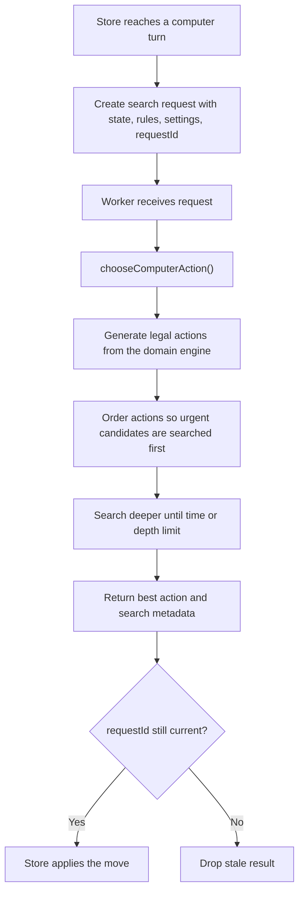
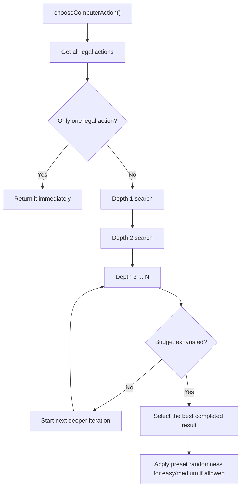
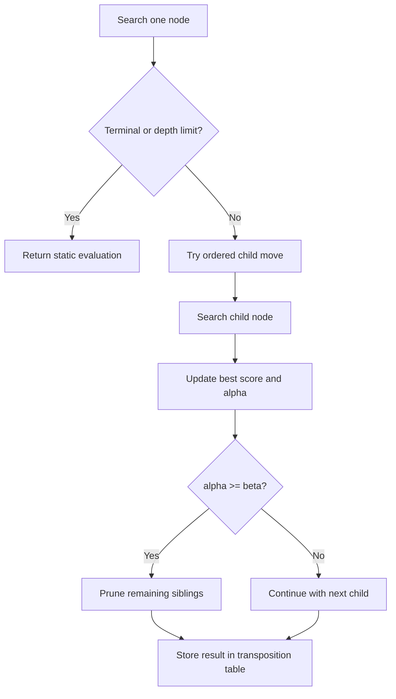
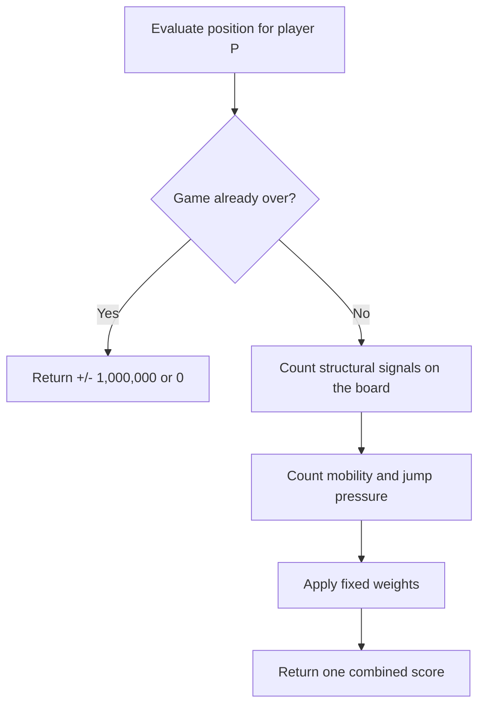

# AI Engine

This folder contains the pure computer-opponent engine used by the browser match mode.
It is intentionally separate from React and the Zustand store.

The AI package has four responsibilities:

1. Evaluate a board position.
2. Order legal moves so search sees the best candidates first.
3. Search the game tree within a difficulty-specific time/depth budget.
4. Expose a worker-friendly API so the browser UI stays responsive.

## What lives here

- `types.ts`
  Defines the request/response contracts and difficulty preset shape.
- `presets.ts`
  Encodes the exact `easy` / `medium` / `hard` limits.
- `evaluation.ts`
  Game-specific heuristic scoring.
- `moveOrdering.ts`
  Tactical-first move sorting and quiet-move trimming.
- `search.ts`
  Iterative-deepening negamax with alpha-beta pruning and a transposition table.
- `worker/ai.worker.ts`
  Thin browser worker wrapper around `chooseComputerAction()`.
- `index.ts`
  Public barrel for the rest of the application.

## First mental model

If you are not used to board-game AI, the simplest way to read this package is:

1. The AI looks at every legal move it can make now.
2. For each move, it imagines the opponent's best reply.
3. Then it imagines its own best reply to that reply.
4. It keeps doing that until it hits a time or depth limit.
5. When it cannot look deeper, it scores the current board with fast heuristics.
6. It picks the move that leads to the best worst-case outcome.

That is the core idea behind minimax-style search.
This package uses the compact variant called `negamax`, but the high-level behavior is the same: "assume the opponent is smart, and choose the move that still leaves you in the best position."

## Integration flow

The full "play with computer" flow is:

1. The store detects that the current turn belongs to the computer.
2. The store sends `{ state, ruleConfig, matchSettings, requestId }` to the worker.
3. The worker calls `chooseComputerAction()`.
4. `chooseComputerAction()` asks the domain engine for legal moves and searches them.
5. The worker posts the best result back to the store.
6. The store ignores stale `requestId`s, applies only the latest result, and schedules the next AI turn when needed.

Important architectural boundary:

- The AI never mutates UI state.
- The AI never knows about React.
- The AI only depends on pure domain functions such as `getLegalActions()` and `advanceEngineState()`.

That keeps the engine reusable later for server validation, replay analysis, benchmarking, and alternative frontends.

## Domain assumptions the AI relies on

The AI assumes the domain already guarantees:

- all generated actions are legal;
- forced jump continuation is encoded in `pendingJump`;
- `advanceEngineState()` returns a complete, immutable next state;
- victory and draw status are already resolved by the reducer layer;
- position hashing is stable for equivalent search states.

This is why the AI does not duplicate rules. It delegates legality and state transitions to `src/domain/`.

## Search algorithm

The engine uses iterative-deepening negamax with alpha-beta pruning.

In plain language, that means:

- `negamax`: one search function handles both players by flipping the score sign whenever the turn changes;
- `alpha-beta`: stop reading branches that are already proved to be worse than something we have seen before;
- `iterative deepening`: search shallow first, then deeper and deeper, so there is always a safe best-so-far move if the timer expires.

### Search flow at a glance

### What a game tree is

Think of every legal move as a branch in a tree:

- the root is the current board;
- each child is "what the board looks like after one legal move";
- grandchildren are "what happens after the opponent replies";
- deeper levels are later turns.

The search never "knows the future". It builds a small future tree, scores the leaves, then works backward to decide which current move is safest or strongest.

### Why negamax

The game is deterministic, zero-sum, turn-based, and has no hidden information.
That makes the minimax family the right baseline, and negamax is the compact symmetric formulation of minimax.

Beginner-friendly version:

- In ordinary minimax, the AI tries to maximize its own score, then assumes the opponent tries to minimize that same score.
- In negamax, both sides use the same logic: "maximize the score for the side to move".
- When the turn changes, the meaning of "good" flips, so the score is multiplied by `-1`.

That removes duplicated "max player" and "min player" code without changing the decision quality.

### Why iterative deepening

Iterative deepening searches depth `1`, then `2`, then `3`, and so on until the budget expires.

This gives three important properties:

1. There is always a best-so-far move.
2. Earlier shallow searches seed move ordering for deeper searches.
3. Time-bounded difficulties stay stable inside the browser worker.

This matters in the browser because the AI cannot assume it will always finish the deepest planned search.
If the worker has to stop after depth `3`, the result from depth `3` is still valid and usually stronger than a single one-shot search at the same depth.

### Why alpha-beta pruning

Alpha-beta cuts branches that cannot improve the current result.
Without it, the branching factor is too large for a local browser AI.

Plain-language example:

1. Suppose move `A` already leads to a score of `+120`.
2. The AI starts checking move `B`.
3. Very early inside move `B`, it becomes clear that the opponent can force the result down to `+40`.
4. Because `+40` is already worse than `+120`, the AI does not need to finish reading the rest of move `B`'s branch.

That skipped work is called a prune.
The better the move ordering is, the earlier good branches are found, and the more bad branches can be cut away.

### Why a transposition table

Different move orders can reach the same position.
The transposition table caches those evaluated states and reuses them later.

This is the search equivalent of remembering work you already paid for.

Example:

- line 1 reaches board `X` after `white -> black -> white`;
- line 2 reaches the exact same board `X` through a different move order;
- without caching, the AI would search board `X` twice;
- with a transposition table, the second visit can reuse the first result if it is deep enough.

Current policy:

- max size: `50_000` entries;
- stores best move, depth, bound type, and score;
- evicts the oldest entry when full.

The stored fields matter:

- `score` says how good the position looked;
- `depth` says how deeply it was searched;
- `bound type` says whether the score is exact, only a lower bound, or only an upper bound;
- `best move` helps the next iteration search strong candidates first.

### Tactical extension

The search adds one extra ply when the leaf is tactically unstable:

- an active jump continuation exists, or
- the side to move has an immediate terminal threat.

This avoids stopping exactly one move before an obvious tactical outcome.

In practice, that means the engine is less likely to miss "I can force a win on the very next move" positions just because the normal depth limit happened to land at an awkward moment.

## Move ordering

Move ordering is critical because alpha-beta is only strong when good moves are searched early.

Current ordering priority:

1. transposition-table move;
2. principal-variation move from the previous iteration;
3. immediate wins;
4. tactical moves:
   - jump sequences,
   - manual unfreeze,
   - front-row stack growth,
   - home-row progress,
   - freeze swings;
5. quiet moves sorted by static evaluation delta.

After sorting:

- all tactical moves are kept;
- quiet moves are trimmed according to difficulty.

That means harder difficulties search not only deeper, but also wider.

This is also why the AI does not spend equal effort on every legal move.
Many moves are obviously quiet or strategically similar.
By pushing tactical or promising moves to the front, the engine spends most of its budget where the position can change sharply.

## Evaluation function

`evaluation.ts` scores the position from one player's perspective.

When the search reaches a leaf, the AI cannot say "this is a guaranteed win in 20 turns".
Instead, it asks a simpler question:

"If the game stopped here, how healthy does this position look?"

The evaluation function answers that question with a weighted sum of features that matter in this ruleset.

Terminal result:

- win: `+1_000_000`
- loss: `-1_000_000`
- draw: `0`

Heuristic weights:

| Signal | Weight |
| --- | ---: |
| Full owned 3-stack on front row | `8000` |
| Each checker in a front-row stack | `900` |
| Home-field single | `250` |
| Distance from home rows | `-35` per row |
| Controlled stack | `140` |
| Frozen enemy single | `180` |
| Own frozen single penalty | `-200` |
| Mobility differential | `6` per action, capped at `20` actions |
| Jump availability bonus | `80` |

The heuristic intentionally favors:

- converting structure into front-row pressure;
- preserving mobility;
- creating tactical jump threats;
- freezing enemy singles;
- avoiding self-inflicted frozen liabilities.

It is lightweight by design so it can be called many times during search.

Terminal wins and losses use huge scores on purpose so no ordinary positional bonus can outweigh an actual forced result.

### Evaluation flow

## Difficulty levels

The three difficulty levels are exact product presets, not vague labels.

### Easy

- `120ms`
- max depth `2`
- all tactical moves + top `8` quiet moves
- randomly selects among top `3` moves within `8%` of best score

### Medium

- `400ms`
- max depth `4`
- all tactical moves + top `16` quiet moves
- randomly selects among top `2` moves within `3%` of best score

### Hard

- `1200ms`
- max depth `6`
- all tactical moves + top `28` quiet moves
- deterministic best move

The controlled randomness on easier levels prevents the AI from feeling perfectly scripted while still keeping it reasonable.

## Worker model

The browser never runs search on the main thread.

The worker wrapper is intentionally thin:

- receive the search request;
- call `chooseComputerAction()`;
- return either `{ type: 'result' }` or `{ type: 'error' }`.

The store owns lifecycle concerns:

- creating the worker lazily;
- cancelling by terminating/recreating it;
- dropping stale responses by `requestId`;
- retrying after failure;
- rescheduling after undo, redo, import, restart, or rule changes.

This separation is important for UX:

- the board stays interactive and repainting while the AI thinks;
- the search can be cancelled cleanly by killing the worker;
- stale answers from an old position never leak into the live match.

## Why this engine and not MCTS or neural self-play

This project needs a practical local AI now, not a research pipeline.

This game currently benefits more from:

- fast exact legality,
- tactical search,
- explicit heuristics,
- deterministic worker integration,
- easy testability.

Pure rollout MCTS would spend too much time on noisy playouts, and a neural pipeline would add training, data, model packaging, and inference complexity that is not justified for this scope.

## Extending the AI later

Likely next upgrades, in order:

1. tune weights from self-play logs;
2. add lightweight opening preferences;
3. improve repetition and draw awareness in evaluation;
4. add benchmark fixtures and node-per-second reporting;
5. support background analysis mode for hints and replays.

Keep the same architectural split:

- domain = rules,
- AI = evaluation + search,
- store and UI = orchestration.
