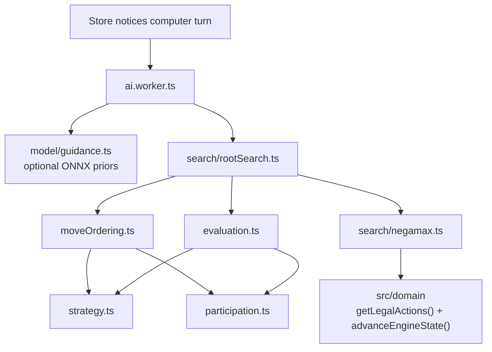
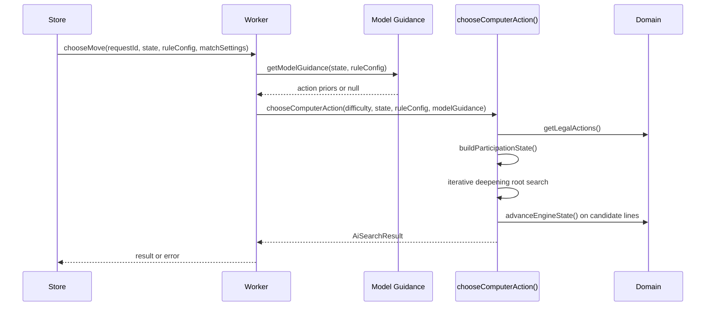
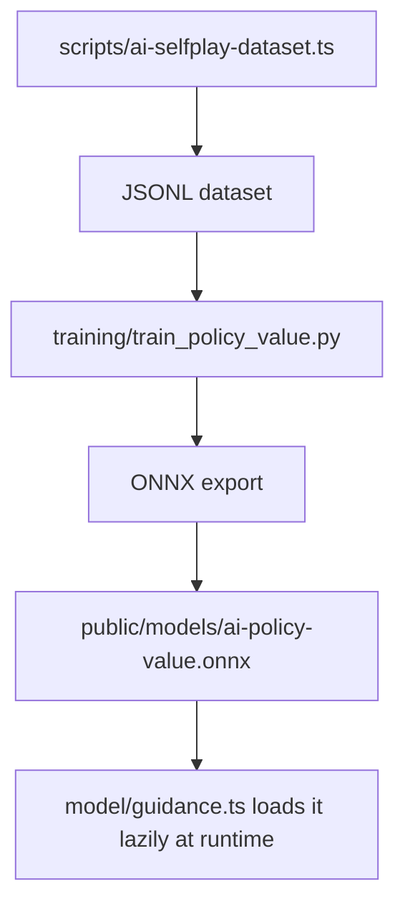

# AI Engine

`src/ai/` contains the computer-opponent system for White Maybe Black. It is intentionally separate from React, separate from the Zustand store, and almost entirely separate from browser APIs except for the thin worker and ONNX-loading bridge.

The AI is best understood as a layered decision pipeline:

1. infer the strategic shape of the current position;
2. score and order legal moves so the search explores the most promising ones first;
3. search the game tree under a strict time/depth budget;
4. optionally bias ordering with a lazily loaded policy/value model;
5. return one action plus rich diagnostics that the rest of the app can inspect or ignore.

That layering matters because the AI is not “just search” and not “just heuristics.” Search, strategy analysis, participation heuristics, and optional neural priors are all present, but they play different roles.

## What The Runtime AI Is, And What It Is Not

The current runtime AI is:

- a deterministic, bounded, browser-side search engine;
- classical game-tree search (`iterative deepening`, `negamax`, `alpha-beta`, `quiescence`);
- augmented with custom heuristics for this ruleset;
- optionally nudged by ONNX policy priors when a model file is present.

The current runtime AI is **not**:

- a Monte Carlo Tree Search implementation;
- a neural-only move picker;
- a server-backed opponent;
- a full AlphaZero reproduction.

That distinction is important for correct expectations. The repository borrows ideas from policy/value self-play systems, but the move chooser you ship to the browser is still search-first.

## Boundary With The Rest Of The App

The AI depends on the domain engine, not on the UI.

This folder exists to preserve three architectural properties:

1. the AI never mutates live application state directly;
2. the AI never invents its own legality rules;
3. the store can treat AI computation as replaceable infrastructure instead of embedding it inside UI state logic.

## Runtime Entry Points

| File | Export | Why it exists |
| --- | --- | --- |
| [`index.ts`](./index.ts) | package barrel | Stable API surface for store, worker, tests, and scripts |
| [`search.ts`](./search.ts) | `chooseComputerAction` re-export | Clean public search entry point |
| [`worker/ai.worker.ts`](./worker/ai.worker.ts) | browser worker bridge | Keeps search off the main UI thread |
| [`types.ts`](./types.ts) | request/result/preset contracts | Makes AI I/O explicit across worker, store, and tests |
| [`presets.ts`](./presets.ts) | `AI_DIFFICULTY_PRESETS` | Product-level difficulty tuning in one place |

## End-To-End Decision Flow

The AI worker exists for responsiveness, not correctness. Correctness still comes from the domain layer and the search code itself.

## Difficulty Presets

Difficulty levels are exact parameter bundles, not vague labels.

| Difficulty | Time budget | Max depth | Quiet move limit | Participation window | Variety top count |
| --- | ---: | ---: | ---: | ---: | ---: |
| `easy` | `120ms` | `2` | `8` | `2` | `3` |
| `medium` | `400ms` | `4` | `16` | `3` | `2` |
| `hard` | `1200ms` | `6` | `28` | `3` | `3` |

The full preset object in [`presets.ts`](./presets.ts) also tunes:

- participation bias;
- family/source reuse penalties;
- repetition and self-undo penalties;
- policy-prior weight;
- root candidate list length;
- controlled randomness among near-equal quiet moves.

Those numbers are not arbitrary metadata. They are the AI's product behavior encoded as data, which is why tests and scripts import them directly.

## Core Search Pipeline

### 1. Root orchestration: `search/rootSearch.ts`

`chooseComputerAction()` is the orchestration layer, not merely a wrapper.

Its responsibilities are:

- read the difficulty preset;
- gather legal actions from the domain engine;
- infer or accept strategic intent;
- seed participation state from recent history;
- initialize the shared search context;
- short-circuit immediate terminal wins when visible at the root;
- run iterative deepening with aspiration windows;
- degrade gracefully on timeout via ordered or previous-depth fallbacks;
- return diagnostics, principal variation, and root candidate explanations.

It also decides which fallback label to expose:

| Fallback kind | Meaning |
| --- | --- |
| `none` | completed search within the active budget |
| `orderedRoot` | timeout happened before useful depth completion, so root ordering decided the fallback |
| `partialCurrentDepth` | current depth timed out after some root moves were already ranked |
| `previousDepth` | deeper search timed out, so the previous completed depth is kept |
| `legalOrder` | only a trivial legal-order result existed |

### 2. Negamax core: `search/negamax.ts`

The internal search is a negamax formulation of minimax with alpha-beta pruning.

Why this formulation fits the game:

- the game is deterministic;
- it is zero-sum;
- both players alternate perfect-information turns;
- the only thing that changes between sides is the sign of “goodness.”

The implementation also uses principal-variation-style null-window re-search:

- first child is searched with the full alpha-beta window;
- later children are searched with a narrow window first;
- if a move proves better than expected, it is re-searched with the full window.

That is why the diagnostics include `pvsResearches`.

### 3. Quiescence tail: `search/quiescence.ts`

The main search stops at the configured depth limit, but the engine does not always trust that leaf. If the position is tactically “noisy,” quiescence search continues through forcing moves:

- jumps;
- manual unfreezes;
- strongly goal-directed moves into home rows or front home row.

This prevents shallow evaluations from stopping one ply before an obvious tactical swing.

### 4. Result shaping: `search/result.ts`

Once root actions are scored, the result layer:

- keeps ranked actions in stable order;
- reconstructs the principal variation from the transposition table;
- selects among near-equal quiet candidates using difficulty-specific controlled randomness;
- exposes a deduplicated root-candidate list for diagnostics and reporting.

The AI does not return only a move. It returns an explanation surface.

## Search Context And Supporting Heuristics

### `search/types.ts`

`SearchContext` is the shared mutable working set for one search:

- deadline and timer function;
- diagnostics counters;
- history, continuation, and killer heuristics;
- principal-variation move hints;
- repetition/self-undo context from the root;
- participation state;
- transposition table.

It exists so the search helpers can cooperate without building large nested parameter objects repeatedly at every node.

### `search/shared.ts`

| Function | Bigger purpose |
| --- | --- |
| `actionKey()` | Stable action serialization for tables, diagnostics, and tests |
| `throwIfTimedOut()` / `isSearchTimeout()` | Single timeout protocol across ordering, search, and quiescence |
| `makeTableKey()` | Canonical transposition-table key built from the domain's `hashPosition()` |

### `search/heuristics.ts`

This file manages search-wide heuristics that are not local to a single node:

- transposition-table size cap (`50_000`);
- extra quiescence depth allowance (`6`);
- repetition and self-undo penalties;
- killer/history/continuation updates after beta cutoffs;
- root reconstruction of previous same-side action, previous tags, and previous same-side position.

This is where the AI remembers useful search experience from earlier branches in the same move calculation.

## Move Ordering

### `moveOrdering.ts`

Move ordering is the bridge between shallow heuristics and deep search. Alpha-beta only becomes powerful when promising moves are searched early.

The ordering score combines:

- transposition-table move bonus;
- principal-variation move bonus;
- immediate win bonus;
- jump/manual-unfreeze/front-row/home-progress bonuses;
- static structure delta;
- strategic intent delta;
- participation delta;
- policy prior weight;
- history/continuation/killer bonuses;
- novelty, repetition, and self-undo penalties.

The file also classifies moves into concepts the rest of the AI uses:

- `isTactical`
- `isForced`
- `isRepetition`
- `isSelfUndo`
- `winsImmediately`
- `sourceFamily`
- `sourceRegion`

The expensive part of ordering is also intentionally split in two:

- `precomputeOrderedActions()` computes per-move static features that do not change while the root position stays the same;
- `orderPrecomputedMoves()` re-applies only the dynamic search-learned terms (`TT`, `PV`, history, continuation, killer moves).

`search/rootSearch.ts` reuses that precomputed root set across iterative-deepening passes instead of rebuilding the full static ordering payload at every depth. This preserves move quality because the same dynamic ordering terms are still re-scored each pass, and parity is locked by [`moveOrdering.test.ts`](./moveOrdering.test.ts).

Those ordered entries also carry the serialized action key and child position key forward, so `negamax`, `quiescence`, and root orchestration do not need to re-serialize the same move or re-hash the same child state later in the same search.

Why this file exists separately from search:

- ordering logic is rich enough to deserve independent tests and documentation;
- the same ordering machinery is reused at the root, in negamax, and in quiescence;
- separating it makes the search algorithm easier to reason about.

### Quiet move trimming

After moves are scored:

- tactical moves are always preserved;
- quiet moves are truncated to the preset's `quietMoveLimit`;
- harder difficulties therefore search both deeper and wider.

This is an important product behavior: “harder” does not only mean “more plies.” It also means “fewer plausible moves are pruned before the search even begins.”

## Strategic Analysis Layer

### `strategy.ts`

This file is the engine's position interpreter. It answers questions that raw legality does not answer:

- is the position leaning toward a `home`, `sixStack`, or `hybrid` plan?
- how much lane openness does each side have?
- how much front-row stack progress exists?
- how much buried material debt is locked inside stacks?
- how many frozen critical singles exist?

The output is used in three places:

1. static evaluation;
2. move ordering;
3. offline analysis/reporting.

#### Main exports

| Function | Role |
| --- | --- |
| `analyzePosition()` | Cached extraction of position-wide structural features |
| `getStrategicIntent()` | Classifies the side's current macro-plan |
| `getStrategicScore()` | Converts structural analysis into a scalar position score |
| `getActionStrategicProfile()` | Tags one move with intent change and semantic tags such as `frontBuild`, `openLane`, `rescue`, `freezeBlock` |
| `getNoveltyPenalty()` | Penalizes repeating the same tag profile across consecutive same-side moves |
| `inferPreviousStrategicTags()` | Reconstructs the last same-side action's tags from history |

The analysis cache (`50_000` positions) exists because these structural features are reused repeatedly during a single search.

## Participation Layer

### `participation.ts`

This subsystem is specific to White Maybe Black. It tries to keep the AI from becoming technically competent but behaviorally narrow.

It tracks:

- which checker families have moved recently;
- which source cells and source regions are “hot”;
- how wide the current frontier is;
- how much reserve mass remains idle;
- whether the same family/region is being reused too often.

The point is not to add randomness for its own sake. The point is to encourage broader, more legible participation of material when several moves are otherwise close.

#### Main exports

| Function | Role |
| --- | --- |
| `buildParticipationState()` | Reconstructs recent-move participation context from history |
| `getParticipationScore()` | Adds a board-level participation bonus/penalty to static evaluation |
| `getActionParticipationProfile()` | Computes how one candidate move changes participation quality |

This layer is why the AI can prefer “spread pressure across more material” over “reuse the same source family forever” when tactical urgency is absent.

## Static Evaluation

### `evaluation.ts`

There are two evaluators:

| Function | Purpose |
| --- | --- |
| `evaluateStructureState()` | Cheap structure-only score used primarily inside move ordering |
| `evaluateState()` | Full leaf evaluation combining strategic score, intent bias, pending-jump pressure, and participation score |

The evaluator is intentionally strategic rather than fully tactical. Tactical sharpness is delegated to search depth, move ordering, and quiescence.

Important terminal behavior:

- terminal win for the perspective player: `+1_000_000`
- terminal loss: `-1_000_000`
- draw: `0`

That large terminal constant guarantees that no heuristic bonus can outweigh an actual forced result.

## Model Guidance Path

The ONNX model path is optional, but it is real and integrated.

### `model/actionSpace.ts`

The policy head predicts over a fixed action space of `2_736` indices:

| Segment | Count | Derivation |
| --- | ---: | --- |
| Manual unfreeze | `36` | one per coordinate |
| Jump directions | `288` | `36 * 8` |
| Adjacent move kinds | `1_152` | `36 * 8 * 4` for `climbOne`, `moveSingleToEmpty`, `splitOneFromStack`, `splitTwoFromStack` |
| Friendly stack transfer | `1_260` | `36 * 35` ordered source-target pairs |
| **Total** | **`2_736`** | fixed action-space size |

Key exports:

| Function | Role |
| --- | --- |
| `encodeActionIndex()` | Maps one legal root action into its fixed policy index |
| `buildMaskedActionPriors()` | Converts raw logits into a normalized distribution over legal actions only |
| `getActionSpaceMetadata()` | Debugging/introspection helper for tooling and tests |

### `model/encoding.ts`

`encodeStateForModel()` maps an engine state into `16 x 6 x 6` planes:

| Plane range | Meaning |
| --- | --- |
| `0..5` | current player's single/stack occupancy by role and depth |
| `6..11` | opponent occupancy by the same role/depth scheme |
| `12` | empty cells |
| `13` | current player's home rows |
| `14` | current player's front home row |
| `15` | pending-jump source |

The board is encoded from the current player's perspective. That choice reduces symmetry burden on the model because “own” and “opponent” remain semantically stable.

### `model/guidance.ts`

`getModelGuidance()` performs the browser-side inference bridge:

1. probe `/models/ai-policy-value.onnx` with a `HEAD` request;
2. lazily import `onnxruntime-web`;
3. encode the current state;
4. run the model;
5. extract policy logits and optional value scalar;
6. mask policy priors down to legal actions;
7. return `AiModelGuidance`, or `null` on any failure.

Two intentional nuances matter here:

- if the model file is absent, the AI silently falls back to search-only play;
- `valueEstimate` is surfaced for diagnostics/tests today, but the runtime search does not currently inject it into evaluation.

Likewise, `AiModelGuidance` can theoretically carry a model-supplied `strategicIntent`, but the current ONNX bridge returns `strategicIntent: null`; the search therefore falls back to heuristic intent inference from `strategy.ts`.

## Training Pipeline

The offline model path is intentionally simple and reproducible.

### Self-play dataset generation

[`scripts/ai-selfplay-dataset.ts`](../../scripts/ai-selfplay-dataset.ts) does four important things:

- generates games by repeatedly calling `chooseComputerAction()`;
- stores the chosen root candidates as a sparse policy target;
- stores terminal outcomes as value targets;
- mirrors states horizontally to double the dataset and encourage symmetry learning.

It uses:

- `drawRule: 'threefold'`
- `scoringMode: 'off'`
- deterministic seeded randomness per game index

### Training script

[`training/train_policy_value.py`](../../training/train_policy_value.py) trains a small residual policy/value network:

- input planes: `16`
- board size: `6x6`
- residual body: `4` residual blocks, `32` channels
- policy head: dense logits over `2_736` action indices
- value head: scalar `tanh` output
- loss: policy cross-entropy against sparse targets plus MSE for value
- optimizer: `AdamW`

This path is modest on purpose. The runtime search remains the main intelligence; the model is currently a guidance layer rather than the primary decision-maker.

## Reporting And Quality Gates

### Search and behavior tests

Important test files:

- [`moveOrdering.test.ts`](./moveOrdering.test.ts)
- [`search.behavior.test.ts`](./search.behavior.test.ts)
- [`search.timeout.test.ts`](./search.timeout.test.ts)
- [`search.soak.test.ts`](./search.soak.test.ts)
- [`search.variety.test.ts`](./search.variety.test.ts)
- [`model.test.ts`](./model.test.ts)

These cover:

- fallback behavior under timeout;
- ordering behavior;
- candidate-list stability;
- long playout stability;
- model encoding and ONNX fallback behavior.

### Variety and quality metrics

[`test/metrics.ts`](./test/metrics.ts) defines the offline vocabulary for AI quality reports. It is not runtime code, but it is part of the repository's intellectual model of “good play.”

It measures, among other things:

- opening entropy and opening diversity;
- two-ply undo rate;
- repetition share and stagnation windows;
- decompression and mobility-release slopes;
- drama, tension, and composite interestingness;
- behavior-space coverage and novelty score.

Those metrics feed [`scripts/ai-variety.report.ts`](../../scripts/ai-variety.report.ts), which writes `output/ai/ai-variety-report.{json,md}` and can fail the process on regression.

### Performance reports

[`scripts/domainPerformance.report.ts`](../../scripts/domainPerformance.report.ts) and [`scripts/perf-report.mjs`](../../scripts/perf-report.mjs) benchmark both the engine and the shipping browser build. This matters because the AI is designed for a browser worker, not a server with unlimited compute.

Today that reporting covers four distinct views:

- domain microbenchmarks such as hashing and legal-action generation;
- root-ordering reuse benchmark on deterministic `opening`, `turn50`, `turn100`, and `turn200` states;
- mobile browser measurements under `1x`, `4x`, and `6x` CPU throttling;
- imported late-game hard-AI reply timings on those same deterministic turn-count fixtures.

## File-By-File Summary

| File | Main exported functions | Bigger reason it exists |
| --- | --- | --- |
| [`evaluation.ts`](./evaluation.ts) | `evaluateStructureState`, `evaluateState` | Converts position semantics into scalar scores |
| [`moveOrdering.ts`](./moveOrdering.ts) | `orderMoves`, `precomputeOrderedActions`, `orderPrecomputedMoves` | Makes alpha-beta practical by searching promising moves first while allowing exact root-order reuse |
| [`participation.ts`](./participation.ts) | `buildParticipationState`, `getParticipationScore`, `getActionParticipationProfile` | Rewards broader, less repetitive material participation |
| [`strategy.ts`](./strategy.ts) | `analyzePosition`, `getStrategicIntent`, `getStrategicScore`, `getActionStrategicProfile` | Captures game-specific strategic structure |
| [`presets.ts`](./presets.ts) | `AI_DIFFICULTY_PRESETS` | Encodes product difficulty policy as data |
| [`types.ts`](./types.ts) | AI request/result contracts | Stable protocol surface |
| [`search/rootSearch.ts`](./search/rootSearch.ts) | `chooseComputerAction` | Full search orchestration and fallback policy |
| [`search/negamax.ts`](./search/negamax.ts) | `negamax` | Core recursive alpha-beta search |
| [`search/quiescence.ts`](./search/quiescence.ts) | `quiescence`, `getQuiescenceMoves` | Tactical leaf stabilization |
| [`search/result.ts`](./search/result.ts) | diagnostics/result shaping helpers | Turns internal ranking into public result objects |
| [`search/heuristics.ts`](./search/heuristics.ts) | heuristic coordination helpers | Shared heuristics across root and inner search |
| [`search/shared.ts`](./search/shared.ts) | timeout/action-key utilities | Common protocol helpers |
| [`model/actionSpace.ts`](./model/actionSpace.ts) | action-space encoding helpers | Bridge between domain actions and policy head indices |
| [`model/encoding.ts`](./model/encoding.ts) | `encodeStateForModel` | Bridge between engine state and tensor input |
| [`model/guidance.ts`](./model/guidance.ts) | `getModelGuidance` | Optional runtime inference layer |
| [`worker/ai.worker.ts`](./worker/ai.worker.ts) | worker message bridge | Browser integration boundary |

## Intentional Non-Goals

This package deliberately does **not**:

- own turn scheduling or stale-request cancellation logic; that belongs to the store;
- know anything about rendering, localization, or tooltips;
- mutate application state directly;
- define move legality independently from the domain engine;
- require the ONNX model to exist.

That restraint is why the AI code remains understandable. It is free to focus on move selection rather than application orchestration.

## Algorithmic Lineage And References

The repository code does not embed a formal bibliography, so the list below should be read as the closest academic lineage for the techniques that are visibly implemented here, not as a claim that the project is a direct reproduction of any single paper.

| Technique visible in this repo | Closest reference |
| --- | --- |
| Alpha-beta search / negamax-style zero-sum pruning | Donald E. Knuth and Ronald W. Moore, “An Analysis of Alpha-Beta Pruning,” *Artificial Intelligence* 6(4), 1975. DOI: `10.1016/0004-3702(75)90019-3`. |
| Iterative deepening under bounded search budgets | Richard E. Korf, “Depth-first Iterative-Deepening: An Optimal Admissible Tree Search,” *Artificial Intelligence* 27(1), 1985. DOI: `10.1016/0004-3702(85)90084-0`. |
| Null-window / principal-variation-style search refinement | Murray Campbell and Tony Marsland, “A Comparison of Minimax Tree Search Algorithms,” *Artificial Intelligence* 20(4), 1983. DOI: `10.1016/0004-3702(83)90037-5`. |
| Quiescence search to stabilize tactical leaves | Larry Harris, “The Heuristic Search and the Game of Chess: A Study of Quiescence, Sacrifices, and Plan Oriented Play,” *IJCAI 1975*. |
| History heuristic family of move-ordering improvements | Jonathan Schaeffer, “The History Heuristic and Alpha-Beta Search Enhancements in Practice,” *IEEE Transactions on Pattern Analysis and Machine Intelligence* 11(11), 1989. DOI: `10.1109/34.42847`. |
| Policy/value self-play guidance as conceptual lineage for the offline model path | David Silver et al., “Mastering the game of Go without human knowledge,” *Nature* 550, 2017. DOI: `10.1038/nature24270`. |
| Residual network architecture used in the training script | Kaiming He, Xiangyu Zhang, Shaoqing Ren, and Jian Sun, “Deep Residual Learning for Image Recognition,” *CVPR 2016*. |

Useful primary links:

- [Knuth and Moore 1975](https://charlesames.net/references/DonaldKnuth/alpha-beta.html)
- [Korf 1985 PDF](https://www.bibsonomy.org/bibtex/15367f883b60b7da6dedad7b5bd0e7cea)
- [Campbell and Marsland 1983](https://doi.org/10.1016/0004-3702(83)90037-5)
- [Harris 1975 PDF](https://www.ijcai.org/Proceedings/75-1/Papers/059.pdf)
- [Schaeffer 1989](https://doi.org/10.1109/34.42847)
- [Silver et al. 2017](https://www.nature.com/articles/nature24270)
- [He et al. 2016 PDF](https://www.cv-foundation.org/openaccess/content_cvpr_2016/html/He_Deep_Residual_Learning_CVPR_2016_paper.html)

The key takeaway is that this AI is intentionally hybrid: classical tree search does the hard tactical work, while domain-specific heuristics and optional neural priors improve ordering and style without replacing the deterministic rule engine underneath.
