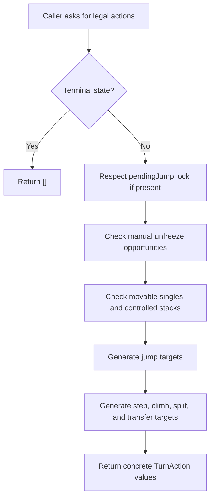
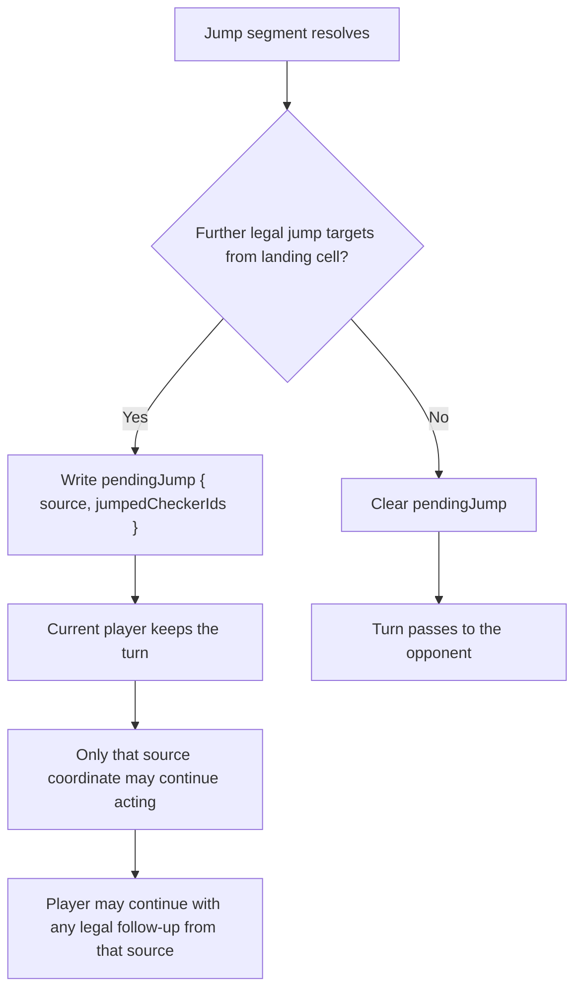
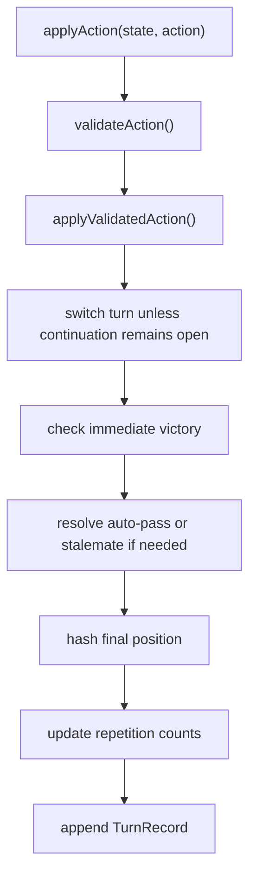
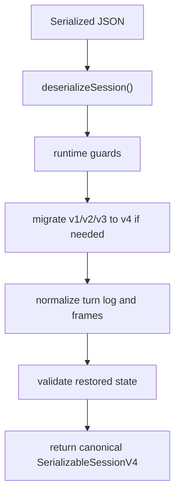
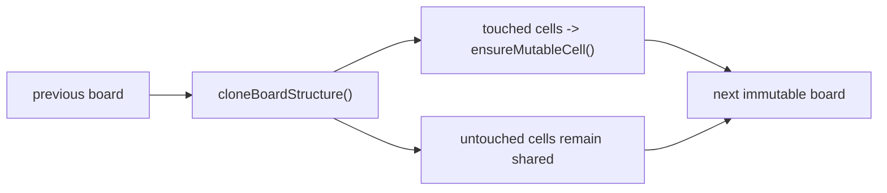

# Domain Engine

**Copyright (c) 2026 Kostiantyn Stroievskyi. All Rights Reserved.**

No permission is granted to use, copy, modify, merge, publish, distribute, sublicense, or sell copies of this software or any portion of it, for any purpose, without explicit written permission from the copyright holder.

---

`src/domain/` is the authoritative rules engine for YOUI. It is pure TypeScript, independent of React, and reused by the UI, the store, the AI, tests, and session serialization. If a subsystem needs to know whether something is legal, what state follows from a move, or whether a game is terminal, it must ask this layer.

That is the most important architectural fact in the repository:

- the UI does not define legal moves;
- the AI does not reimplement jump semantics;
- the store does not invent victory conditions;
- persistence does not get to reinterpret saved state.

## Canonical Inputs

Three artifacts define the truth this layer preserves:

| Source | Role |
| --- | --- |
| [`docs/instruction.md`](../../docs/instruction.md) / [`docs/instruction.ru.md`](../../docs/instruction.ru.md) | human-facing rulebook |
| [`model/types.ts`](./model/types.ts) | type-level contract for state, actions, history, and victory |
| Domain tests under [`rules/`](./rules/) | executable behavior contract |

The rulebook explains the game. The domain code decides its precise operational semantics.

## Why This Layer Exists Separately

The separation from the app, UI, and AI layers solves four concrete problems:

1. legality is authored once instead of reimplemented in multiple places;
2. deterministic pure functions are easier to test and reason about than store-bound or DOM-bound logic;
3. the same engine can support browser play, replay tooling, import/export, and future alternative frontends;
4. persistence, undo/redo, and repetition logic all depend on canonical hashes and canonical snapshots rather than ad-hoc UI state.

## Core State Vocabulary

| Type | Meaning |
| --- | --- |
| `Checker` | one physical piece with stable `id`, `owner`, and `frozen` flag |
| `Cell` | stack-ordered list of checkers from bottom to top |
| `Board` | fixed `Record<Coord, Cell>` over all `A1..F6` coordinates |
| `TurnAction` | canonical action union used by UI, history, AI, and serialization |
| `PendingJump` | same-turn continuation lock anchored at one source coordinate |
| `StateSnapshot` | history-safe snapshot without live `positionCounts` or `history` |
| `EngineState` | snapshot plus repetition counts |
| `GameState` | engine state plus committed `history` |
| `TurnRecord` | committed action plus before/after snapshots and the canonical post-move hash |

Stable checker ids are not incidental. They allow jump-continuation tracking, deterministic tests, reproducible history, and model-training data generation.

## Action Union

The engine uses an explicit action union rather than a generic `{ source, target }` move payload.

| Action | Meaning |
| --- | --- |
| `manualUnfreeze` | spend the turn thawing one own frozen single |
| `jumpSequence` | execute one jump segment to an empty landing cell |
| `climbOne` | move one checker onto an adjacent occupied active cell |
| `moveSingleToEmpty` | move an active single, or an entire controlled stack, one cell to an adjacent empty cell |
| `splitOneFromStack` | peel the top checker from a controlled stack to an adjacent empty cell |
| `splitTwoFromStack` | peel the top two checkers together to an adjacent empty cell |
| `friendlyStackTransfer` | optional non-adjacent move from one controlled stack to another controlled stack |

This explicit action language keeps legality, serialization, and AI move ordering aligned around the same semantic vocabulary.

### Formal semantics of the action union

The explicit union is a deliberate design choice. The engine could have used a generic payload such as `{ source, target }` and inferred the meaning of the move from board occupancy at application time. That approach was rejected because it spreads semantic interpretation across validators, reducers, history code, and AI tooling.

With `TurnAction`, the engine commits early to the meaning of the move:

- `manualUnfreeze` is not movement and therefore deserves its own rule path;
- `jumpSequence` carries continuation semantics that ordinary adjacent moves do not have;
- stack splits and whole-stack step moves are distinct structural operations even when they may look similar in coordinates alone.


*This illustration is intentionally attached to the action-union discussion rather than to the UI layer. Its purpose is to visualize that the engine does not think in raw coordinate pairs; it thinks in semantically distinct action classes whose legality depends on ownership, stack shape, landing occupancy, and active jump context.*

## Folder Structure

| Path | Responsibility |
| --- | --- |
| [`model/`](./model/) | core types, constants, coordinates, hashing, board helpers |
| [`generators/`](./generators/) | initial board and initial state construction |
| [`validators/`](./validators/) | structural and ownership invariants |
| [`rules/moveGeneration/`](./rules/moveGeneration/) | legal-action discovery, validation, and application |
| [`rules/scoring.ts`](./rules/scoring.ts) | informational scoreboard summary |
| [`rules/victory.ts`](./rules/victory.ts) | terminal state detection and tiebreak logic |
| [`reducers/`](./reducers/) | immutable engine transitions |
| [`serialization/`](./serialization/) | session guards, migrations, normalization, import/export |

## Public API Surface

The barrel file [`index.ts`](./index.ts) exposes the stable engine API used by the rest of the repository.

| Function | Role |
| --- | --- |
| `createInitialBoard()` / `createInitialState()` | deterministic opening-state construction |
| `getLegalActions()` | exhaustive turn-level action generation |
| `getLegalActionsForCell()` / `getLegalTargetsForCell()` | per-cell legality for UI and tests |
| `validateAction()` | authoritative check for one candidate action |
| `applyActionToBoard()` / `applyValidatedAction()` | board or board-plus-continuation application |
| `advanceEngineState()` | history-free forward simulation used by AI and replay logic |
| `applyAction()` | full state transition with history append |
| `checkVictory()` | standalone terminal-condition evaluation |
| `getScoreSummary()` | informational scoreboard summary |
| `createUndoFrame()` / `restoreGameState()` | lightweight history framing and runtime rehydration |
| `serializeSession()` / `deserializeSession()` | session import/export boundary |

## State Construction

[`generators/createInitialState.ts`](./generators/createInitialState.ts) centralizes opening-state construction.

- `createInitialBoard()` produces the fully populated opening board with deterministic checker ids such as `white-01` and `black-01`;
- `createInitialState()` seeds the initial repetition table by hashing the opening position once.

Those deterministic ids matter beyond aesthetics. They make tests reproducible, session exports stable, and jump-identity tracking precise.

## Geometry And Board Helpers

The helpers under [`model/`](./model/) exist to keep rule files declarative rather than array-oriented.

### `constants.ts` and `ruleConfig.ts`

| File | Why it matters |
| --- | --- |
| [`constants.ts`](./model/constants.ts) | centralizes the board dimensions, direction vectors, and home-row landmarks used by rules, hashing, and evaluation |
| [`ruleConfig.ts`](./model/ruleConfig.ts) | defines `RULE_DEFAULTS`, `RULE_TOGGLE_DESCRIPTORS`, and `withRuleDefaults()` so every caller sees a total configuration |

### `types.ts`

[`types.ts`](./model/types.ts) is more than a collection of TypeScript aliases. It encodes the conceptual boundary of the engine:

- the action union defines the legal move language;
- `PendingJump` is the continuation contract shared by reducers, history, and AI search;
- `StateSnapshot` keeps history payloads free from live mutable runtime fields;
- `ValidationResult` gives validators and reducers one common failure vocabulary.

### `coordinates.ts`

Typed coordinate arithmetic stays in [`coordinates.ts`](./model/coordinates.ts):

- symbolic parsing and formatting;
- adjacency and jump landing geometry;
- canonical iteration order across all `A1..F6` coordinates.

That file exists because geometry bugs are easy to introduce when vector logic is scattered across reducers and validators.

### `board.ts`

[`board.ts`](./model/board.ts) keeps the rest of the engine talking in board concepts rather than array surgery:

- `createEmptyBoard()` ensures every coordinate always exists;
- `cloneBoardStructure()` plus `ensureMutableCell()` implement structural sharing;
- `getTopChecker()`, `getController()`, `isSingleChecker()`, and `isStack()` express stack semantics directly;
- `isFullStackOwnedByPlayer()` captures the stricter six-stack victory rule;
- `createSnapshot()` produces history-safe state snapshots.

### `hash.ts` and `pendingJump.ts`

[`hash.ts`](./model/hash.ts) provides canonical board and position hashes. [`pendingJump.ts`](./model/pendingJump.ts) keeps continuation payload compatibility helpers out of the core reducer logic.

### Why `pendingJump` is part of the position hash

[`hashPosition()`](./model/hash.ts) includes:

- side to move;
- the `pendingJump` source and trail;
- the board layout.

That is necessary because two boards that look identical can still have different legal futures when one of them is in the middle of a same-turn jump continuation.

## Validation Layer

The validation helpers under [`validators/`](./validators/) keep structural invariants centralized instead of scattering them across move generation and reduction.

### `validators/stateValidators.ts`

This file owns the reusable legality predicates that other domain files depend on:

- piece-state helpers such as `isFrozenSingle()` and `isActiveSingle()`;
- ownership and mobility helpers such as `isControlledStack()` and `isMovableSingle()`;
- landing and jump-over predicates such as `canLandOnOccupiedCell()` and `canJumpOverCell()`;
- geometry-level legality helpers such as `isAdjacentCoord()`;
- full-state checks through `validateBoard()` and `validateGameState()`.

## Move Generation

The move-generation subsystem answers two questions:

1. what can the current player legally do;
2. what board and continuation state follow from that action.

### Move generation flow



### Discovery

[`targetDiscovery.ts`](./rules/moveGeneration/targetDiscovery.ts) is the main entry point for legality:

- `getLegalActionsForCell()`
- `getLegalTargetsForCell()`
- `getLegalActions()`

The discovery path respects `pendingJump`: when a jump continuation exists, only the coordinate in `pendingJump.source` may act this turn.

### `targetMap.ts`

[`targetMap.ts`](./rules/moveGeneration/targetMap.ts) is a small but important bridge between rule truth and UI consumption.

- `createEmptyTargetMap()` defines stable per-action buckets;
- `buildTargetMap()` groups legal actions by action kind into UI-ready targets.

It remains in the domain layer because it is still a projection of legal actions, not a presentation-layer invention.

### Validation

[`validation.ts`](./rules/moveGeneration/validation.ts) does not try to outsmart generation. It validates structural preconditions and then proves legality by checking whether the candidate action appears in the generated legal set for the relevant source cell.

That design is intentionally redundant in CPU terms and conservative in correctness terms.

### Application

[`application.ts`](./rules/moveGeneration/application.ts) and the action handlers in [`actionHandlers.ts`](./rules/moveGeneration/actionHandlers.ts) project legal actions into next-board state. They also return the next `pendingJump` payload when a jump continuation remains open.

Important application exports:

| Function | Role |
| --- | --- |
| `applyActionToBoard()` | validate then apply when a caller only needs the next board |
| `applyValidatedAction()` | return the next board plus next `pendingJump` payload |
| `applyValidatedActionToBoard()` | board-only projection of a previously validated action while preserving structural sharing |

### Jump-chain semantics and identity-based loop prevention

Jump continuation is one of the most subtle rules in the project, so the engine makes the loop-prevention rule explicit:

1. from the source coordinate, inspect each adjacent direction;
2. only a single checker may occupy the jumped coordinate;
3. the landing coordinate two steps away must be empty;
4. the jumped checker's `id` must not already be present in the continuation trail;
5. if the jump is legal, that checker id is appended to `pendingJump.jumpedCheckerIds`.

That design allows a chain to revisit a landing square, including the starting square, if it does so by jumping different physical checkers. The engine therefore blocks repeated jumped identities, not repeated landing coordinates.

Additional jump-specific exports matter outside the reducer itself:

| Function | Role |
| --- | --- |
| `createJumpStateKey()` | board-sensitive jump-context key used by tests and performance helpers |
| `getVisitedJumpedCheckerIds()` | reconstructs the same-chain checker-identity trail from `pendingJump`, committed history, or legacy payloads |
| `getJumpContinuationTargets()` | computes next legal jump landings after an optional drafted path |

## Jump Semantics

Jump continuation is the most delicate rule in the engine, and the domain models it explicitly rather than implicitly.

### What a jump may cross

The current rule implementation is:

- only single checkers may be jumped over;
- stacks may never be jumped over;
- active enemy singles freeze when jumped;
- any frozen single, regardless of owner, thaws when jumped.

That thaw rule is implemented directly in [`jump.ts`](./rules/moveGeneration/jump.ts) through `applySingleJumpSegment()`.

### Same-turn continuation

When a jump leaves further jump targets from the landing coordinate, the engine writes:

```text
pendingJump = {
  source: currentCoord,
  jumpedCheckerIds: [...]
}
```

The turn does not switch. On the continued turn, the acting coordinate is constrained to that `source`, but the player may choose any legal action available from that coordinate, not only another jump.



### Loop prevention

The canonical loop-prevention rule is identity-based:

- a jump chain may not jump over the same physical checker twice.

`resolveJumpPath()` enforces this through the `jumpedCheckerIds` set. This is the current operational rule used by move generation and application.

Legacy session payloads may still contain `visitedCoords` or `visitedStateKeys`, and the compatibility helpers in [`pendingJump.ts`](./model/pendingJump.ts) and [`jump.ts`](./rules/moveGeneration/jump.ts) can reconstruct equivalent identity trails from them. Those fields exist for backwards compatibility, not as the primary runtime representation.


*This illustration belongs here because the subtlety is not geometric reachability alone. The important rule is that a continuation chain may revisit a landing coordinate if it crosses different physical checkers; what is forbidden is re-jumping the same checker identity.*

## Reducer Pipeline

The reducers in [`reducers/`](./reducers/) turn local action legality into full game progression.

### `advanceEngineState()`

History-free forward simulation used by:

- AI search
- replay helpers
- benchmark and reporting scripts

### `applyAction()`

Full runtime transition with history append, auto-pass handling, terminal checks, and repetition tracking.

At a high level the reducer pipeline is:



The reducer therefore has two simultaneous responsibilities:

- produce the correct next engine state;
- keep history, repetition tracking, and terminal-state interpretation synchronized with that state.

## Victory And Draw Resolution

Victory logic lives in [`rules/victory.ts`](./rules/victory.ts).

Immediate wins:

- `homeField`
- `sixStacks`

Draw-related terminal outcomes when the configured draw rule allows them:

- `threefoldTiebreakWin`
- `threefoldDraw`
- `stalemateTiebreakWin`
- `stalemateDraw`

Tiebreak resolution compares:

1. own-home single checkers
2. completed home-row height-3 stacks
3. draw if still tied

### Informational scoring

[`rules/scoring.ts`](./rules/scoring.ts) is intentionally separate from terminal victory logic. `getScoreSummary()` computes presentation-facing counters such as:

- home-field singles;
- controlled stacks;
- fully owned front-row height-`3` stacks;
- frozen enemy singles.

These values are useful for UI and analysis, but they do not decide terminal truth.

The newer helper `getScoreSummaryByKey()` exists for the AI performance layer. It does not add a second scoring algorithm; it simply lets callers reuse an already-known canonical position hash when they need the same pure summary together with other keyed caches.

### The two-phase victory evaluation

Terminal logic is effectively checked twice in the reducer pipeline:

1. immediately after the action is applied, to catch direct `homeField` or `sixStacks` wins;
2. after auto-pass and repetition updates, to catch stalemate and threefold outcomes that become visible only after the move has been fully integrated into match state.

`getDrawTiebreakMetricsByKey()` plays the same role for tiebreak snapshots that `getScoreSummaryByKey()` plays for informational scoring: it lets the AI reuse a known position hash while still asking the domain layer for the canonical tiebreak computation.

## Invariants And Validation

[`validators/stateValidators.ts`](./validators/stateValidators.ts) centralizes structural invariants such as:

- exact piece counts;
- valid board shape;
- stack height never exceeding `3`;
- stacks never containing frozen checkers;
- `pendingJump` pointing at a source controlled by the current player;
- continuation payloads carrying a non-empty trail.

This keeps invariant logic out of the UI, AI, and persistence layers.

## Invariants The Engine Protects

The engine's central invariants are:

- every coordinate `A1..F6` exists on the board;
- stack height is always in `0..3`;
- frozen checkers may exist only as single checkers, never inside stacks;
- both players retain exactly `18` checkers in valid runtime states;
- jumps land only on empty cells and never cross stacks;
- `pendingJump` always points to material controlled by the current player;
- repetition counts are derived from canonical position hashes, not trusted external metadata.

## Serialization, Import, And Migration

The serialization subsystem under [`serialization/`](./serialization/) is the trust boundary for persisted sessions.

It performs:

- guard validation of imported JSON;
- migration across stored session versions;
- normalization of derived fields such as repetition counts.

The domain therefore treats imported sessions as claims to be validated, not as state to be trusted blindly.

### Serialization flow



### File map

| File | Responsibility |
| --- | --- |
| [`serialization/session.ts`](./serialization/session.ts) | public serialization entry points |
| [`serialization/session/deserialization.ts`](./serialization/session/deserialization.ts) | guard validation and migration to `v4` |
| [`serialization/session/guards.ts`](./serialization/session/guards.ts) | runtime validation of nested payload fragments |
| [`serialization/session/normalization.ts`](./serialization/session/normalization.ts) | canonical turn-log and frame normalization |
| [`serialization/session/frames.ts`](./serialization/session/frames.ts) | `UndoFrame` creation and runtime restoration |

### Session versions

The serialization layer currently normalizes every imported payload to `SerializableSessionV4`:

- `v1`: full nested game states in `present`, `past`, and `future`
- `v2`: shared `turnLog` plus lightweight `UndoFrame` history cursors
- `v3`: `v2` plus persisted `matchSettings`
- `v4`: `v3` plus persisted `aiBehaviorProfile`

The hidden AI persona is validated as part of session shape, but migration from older sessions never invents one. Legacy payloads become canonical `v4` sessions with `aiBehaviorProfile: null`, which keeps imports backward-compatible without retroactively assigning opponent identity to old saves.

This is why the domain layer depends on shared session types even though it otherwise stays UI-agnostic: session shape is a cross-layer contract.

### Why normalization recomputes hashes and counts

Persisted metadata can be stale, missing, or produced by older versions of the application. The domain therefore re-establishes canonical truth from the turn log and validated frames instead of blindly trusting stored repetition counts or legacy continuation payloads.

## Why The Engine Uses Structural Sharing

The engine preserves immutable public state without deep-cloning the entire board on every move:

1. `cloneBoardStructure()` clones only the top-level board record;
2. `ensureMutableCell()` deep-clones a cell only when a move path touches it;
3. untouched cells remain referentially shared.

That trade-off matters especially in AI search, where `advanceEngineState()` may be called recursively thousands of times.

### GC and search-path implications

Without structural sharing, every speculative move would allocate a fully new `36`-cell board and all nested checker arrays. Structural sharing keeps the hot search path tractable while still giving React and persistence code a clean immutable surface to consume.



## Performance Characteristics

The engine is written as a pure layer, but it is not naive about cost.

- structural sharing in board application avoids cloning untouched cells on every move;
- compact helpers for coordinates, hashing, and validation keep the AI search path usable in a browser worker.
- keyed pure-summary helpers such as `getScoreSummaryByKey()` and `getDrawTiebreakMetricsByKey()` let higher layers reuse canonical hashes instead of recomputing identical read-only summaries through multiple call paths.

Performance reports for these paths are generated separately and documented in [`../../docs/INFRASTRUCTURE.md`](../../docs/INFRASTRUCTURE.md).

## Test Coverage As Documentation

The domain tests are not auxiliary. They are part of the documentation surface because they pin the exact semantics of edge cases that prose alone can describe only ambiguously.

Representative files:

- [`rules/gameEngine.actions.test.ts`](./rules/gameEngine.actions.test.ts): action legality and reducer boundaries
- [`rules/gameEngine.moves.test.ts`](./rules/gameEngine.moves.test.ts): freeze/thaw behavior, same-turn continuation, and landing-revisit-versus-checker-identity semantics
- [`rules/gameEngine.session.test.ts`](./rules/gameEngine.session.test.ts): threefold and stalemate tiebreak resolution, serialization, migration, normalization, and restore flows
- [`performanceHelpers.test.ts`](./performanceHelpers.test.ts): helper and hash assumptions used by performance-sensitive code

## What This Layer Deliberately Does Not Do

The domain layer does not:

- know about React components or browser APIs;
- manage persistence keys or IndexedDB envelopes;
- decide whether the current player is human or computer;
- order moves strategically for search;
- render UI copy, glossary text, or victory messages.

Those exclusions are what make the engine trustworthy as a reusable rule oracle.

## Boundary Of This Document

This file is the canonical rule-engine and invariant reference. For adjacent concerns:

- runtime store, worker, and hydration: [`../../docs/ARCHITECTURE.md`](../../docs/ARCHITECTURE.md)
- AI architecture and search pipeline: [`../ai/README.md`](../ai/README.md)
- exact AI formulas: [`../ai/HEURISTICS.md`](../ai/HEURISTICS.md)
