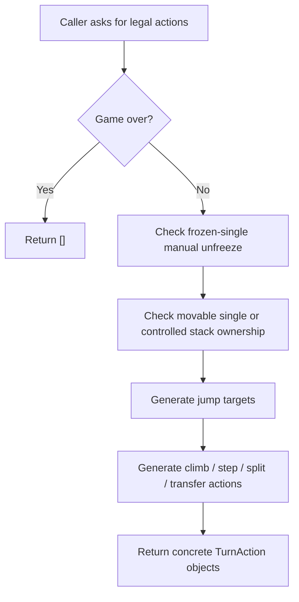
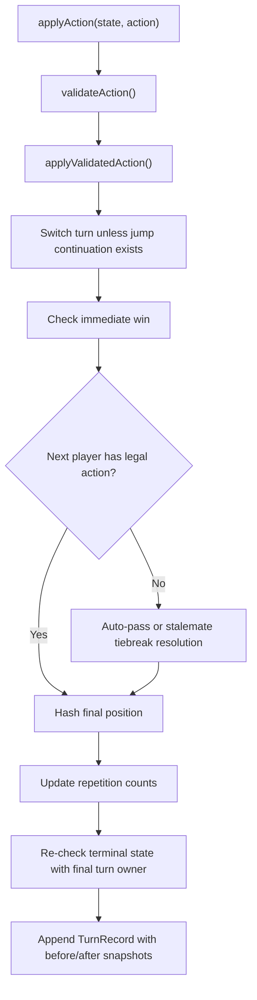
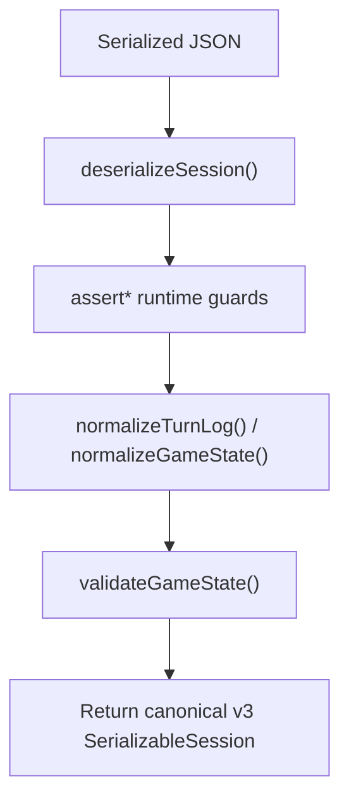

# Domain Engine

`src/domain/` is the authoritative rules engine for White Maybe Black. It is pure TypeScript, it has no React dependency, and it exists so that every other subsystem can treat game legality as a reusable service instead of embedding rule fragments in multiple places.

That is the most important idea in this folder:

- the UI may ask what can be selected;
- the store may decide when to persist or hydrate;
- the AI may search future positions;
- tests may build synthetic positions;

but only the domain layer is allowed to define whether a position is valid, which actions are legal, how a jump changes frozen state, when a player keeps the turn, or when the game ends.

## Canonical Inputs To This Layer

Three artifacts define what this engine is trying to preserve:

| Source | Role |
| --- | --- |
| [`docs/instruction.md`](../../docs/instruction.md) / [`docs/instruction.ru.md`](../../docs/instruction.ru.md) | Human-facing rulebook |
| [`src/domain/model/types.ts`](./model/types.ts) | Type-level contract for runtime state, actions, history, and victory payloads |
| Domain test suite under [`src/domain/rules/`](./rules/) | Executable behavior contract for transitions, serialization, and invariants |

The engine is therefore both a rules implementation and a normalization boundary. It does not merely “apply moves”; it turns potentially messy runtime inputs into canonical, validated state transitions.

## Why This Layer Exists Separately

The separation from the app/UI layers solves four concrete problems:

1. **Single source of truth for legality.** If the UI and AI both implemented move rules separately, they would drift.
2. **Deterministic testing.** Pure functions are much easier to test than store-bound or DOM-bound logic.
3. **Future portability.** The same engine can back replays, a server validator, alternative frontends, or offline tooling.
4. **Stable persistence semantics.** Serialization, migration, and draw detection depend on canonical hashes and canonical history snapshots.

## Mental Model Of The State

The engine uses a deliberately small vocabulary.

| Type | Meaning | Why it matters beyond local implementation |
| --- | --- | --- |
| `Checker` | One physical piece with `owner`, `frozen`, and stable `id` | Stable ids make history, tests, and training data reproducible |
| `Cell` | `checkers[]` ordered bottom -> top | Stack control and structural analysis both depend on order |
| `Board` | `Record<Coord, Cell>` over all `A1..F6` coordinates | Fixed coordinates simplify hashing, iteration, and serialization |
| `TurnAction` | One legal action variant | The action union is the canonical move vocabulary used by UI, history, and AI |
| `PendingJump` | Source cell plus jumped-checker ids | Preserves same-turn jump continuation without allowing the same checker to be jumped twice |
| `StateSnapshot` | Board + turn + status + victory + pending jump | Used inside history and undo frames without duplicating runtime-only fields |
| `EngineState` | Snapshot + repetition counts | The smallest state the reducer/AI need for legal forward simulation |
| `GameState` | Engine state + committed turn history | Full runtime state for gameplay, persistence, replay, and AI context |
| `TurnRecord` | Actor, action, before/after snapshots, auto-passes, victory, hash | Lets the app replay, serialize, explain, and analyze turns |

## Rule Vocabulary

The action union is small, but each action exists for a distinct reason in the rules.

| Action kind | Meaning in the game | Why it is encoded explicitly |
| --- | --- | --- |
| `manualUnfreeze` | Spend the turn to reactivate one of your frozen singles | This is not movement, so it deserves its own action type |
| `jumpSequence` | Execute one jump segment to an empty landing cell | Jump continuation has special turn ownership and loop-prevention rules |
| `climbOne` | Move one top checker onto an adjacent occupied active cell | This is the move that creates or changes stack control directly |
| `moveSingleToEmpty` | Move an active single, or an entire controlled stack, one cell to an adjacent empty cell | The same action kind covers both single-step and whole-stack step motion |
| `splitOneFromStack` | Peel one checker from a controlled stack onto an adjacent empty cell | Needed to transform stacks back into singles or reposition control |
| `splitTwoFromStack` | Peel the top two checkers together onto an adjacent empty cell | Preserves stack structure while redistributing material |
| `friendlyStackTransfer` | Optional rule: move one top checker from one controlled stack to another controlled stack anywhere on the board | Exists only when the rule toggle is enabled, so the engine keeps it explicit and configurable |

## Folder Structure

| Path | Responsibility | Why it exists |
| --- | --- | --- |
| [`model/`](./model/) | Core types, constants, board helpers, coordinates, hashing, rule defaults | Shared low-level vocabulary used everywhere else |
| [`generators/`](./generators/) | Initial board and initial game state construction | Centralizes opening-state semantics and deterministic ids |
| [`validators/`](./validators/) | Structural and ownership checks | Keeps invariants readable and reusable |
| [`rules/moveGeneration/`](./rules/moveGeneration/) | Legal action discovery, jump logic, action application, validation, UI target shaping | Splits “what can happen” from “how the reducer sequences turns” |
| [`rules/scoring.ts`](./rules/scoring.ts) | Informational score summary | Keeps optional scoreboard logic separate from victory rules |
| [`rules/victory.ts`](./rules/victory.ts) | Terminal condition detection | Makes win/draw logic independently testable |
| [`reducers/gameReducer.ts`](./reducers/gameReducer.ts) | Authoritative immutable state transition pipeline | The only place that sequences validation, application, pass logic, victory checks, and history append |
| [`serialization/`](./serialization/) | Session JSON import/export, migration, guard validation, normalization | Makes persisted sessions safe to trust again after deserialization |

## Public API Surface

The barrel file [`index.ts`](./index.ts) re-exports the stable engine API. These are the functions other layers are meant to depend on:

| Function | File | System role |
| --- | --- | --- |
| `createInitialBoard()` | [`generators/createInitialState.ts`](./generators/createInitialState.ts) | Deterministic opening board constructor |
| `createInitialState()` | [`generators/createInitialState.ts`](./generators/createInitialState.ts) | Full initial game state with seeded repetition count |
| `getLegalActions()` | [`rules/moveGeneration/targetDiscovery.ts`](./rules/moveGeneration/targetDiscovery.ts) | Global legal-action enumeration |
| `getLegalActionsForCell()` | [`rules/moveGeneration/targetDiscovery.ts`](./rules/moveGeneration/targetDiscovery.ts) | Per-cell legal-action enumeration used by UI and tests |
| `getLegalTargetsForCell()` | [`rules/moveGeneration/targetDiscovery.ts`](./rules/moveGeneration/targetDiscovery.ts) | UI-facing target map projection |
| `validateAction()` | [`rules/moveGeneration/validation.ts`](./rules/moveGeneration/validation.ts) | Authoritative legality check for one candidate action |
| `applyActionToBoard()` | [`rules/moveGeneration/application.ts`](./rules/moveGeneration/application.ts) | Board-only application with validation |
| `applyValidatedAction()` | [`rules/moveGeneration/application.ts`](./rules/moveGeneration/application.ts) | Board application plus `pendingJump` follow-up state |
| `advanceEngineState()` | [`reducers/gameReducer.ts`](./reducers/gameReducer.ts) | History-free forward simulation used by search and replay helpers |
| `applyAction()` | [`reducers/gameReducer.ts`](./reducers/gameReducer.ts) | Full state transition with history append |
| `checkVictory()` | [`rules/victory.ts`](./rules/victory.ts) | Standalone win/draw detection |
| `getScoreSummary()` | [`rules/scoring.ts`](./rules/scoring.ts) | Optional informational scoreboard |
| `serializeSession()` / `deserializeSession()` | [`serialization/session.ts`](./serialization/session.ts) | Export/import entry points |
| `createUndoFrame()` / `restoreGameState()` | [`serialization/session/frames.ts`](./serialization/session/frames.ts) | Lightweight history cursor framing for undo/redo |

## Model And Utility Functions

### `model/constants.ts`

| Export | Why it exists |
| --- | --- |
| `BOARD_COLUMNS`, `BOARD_ROWS` | One canonical coordinate space shared by board helpers, hashing, and UI |
| `DIRECTION_VECTORS` | The eight legal movement directions; prevents geometry duplication |
| `HOME_ROWS`, `FRONT_HOME_ROW` | Encodes the two victory geometries and evaluation landmarks once |

### `model/types.ts`

This file is not “just types.” It encodes the engine's conceptual boundaries:

- the action union defines the legal move language;
- `PendingJump` is the contract that lets jump continuation survive across reducers, history, and AI search;
- `StateSnapshot` exists so history can preserve board truth without also preserving mutable runtime extras;
- `ValidationResult` standardizes failure signaling across validators and appliers.

### `model/coordinates.ts`

| Function | Bigger purpose |
| --- | --- |
| `createCoord()` / `parseCoord()` | Typed conversion between symbolic coordinates and structured parts |
| `coordToIndices()` / `toCoord()` | Bridge between board notation and vector arithmetic |
| `isInsideBoardPosition()` | Central bounds check so geometry code stays total and safe |
| `getAdjacentCoord()` | Single-step movement primitive |
| `getJumpLandingCoord()` | Two-step landing primitive for jump generation |
| `isAdjacent()` / `getDirectionBetween()` / `getJumpDirection()` | Geometry validators used to reject illegal targets and encode model actions |
| `allCoords()` / `displayCoords()` | Canonical iteration orders: machine order and top-down display order |

These helpers exist because geometry mistakes are easy to make and hard to spot once scattered through rule logic.

### `model/board.ts`

| Function | Bigger purpose |
| --- | --- |
| `createCell()` / `createEmptyBoard()` | Ensure all coordinates always exist, which simplifies serialization and hashing |
| `cloneChecker()` / `cloneCell()` / `cloneBoard()` | Preserve immutability at the API boundary |
| `cloneBoardStructure()` / `ensureMutableCell()` | Structural sharing: only touched cells are deep-cloned during move application |
| `getCell()`, `getCellHeight()`, `isEmptyCell()`, `isSingleChecker()`, `isStack()` | Centralized board predicates so rule files do not duplicate raw array logic |
| `getTopChecker()` / `getBottomChecker()` / `getController()` | Express stack semantics directly |
| `isFullStackOwnedByPlayer()` | Six-stack victory needs ownership of every checker, not only top control |
| `removeTopCheckers()` / `addCheckers()` / `setSingleCheckerFrozen()` | Low-level mutable helpers used only inside validated move application |
| `countCheckersForPlayer()` | Runtime invariant checks and victory tests rely on exact piece counts |
| `createSnapshot()` | Produces history-safe copies of runtime state |

The board helper file exists so the rest of the engine can talk in domain concepts instead of array surgery.

### `model/hash.ts`

| Function | Bigger purpose |
| --- | --- |
| `hashBoard()` | Canonical board signature |
| `hashPosition()` | Canonical full-position signature including side to move and `pendingJump` |

Including `pendingJump` in the position hash is not an implementation accident. A board that looks identical can still have different legal futures depending on whether the side to move is in a same-turn jump continuation context.

### `model/ruleConfig.ts`

| Export | Bigger purpose |
| --- | --- |
| `RULE_DEFAULTS` | Single canonical default rule policy |
| `RULE_TOGGLE_DESCRIPTORS` | UI-facing description of rule toggles without putting UI strings into store code |
| `withRuleDefaults()` | Normalizes partial configs so every rule call sees a total configuration |

## State Construction

### `generators/createInitialState.ts`

| Function | Bigger purpose |
| --- | --- |
| `createInitialBoard()` | Creates the completely filled opening board with deterministic checker ids |
| `createInitialState()` | Seeds the runtime state and initial repetition table |

The deterministic ids are especially important for tests, serialization consistency, and the optional AI dataset generation pipeline.

## Validation Layer

### `validators/stateValidators.ts`

| Function | Bigger purpose |
| --- | --- |
| `isFrozenSingle()` / `isActiveSingle()` | Separate piece state from ownership or stack logic |
| `isControlledStack()` / `isMovableSingle()` | Express who is allowed to move what |
| `canLandOnOccupiedCell()` | Centralizes climb/transfer landing rules |
| `canJumpOverCell()` | Encodes the special jump-over rule for any single checker |
| `validateBoard()` | Enforces structural board invariants after every legal action |
| `validateGameState()` | Enforces global invariants: board validity, exact piece counts, and valid `pendingJump` |
| `isAdjacentCoord()` | App-layer alias that keeps naming explicit |

This file exists to keep invariants centralized. Without it, legality bugs would appear as scattered conditionals in move generation and application code.

## Move Generation Subsystem

This subsystem is the most important part of the engine outside the reducer. It answers two questions:

1. “What can the current player legally do?”
2. “What does the board become if they do it?”

The code is split by concern so those questions remain readable.

### Move generation flow

### `rules/moveGeneration/targetDiscovery.ts`

| Function | Bigger purpose |
| --- | --- |
| `getLegalTargetsForCell()` | Projects legal actions into a target map the UI can highlight |
| `getLegalActionsForCell()` | Builds all legal actions from one source coordinate |
| `getLegalActions()` | Exhaustive per-turn action generation across the board |

Important design choice: this file does not only exist for the UI. The reducer, tests, and AI all rely on it as the single source of truth for legality.

### `rules/moveGeneration/jump.ts`

| Function | Bigger purpose |
| --- | --- |
| `createJumpStateKey()` | Helper for board-sensitive jump-state hashing used by tests and perf helpers |
| `getMovingPlayer()` | Resolves moving-side ownership from the source cell |
| `resolveJumpPath()` | Applies one or more jump segments while detecting loops and freeze/unfreeze effects |
| `getVisitedJumpedCheckerIds()` | Restores same-chain jumped-checker history from `pendingJump`, legacy payloads, or committed history |
| `getJumpTargetsForContext()` | Legal jump continuation under a specific board + jumped-checker context |
| `getJumpContinuationTargets()` | Computes next jump options after optional draft path segments |

This file is why jump logic remains tractable. Same-turn continuation is the most subtle rule in the game, and these helpers keep it explicit instead of implicit.

### Why jumped-checker history is identity-based

The engine blocks jumping over the same physical checker twice in one chain. Landing coordinates may repeat, including the starting square, as long as each segment uses a different jumped checker. Stable checker ids make that rule precise without forcing the engine to ban all landing-cell revisits.

### `rules/moveGeneration/validation.ts`

`validateAction()` is the authoritative legality gate. It does not try to outsmart the generation subsystem. Instead, it validates ownership and structural facts, then proves legality by comparing the candidate action against freshly generated legal actions for that source cell.

That design is slower than hand-coding every branch in the validator, but much safer: the engine has one canonical action generator, not parallel rule implementations that can drift.

### `rules/moveGeneration/application.ts`

| Function | Bigger purpose |
| --- | --- |
| `applyActionToBoard()` | Public “validate then apply” entry point when only the board matters |
| `applyValidatedAction()` | Returns both next board and next `pendingJump` state |
| `applyValidatedActionToBoard()` | Board-only projection of the validated application result |

`applyValidatedAction()` exists because the reducer and AI need more than board mutation. They need to know whether the action hands the turn over or creates a jump-continuation context.

### `rules/moveGeneration/targetMap.ts`

| Function | Bigger purpose |
| --- | --- |
| `createEmptyTargetMap()` | Stable, fully populated target buckets for UI state |
| `buildTargetMap()` | Groups actions by kind into UI-friendly target lists |

This is a UI convenience adapter, but it lives in the domain layer because it is still derived from rule truth.

## Reducer And Turn Resolution

The reducer is where local move legality becomes full game progression.

### `reducers/gameReducer.ts`

| Function | Bigger purpose |
| --- | --- |
| `advanceEngineState()` | History-free forward simulation for AI search and replay helpers |
| `applyAction()` | Authoritative runtime transition with history append |

Internally the reducer does much more than “apply a move”:

Why the two victory checks?

- The first check catches direct wins from the move itself.
- The second check catches terminal conditions that only become meaningful after auto-pass handling or repetition-count update.

Why `advanceEngineState()` and `applyAction()` both exist?

- the AI and replay helpers need forward simulation without growing history;
- the live app needs committed history with snapshots and hashes.

Keeping both paths in one file ensures the non-history semantics stay aligned.

## Victory And Scoring

### `rules/victory.ts`

`checkVictory()` answers one narrow question: “Given this engine state and rule configuration, is the game terminal?”

It checks:

- `homeField`: every checker owned by a player is a single on that player's home rows;
- `sixStacks`: all six front-row home cells contain height-3 stacks made entirely of that player's checkers;
- `threefold` terminal trigger: only when enabled in config, and only when the full position hash has occurred at least three times;
- draw-resolution tiebreak for both threefold and stalemate triggers:
  compare own home-field checker counts, then completed own home stacks, then keep draw on full equality.

Important nuance: six-stack victory requires full ownership of the stack, not just top control.

### `rules/scoring.ts`

`getScoreSummary()` computes optional, informational counters:

- home-field singles;
- controlled stacks;
- controlled height-3 stacks on the front home row;
- frozen enemy singles.

These metrics exist for presentation and analysis only. They are intentionally separate from terminal conditions so the UI can expose meaningful progress without affecting rule truth.

## Serialization, Import, And Migration

Domain serialization exists because game state must survive across browser restarts, exports, imports, tests, and future evolution of the session format.

### Serialization flow

### File map

| File | Main responsibility | Why it exists |
| --- | --- | --- |
| [`serialization/session.ts`](./serialization/session.ts) | Public export/import entry points | Keeps callers away from internal guard details |
| [`serialization/session/deserialization.ts`](./serialization/session/deserialization.ts) | v1/v2/v3 parsing and migration to v3 | Supports backward compatibility |
| [`serialization/session/guards.ts`](./serialization/session/guards.ts) | Runtime type guards for nested payloads | Rejects malformed user or storage data early |
| [`serialization/session/normalization.ts`](./serialization/session/normalization.ts) | Recomputes hashes and canonical position counts | Prevents stale serialized metadata from becoming authoritative |
| [`serialization/session/frames.ts`](./serialization/session/frames.ts) | Lightweight undo-frame conversion | Lets the app store history efficiently |

### Why normalization recomputes hashes and counts

Persisted metadata can be stale, missing, or produced by older versions of the application. The engine therefore treats hashes and repetition counts as derived truth, not as blindly trusted input.

### Session versions

The domain layer currently normalizes everything to `SerializableSessionV3`:

- `v1`: full nested game states in `present`, `past`, and `future`;
- `v2`: shared `turnLog` plus lightweight undo frames;
- `v3`: `v2` plus persisted `matchSettings`.

This migration policy explains why the domain layer depends on shared session types even though it is otherwise UI-agnostic: session shape is a cross-layer contract.

## Invariants The Engine Protects

These invariants are enforced by validators, reducer logic, or normalization:

- every coordinate exists on the board;
- cell height is always `0..3`;
- stacks never contain frozen checkers;
- a frozen checker can only exist as a single checker;
- both players always retain exactly `18` checkers in valid runtime states;
- jumps land only on empty cells;
- jumps never cross stacks;
- `pendingJump` always points to a source controlled by `currentPlayer`;
- repetition counts are derived from canonical position hashes.

These are not incidental guardrails. They are what make import/export, AI search, and undo/redo trustworthy.

## Why The Engine Uses Structural Sharing

Move application does not deep-clone the entire board on every step. Instead it:

1. shallow-clones the board record with `cloneBoardStructure()`;
2. deep-clones only touched cells using `ensureMutableCell()`;
3. keeps untouched cells referentially shared.

This is a pragmatic trade-off:

- full immutability is preserved at the public API boundary;
- the reducer and AI can simulate many moves without paying for whole-board deep clones every time.

## Test Coverage As Documentation

The domain tests are not auxiliary; they are part of the documentation surface.

Particularly important files are:

- [`rules/gameEngine.actions.test.ts`](./rules/gameEngine.actions.test.ts)
- [`rules/gameEngine.moves.test.ts`](./rules/gameEngine.moves.test.ts)
- [`rules/gameEngine.session.test.ts`](./rules/gameEngine.session.test.ts)
- [`performanceHelpers.test.ts`](./performanceHelpers.test.ts)

They describe the intended behavior of:

- jump freezing and unfreezing;
- same-turn jump continuation;
- auto-pass and stalemate tiebreak behavior;
- serialization migration and normalization;
- helper/hash stability assumptions used by performance-sensitive code.

## What This Layer Deliberately Does Not Do

The domain engine does **not**:

- know about React components or the DOM;
- know about browser storage keys or IndexedDB;
- know whether the current player is human or computer;
- order moves strategically for search;
- render rule text or glossary content.

Those responsibilities live elsewhere on purpose. The domain layer's value comes from staying small in scope and absolute in authority.
